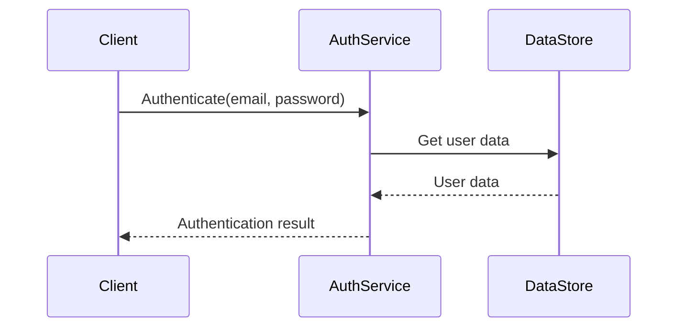
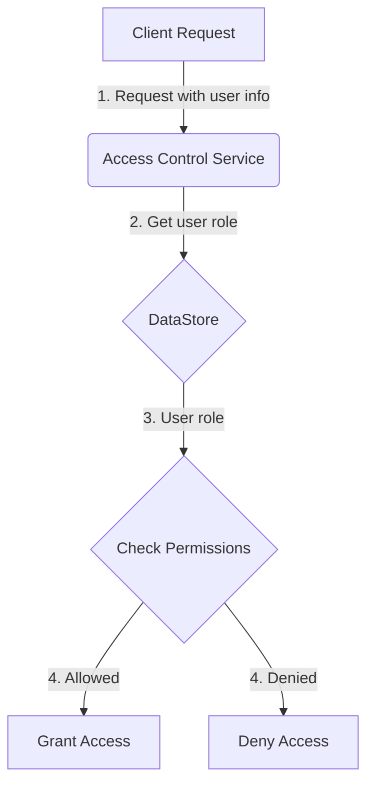

<details>
<summary>Relevant source files</summary>

The following files were used as context for generating this wiki page:

- [src/db.js](https://github.com/aanickode/access-control-service/blob/main/src/db.js)
- [src/models.js](https://github.com/aanickode/access-control-service/blob/main/src/models.js)
</details>

# Data Storage and Access

## Introduction

The "Data Storage and Access" component within this project is responsible for managing user data and role-based access control. It provides a simple in-memory data store and defines the data models for users and roles.

Sources: [src/db.js](), [src/models.js]()

## Data Models

### User Model

The `User` model represents a user entity within the system. It has the following fields:

| Field | Type    | Description                   |
|-------|---------|-------------------------------|
| email | string  | The user's email address      |
| role  | string  | The user's assigned role name |

Sources: [src/models.js:1-4]()

### Role Model

The `Role` model defines a role with associated permissions. It consists of the following fields:

| Field       | Type     | Description                                  |
|-------------|----------|----------------------------------------------|
| name        | string   | The name of the role                         |
| permissions | string[] | An array of permission strings for this role |

Sources: [src/models.js:6-9]()

## Data Storage

The project uses an in-memory data store implemented as a JavaScript object called `db`. It contains two properties:

- `users`: An object that maps user email addresses to their respective roles.
- `roles`: An object that maps role names to their corresponding `Role` model instances.

```js
const db = {
  users: {
    'admin@internal.company': 'admin',
    'analyst@internal.company': 'analyst',
  },
  roles: roles
};
```

The `roles` object is imported from a JSON configuration file (`roles.json`).

Sources: [src/db.js:1-10]()

## Role Configuration

The role configuration is defined in a separate JSON file (`roles.json`). This file is not provided in the given source files, but it is assumed to contain the role definitions with their associated permissions.

Sources: [src/db.js:1]()

## Sequence Diagram: User Authentication



This sequence diagram illustrates a potential authentication flow where the client requests authentication with an email and password. The `AuthService` retrieves the user data from the `DataStore` (which could be the in-memory `db` object) and performs the necessary authentication checks before returning the result to the client.

Sources: [src/db.js](), [src/models.js]()

## Access Control Flow



This flow diagram illustrates a potential access control process within the system:

1. A client sends a request with user information to the Access Control Service.
2. The Access Control Service retrieves the user's role from the DataStore.
3. The DataStore returns the user's role.
4. The Access Control Service checks if the user's role has the required permissions for the requested operation.
5. If the user has the necessary permissions, access is granted. Otherwise, access is denied.

Sources: [src/db.js](), [src/models.js]()

## Summary

The "Data Storage and Access" component in this project provides a simple in-memory data store for managing user data and role-based access control. It defines the data models for users and roles, and likely interacts with other components for authentication and authorization purposes. However, without additional source files, the implementation details of these interactions are not fully available.