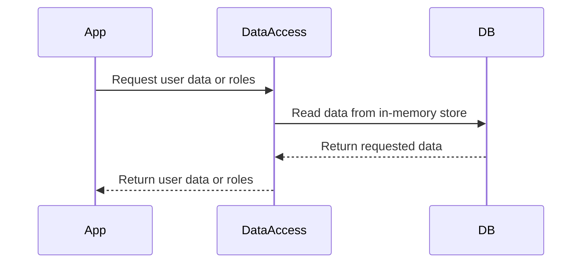

<details>
<summary>Relevant source files</summary>

The following files were used as context for generating this wiki page:

- [src/db.js](https://github.com/aanickode/access-control-service/blob/main/src/db.js)
- [src/models.js](https://github.com/aanickode/access-control-service/blob/main/src/models.js)
</details>

# Data Storage and Access

## Introduction

The "Data Storage and Access" component within this project is responsible for managing user data and role-based access control. It provides a simple in-memory data store and defines the data models for users and roles. This component serves as the foundation for implementing authentication and authorization mechanisms within the application.

## Data Models

### User Model

The `User` model represents a user entity within the system. It consists of the following fields:

```javascript
export const User = {
  email: 'string',
  role: 'string'
};
```

- `email` (string): The email address of the user, which serves as a unique identifier.
- `role` (string): The role associated with the user, which determines their access permissions.

Sources: [src/models.js:1-4]()

### Role Model

The `Role` model defines the structure of roles within the system. It includes the following fields:

```javascript
export const Role = {
  name: 'string',
  permissions: ['string']
};
```

- `name` (string): The name of the role.
- `permissions` (array of strings): A list of permissions granted to users with this role.

Sources: [src/models.js:6-9]()

## Data Storage

The project uses an in-memory data store implemented in the `db.js` file. This data store contains two main objects:

1. `users`: An object that maps user email addresses to their respective roles.
2. `roles`: An object that defines the available roles and their associated permissions.

```javascript
const db = {
  users: {
    'admin@internal.company': 'admin',
    'analyst@internal.company': 'analyst',
  },
  roles: roles
};
```

The `roles` object is imported from a JSON configuration file (`roles.json`), which allows for easy management and modification of role definitions.

Sources: [src/db.js:1-10]()

### Data Flow

The data flow for accessing and managing user data and roles can be represented by the following sequence diagram:



1. The application (App) requests user data or role information from the `DataAccess` module.
2. The `DataAccess` module reads the necessary data from the in-memory data store (`DB`).
3. The data store (`DB`) returns the requested data to the `DataAccess` module.
4. The `DataAccess` module passes the retrieved data back to the application.

Sources: [src/db.js](), [src/models.js]()

## Conclusion

The "Data Storage and Access" component in this project provides a simple in-memory data store for managing user data and role-based access control. It defines the data models for users and roles, and allows for easy retrieval and modification of this data. While this implementation is suitable for small-scale applications or prototypes, a more robust and scalable data storage solution, such as a relational database or a NoSQL database, would be recommended for production-level systems.