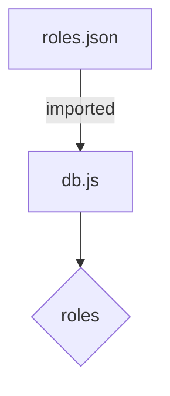
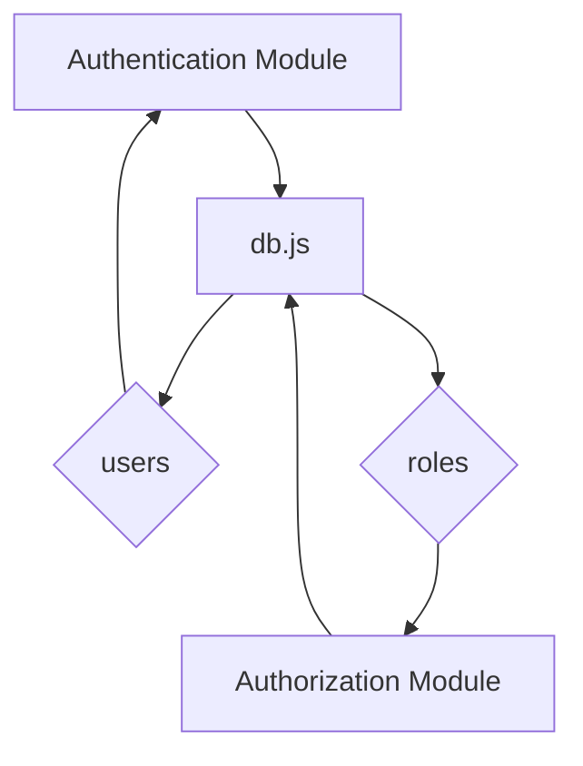

<details>
<summary>Relevant source files</summary>

The following files were used as context for generating this wiki page:

- [src/db.js](https://github.com/aanickode/access-control-service/blob/main/src/db.js)
- [src/models.js](https://github.com/aanickode/access-control-service/blob/main/src/models.js)
</details>

# Data Storage and Access

## Introduction

The "Data Storage and Access" component within this project is responsible for managing user data and role-based access control. It provides a simple in-memory data store for storing user information and role definitions, as well as defining the data models for users and roles.

This component serves as the foundation for implementing authentication and authorization mechanisms within the application, ensuring that users can only access resources and perform actions based on their assigned roles and permissions.

## Data Models

### User Model

The `User` model defines the structure of user data stored in the application. It consists of the following fields:

```javascript
export const User = {
  email: 'string',
  role: 'string'
};
```

- `email` (string): Represents the user's email address, which serves as a unique identifier.
- `role` (string): Specifies the role assigned to the user, which determines their access permissions.

Sources: [src/models.js:1-4]()

### Role Model

The `Role` model defines the structure of role data, which includes the role name and associated permissions.

```javascript
export const Role = {
  name: 'string',
  permissions: ['string']
};
```

- `name` (string): Represents the name of the role.
- `permissions` (array of strings): An array of permission strings associated with the role.

Sources: [src/models.js:6-9]()

## Data Storage

The application uses an in-memory data store implemented in the `db.js` file to store user and role data.

```javascript
const db = {
  users: {
    'admin@internal.company': 'admin',
    'analyst@internal.company': 'analyst',
  },
  roles: roles
};
```

- `users` (object): An object that maps user email addresses to their respective roles.
- `roles` (object): An object containing role definitions, imported from a separate configuration file (`roles.json`).

Sources: [src/db.js:3-9]()

### Role Configuration

The `roles.json` file (not provided in the given source files) likely contains the definitions of roles and their associated permissions. This file is imported and assigned to the `roles` property of the `db` object.



Sources: [src/db.js:1,9]()

## Data Access

The `db` object serves as the central data store for user and role information. Other components of the application can import and use this data store to implement authentication and authorization mechanisms.

For example, an authentication module could check if a user's email and password combination exists in the `db.users` object, and an authorization module could retrieve the user's role from the same object and check their permissions against the `db.roles` object to determine if they have access to a particular resource or action.



Sources: [src/db.js](), [src/models.js]()

## Conclusion

The "Data Storage and Access" component provides a simple in-memory data store for managing user and role data, as well as defining the data models for these entities. It serves as the foundation for implementing authentication and authorization mechanisms within the application, ensuring that users can only access resources and perform actions based on their assigned roles and permissions.

While this implementation is suitable for small-scale applications or prototypes, a production-ready system would likely require a more robust and scalable data storage solution, such as a relational database or a dedicated user management service.