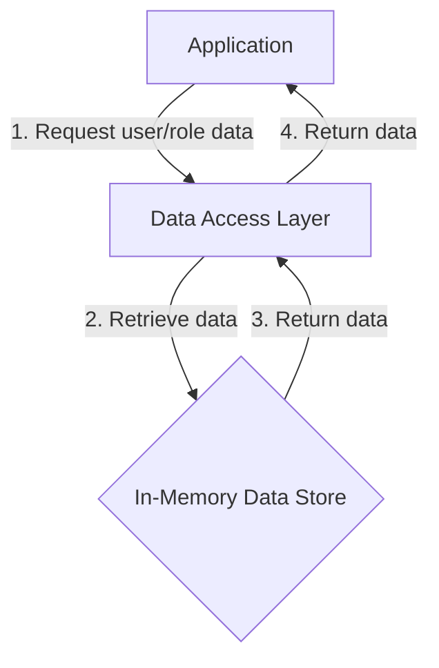

<details>
<summary>Relevant source files</summary>

The following files were used as context for generating this wiki page:

- [src/db.js](https://github.com/aanickode/access-control-service/blob/main/src/db.js)
- [src/models.js](https://github.com/aanickode/access-control-service/blob/main/src/models.js)
</details>

# Data Storage and Access

## Introduction

The "Data Storage and Access" component within this project handles the management and retrieval of user and role data. It serves as a centralized data layer, providing a simple in-memory data store for storing and accessing user information, including their roles and associated permissions.

Sources: [src/db.js](), [src/models.js]()

## Data Models

### User Model

The `User` model represents a user entity within the system. It consists of the following fields:

| Field | Type    | Description                  |
|-------|---------|------------------------------|
| email | string  | The user's email address     |
| role  | string  | The name of the user's role  |

Sources: [src/models.js:1-4]()

### Role Model

The `Role` model defines the structure of a role within the system. It includes the following fields:

| Field       | Type     | Description                                |
|-------------|----------|-------------------------------------------|
| name        | string   | The name of the role                      |
| permissions | string[] | An array of permission strings for the role |

Sources: [src/models.js:6-9]()

## Data Storage

The project uses an in-memory data store implemented as a JavaScript object called `db`. This data store contains two main properties:

1. `users`: An object that maps user email addresses to their respective roles.
2. `roles`: An object that maps role names to their corresponding permissions.

```javascript
const db = {
  users: {
    'admin@internal.company': 'admin',
    'analyst@internal.company': 'analyst',
  },
  roles: roles
};
```

The `roles` object is imported from a JSON configuration file (`roles.json`), allowing for easy management and modification of role permissions.

Sources: [src/db.js:1-10]()

## Data Access

The `db` object serves as the central data access point for retrieving user and role information. Since it is an in-memory data store, there are no explicit functions or methods defined for data access operations. Instead, the data can be accessed directly through the `db` object's properties.

For example, to retrieve a user's role, you can access the `db.users` object using the user's email address as the key:

```javascript
const userRole = db.users['admin@internal.company']; // 'admin'
```

Similarly, to retrieve the permissions associated with a role, you can access the `db.roles` object using the role name as the key:

```javascript
const adminPermissions = db.roles['admin'].permissions;
```

Sources: [src/db.js:1-10]()

## Data Flow Diagram

The following diagram illustrates the high-level data flow within the "Data Storage and Access" component:



1. The application requests user or role data from the Data Access Layer.
2. The Data Access Layer retrieves the requested data from the in-memory data store.
3. The in-memory data store returns the requested data to the Data Access Layer.
4. The Data Access Layer returns the data to the application.

Sources: [src/db.js](), [src/models.js]()

## Conclusion

The "Data Storage and Access" component in this project provides a simple in-memory data store for managing user and role information. It defines data models for users and roles, stores the data in a JavaScript object, and allows direct access to the data through the `db` object. While this approach is suitable for small-scale applications or prototypes, a more robust and scalable data storage solution, such as a database, would be recommended for production environments.