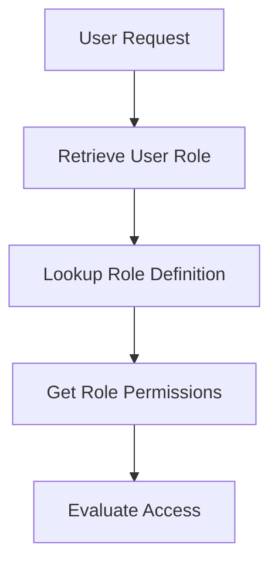

<details>
<summary>Relevant source files</summary>

The following files were used as context for generating this wiki page:

- [src/db.js](https://github.com/aanickode/access-control-service/blob/main/src/db.js)
- [src/models.js](https://github.com/aanickode/access-control-service/blob/main/src/models.js)
</details>

# Data Storage and Access

## Introduction

The "Data Storage and Access" component within this project is responsible for managing user data and role-based access control. It provides a centralized data store for user accounts and their associated roles, as well as the permissions granted to each role. This component serves as the foundation for implementing authentication and authorization mechanisms throughout the application.

Sources: [src/db.js](), [src/models.js]()

## Data Models

### User Model

The `User` model represents a user account within the system. It consists of the following fields:

| Field | Type    | Description                    |
|-------|---------|--------------------------------|
| email | string  | The user's email address       |
| role  | string  | The role assigned to the user  |

Sources: [src/models.js:1-4]()

### Role Model

The `Role` model defines a set of permissions granted to a particular role. It has the following structure:

| Field       | Type     | Description                                |
|-------------|----------|--------------------------------------------| 
| name        | string   | The name or identifier of the role         |
| permissions | string[] | An array of permission strings for the role|

Sources: [src/models.js:6-9]()

## Data Storage

The application uses an in-memory data store implemented as a JavaScript object called `db`. This data store contains two main properties:

1. `users`: An object that maps user email addresses to their respective roles.
2. `roles`: An object that defines the available roles and their associated permissions.

```javascript
const db = {
  users: {
    'admin@internal.company': 'admin',
    'analyst@internal.company': 'analyst',
  },
  roles: roles
};
```

The `roles` object is imported from a JSON configuration file (`roles.json`), allowing for easy management and modification of role definitions.

Sources: [src/db.js:1-10]()

## Role-Based Access Control (RBAC)

The application implements a role-based access control (RBAC) system, where users are assigned roles, and each role is granted a specific set of permissions. This approach simplifies the management of access rights by associating permissions with roles rather than individual users.

To determine a user's permissions, the application first retrieves the user's role from the `users` object in the `db` data store. It then looks up the corresponding role definition in the `roles` object to obtain the associated permissions.



Sources: [src/db.js](), [src/models.js]()

## Potential Enhancements

While the current implementation provides a basic data storage and access control mechanism, there are several potential enhancements that could be considered:

1. **Persistent Storage**: Instead of using an in-memory data store, the application could integrate with a persistent database (e.g., SQL or NoSQL) to store user and role data. This would ensure data persistence across application restarts and enable scalability for larger user bases.

2. **User Authentication**: The current implementation lacks user authentication mechanisms. Adding support for secure authentication (e.g., password-based, token-based, or integration with external identity providers) would enhance the security of the application.

3. **Role Management**: Implementing a role management interface or API would allow administrators to dynamically create, modify, and delete roles, as well as assign or revoke roles for users.

4. **Permission Hierarchies**: The current role model treats permissions as a flat list. Introducing hierarchical or nested permissions could provide more granular access control and better organization of permissions.

5. **Auditing and Logging**: Implementing auditing and logging mechanisms for user actions and access control decisions would improve visibility, enable monitoring, and facilitate troubleshooting and compliance efforts.

Sources: [src/db.js](), [src/models.js]()

## Conclusion

The "Data Storage and Access" component in this project provides a basic foundation for managing user accounts, roles, and permissions. While the current implementation is functional, there are several potential enhancements that could be explored to improve scalability, security, and manageability of the access control system.