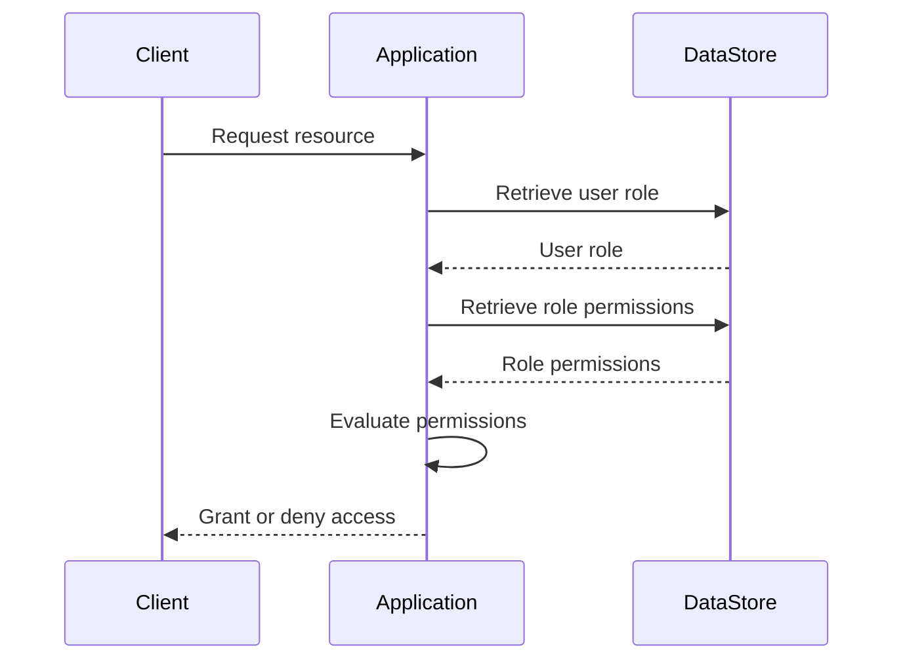
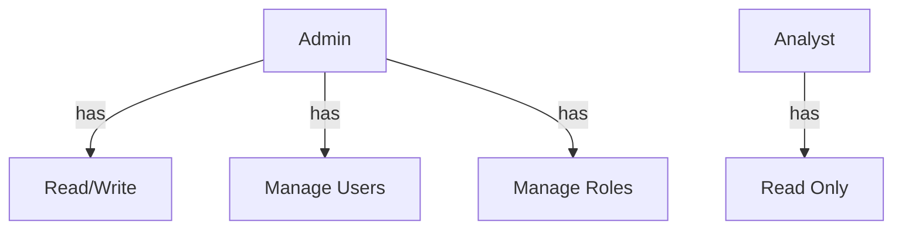

<details>
<summary>Relevant source files</summary>

The following files were used as context for generating this wiki page:

- [src/db.js](https://github.com/aanickode/access-control-service/blob/main/src/db.js)
- [src/models.js](https://github.com/aanickode/access-control-service/blob/main/src/models.js)
</details>

# Data Storage and Access

## Introduction

The "Data Storage and Access" component within this project is responsible for managing user data and role-based access control. It provides a centralized data store for user accounts, their associated roles, and the permissions granted to each role. This component serves as the foundation for implementing authentication and authorization mechanisms throughout the application.

Sources: [src/db.js](), [src/models.js]()

## Data Models

### User Model

The `User` model represents a user account within the system. It consists of the following fields:

| Field | Type    | Description                   |
|-------|---------|-------------------------------|
| email | string  | The user's email address      |
| role  | string  | The role assigned to the user |

Sources: [src/models.js:1-4]()

### Role Model

The `Role` model defines a set of permissions associated with a specific role. It has the following fields:

| Field       | Type     | Description                                  |
|-------------|----------|----------------------------------------------|
| name        | string   | The name or identifier of the role           |
| permissions | string[] | An array of permission strings for the role  |

Sources: [src/models.js:6-9]()

## Data Storage

The application uses an in-memory data store to persist user accounts and role definitions. The `db` object in `src/db.js` serves as the central data store, containing two properties:

1. `users`: An object that maps user email addresses to their respective roles.
2. `roles`: An object that maps role names to their associated permissions.

```javascript
const db = {
  users: {
    'admin@internal.company': 'admin',
    'analyst@internal.company': 'analyst',
  },
  roles: roles
};
```

The `roles` object is imported from a JSON configuration file (`config/roles.json`), allowing for easy management and updates of role definitions.

Sources: [src/db.js:1-10]()

## Access Control Flow

The access control flow within the application can be represented by the following sequence diagram:



1. The client (e.g., a user or another service) requests access to a resource within the application.
2. The application retrieves the user's role from the data store based on their email address.
3. The application then retrieves the permissions associated with the user's role from the data store.
4. The application evaluates the user's permissions against the requested resource.
5. Based on the evaluation, the application either grants or denies access to the requested resource.

Sources: [src/db.js](), [src/models.js]()

## Role Hierarchy (Example)

The role hierarchy within the application can be represented using a graph diagram:



In this example hierarchy:

- The `Admin` role has permissions for `Read/Write`, `Manage Users`, and `Manage Roles`.
- The `Analyst` role has the `Read Only` permission.

The specific permissions and their definitions would be defined in the `config/roles.json` file.

Sources: [src/db.js:10]()

## Conclusion

The "Data Storage and Access" component in this project provides a simple yet extensible mechanism for managing user accounts, roles, and permissions. By leveraging an in-memory data store and a configuration file for role definitions, the application can easily implement role-based access control and authorization mechanisms. The modular design of this component allows for future enhancements, such as integrating with a persistent database or incorporating more advanced access control models.