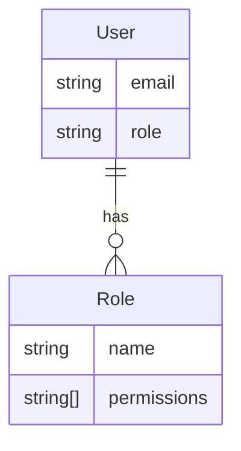

<details>
<summary>Relevant source files</summary>

The following files were used as context for generating this wiki page:

- [src/db.js](https://github.com/aanickode/access-control-service/blob/main/src/db.js)
- [src/models.js](https://github.com/aanickode/access-control-service/blob/main/src/models.js)
</details>

# Data Storage and Access

## Introduction

The "Data Storage and Access" component within this project is responsible for managing user data and role-based access control. It provides a simple in-memory data store and defines the data models for users and roles.

The data store is implemented as a JavaScript object called `db`, which holds user information and role definitions. The `User` and `Role` models define the structure of user and role data, respectively.
Sources: [src/db.js](), [src/models.js]()

## Data Models

### User Model

The `User` model defines the structure of user data, consisting of two properties:

```javascript
export const User = {
  email: 'string',
  role: 'string'
};
```

- `email`: A string representing the user's email address, which serves as the unique identifier.
- `role`: A string representing the user's assigned role.

Sources: [src/models.js:1-4]()

### Role Model

The `Role` model defines the structure of role data, consisting of two properties:

```javascript
export const Role = {
  name: 'string',
  permissions: ['string']
};
```

- `name`: A string representing the name of the role.
- `permissions`: An array of strings representing the permissions associated with the role.

Sources: [src/models.js:6-9]()

## Data Store

The project uses an in-memory data store implemented as a JavaScript object called `db`. It consists of two properties:

```javascript
const db = {
  users: {
    'admin@internal.company': 'admin',
    'analyst@internal.company': 'analyst',
  },
  roles: roles
};
```

- `users`: An object that maps user email addresses to their respective roles.
- `roles`: An object containing role definitions, imported from a JSON file (`roles.json`).

Sources: [src/db.js:3-9]()

### Role Definitions

The role definitions are stored in a separate JSON file (`roles.json`) and imported into the `db` object. The structure and content of this file are not provided in the given source files.

Sources: [src/db.js:1]()

## Data Flow

Based on the provided source files, there is no information about how data is accessed or manipulated within the application. The `db` object and the `User` and `Role` models are defined, but their usage is not evident.

## Mermaid Diagrams

### Data Model Diagram



This entity-relationship diagram illustrates the relationship between the `User` and `Role` models. A user has a single role, and a role can be associated with multiple users.

Sources: [src/models.js]()

### Data Store Structure

```mermaid
graph TD
    A[Data Store (db)]
    B[Users]
    C[Roles]
    A --> B
    A --> C
    B --> D["admin@internal.company: 'admin'"]
    B --> E["analyst@internal.company: 'analyst'"]
    C --> F["roles.json"]
```

This diagram represents the structure of the in-memory data store (`db`). It consists of two main components: `users` (an object mapping user emails to roles) and `roles` (an object containing role definitions imported from a JSON file).

Sources: [src/db.js]()

## Tables

### User Model Properties

| Property | Type   | Description                      |
|----------|--------|----------------------------------|
| `email`  | string | User's email address (unique ID) |
| `role`   | string | User's assigned role             |

Sources: [src/models.js:1-4]()

### Role Model Properties

| Property     | Type     | Description                                |
|--------------|----------|-------------------------------------------|
| `name`       | string   | Name of the role                          |
| `permissions`| string[] | Array of permissions associated with the role |

Sources: [src/models.js:6-9]()

## Conclusion

The "Data Storage and Access" component in this project provides a simple in-memory data store for user and role information. It defines the data models for users and roles, with users having an email address and an assigned role, and roles having a name and a set of associated permissions. The data store itself is a JavaScript object that holds user data and role definitions imported from a JSON file. However, based on the provided source files, there is no information about how this data is accessed or manipulated within the application.