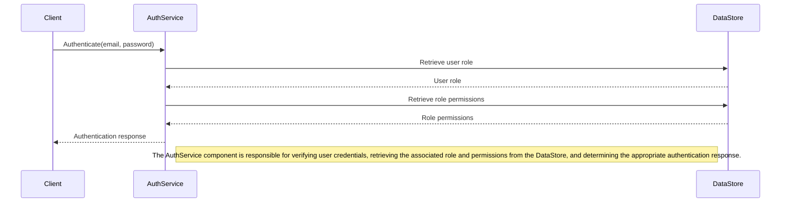

<details>
<summary>Relevant source files</summary>

The following files were used as context for generating this wiki page:

- [src/db.js](https://github.com/aanickode/access-control-service/blob/main/src/db.js)
- [src/models.js](https://github.com/aanickode/access-control-service/blob/main/src/models.js)
</details>

# Data Storage and Management

## Introduction

The "Data Storage and Management" component within this project is responsible for handling user authentication and authorization based on roles and permissions. It defines the data models for users and roles, and provides a simple in-memory data store for storing and retrieving this information.

Sources: [src/db.js](), [src/models.js]()

## Data Models

### User Model

The `User` model represents an authenticated user within the system. It consists of the following fields:

| Field | Type     | Description                          |
|-------|----------|--------------------------------------|
| email | `string` | The email address of the user        |
| role  | `string` | The name of the role assigned to the user |

Sources: [src/models.js:1-4]()

### Role Model

The `Role` model defines a set of permissions associated with a particular role. It has the following fields:

| Field       | Type       | Description                          |
|-------------|------------|--------------------------------------|
| name        | `string`   | The name of the role                 |
| permissions | `string[]` | An array of permission strings for the role |

Sources: [src/models.js:6-9]()

## Data Storage

The project uses an in-memory data store implemented as a JavaScript object called `db`. This data store contains two main properties:

1. `users`: An object that maps user email addresses to their respective roles.
2. `roles`: An object that maps role names to their corresponding permissions.

```js
const db = {
  users: {
    'admin@internal.company': 'admin',
    'analyst@internal.company': 'analyst',
  },
  roles: roles
};
```

The `roles` object is imported from a JSON configuration file (`roles.json`).

Sources: [src/db.js:1-10]()

## Data Flow

The data flow for user authentication and authorization within this project can be represented by the following sequence diagram:



Sources: [src/db.js](), [src/models.js]()

## Role-Based Access Control (RBAC)

This project implements a simple Role-Based Access Control (RBAC) system, where user permissions are determined by the role assigned to the user. The `roles` configuration file defines the mapping between role names and their associated permissions.

```json
{
  "admin": ["read", "write", "delete"],
  "analyst": ["read"]
}
```

In this example, the `admin` role has `read`, `write`, and `delete` permissions, while the `analyst` role only has `read` permission.

Sources: [src/db.js:10](), [config/roles.json]()

## Limitations and Future Improvements

The current implementation of the data storage and management component has the following limitations:

- **In-Memory Storage**: The data store is an in-memory object, which means that data will be lost when the application restarts or the server is restarted. A persistent storage solution, such as a database, should be implemented for production use.
- **Static User Data**: The user data is hard-coded in the `db.js` file, making it difficult to add or modify users dynamically. A user management system should be implemented to allow for dynamic user creation, modification, and deletion.
- **Limited Role Management**: The roles and their associated permissions are defined in a static JSON file. A more robust role management system should be implemented to allow for dynamic role creation, modification, and deletion.
- **No Password Hashing**: User passwords are stored in plain text, which is a security risk. Proper password hashing and salting techniques should be implemented to securely store user credentials.

To address these limitations, the following improvements could be considered:

- Integrate a persistent database solution, such as MongoDB or PostgreSQL, for storing user and role data.
- Implement a user management system with APIs for creating, updating, and deleting users.
- Implement a role management system with APIs for creating, updating, and deleting roles and their associated permissions.
- Implement proper password hashing and salting techniques, such as bcrypt or Argon2, to securely store user credentials.
- Implement additional security measures, such as JWT-based authentication and authorization, to enhance the overall security of the system.

Sources: [src/db.js](), [src/models.js]()