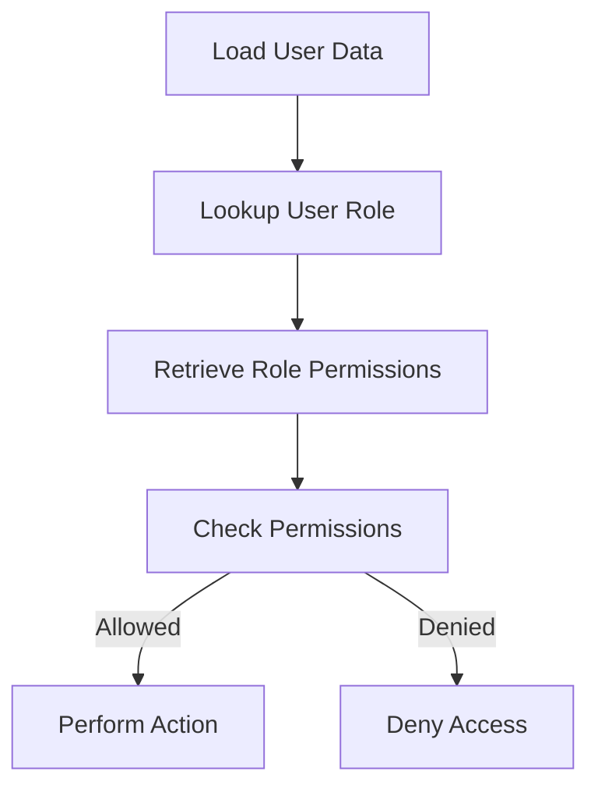

<details>
<summary>Relevant source files</summary>

The following files were used as context for generating this wiki page:

- [src/db.js](https://github.com/aanickode/access-control-service/blob/main/src/db.js)
- [src/models.js](https://github.com/aanickode/access-control-service/blob/main/src/models.js)
</details>

# Data Storage and Management

## Introduction

The "Data Storage and Management" module is responsible for handling user data and role-based access control within the application. It defines the data models for users and roles, and provides a simple in-memory data store for storing and retrieving this information.

Sources: [src/db.js](), [src/models.js]()

## Data Models

### User Model

The `User` model represents a user in the system and has the following properties:

```javascript
export const User = {
  email: 'string',
  role: 'string'
};
```

- `email`: A string representing the user's email address, which serves as a unique identifier.
- `role`: A string representing the user's assigned role, which determines their access permissions.

Sources: [src/models.js:1-4]()

### Role Model

The `Role` model defines the permissions associated with a particular role in the system:

```javascript
export const Role = {
  name: 'string',
  permissions: ['string']
};
```

- `name`: A string representing the name of the role.
- `permissions`: An array of strings, where each string represents a specific permission granted to users with this role.

Sources: [src/models.js:6-9]()

## Data Storage

The application uses an in-memory data store implemented as a JavaScript object called `db`. This data store contains two properties:

```javascript
const db = {
  users: {
    'admin@internal.company': 'admin',
    'analyst@internal.company': 'analyst',
  },
  roles: roles
};
```

- `users`: An object that maps user email addresses to their assigned role names.
- `roles`: An object containing the definitions of available roles and their associated permissions. This object is imported from a separate `roles.json` configuration file.

Sources: [src/db.js:3-9]()

### Role Configuration

The `roles.json` file defines the available roles and their corresponding permissions. Here's an example of what this file might look like:

```json
{
  "admin": ["read", "write", "delete"],
  "analyst": ["read"]
}
```

In this example, the `admin` role has `read`, `write`, and `delete` permissions, while the `analyst` role only has `read` permission.

Sources: [src/db.js:2]()

## Data Flow

The data flow within the "Data Storage and Management" module is relatively simple:

1. User data and role definitions are loaded from the in-memory `db` object and the `roles.json` configuration file, respectively.
2. When a user attempts to perform an action, their email address is used to look up their assigned role in the `users` object.
3. The user's role is then used to retrieve the associated permissions from the `roles` object.
4. Based on the user's permissions, the application can determine whether the requested action is allowed or denied.



Sources: [src/db.js](), [src/models.js]()

## Limitations and Future Improvements

The current implementation of the "Data Storage and Management" module is very basic and has several limitations:

- **In-Memory Storage**: The data store is an in-memory object, which means that all data is lost when the application is restarted or the server is restarted. A persistent storage solution, such as a database, would be required for production use.
- **Static User Data**: User data is hard-coded in the `db` object, making it difficult to add or modify users dynamically.
- **Limited Role Management**: Roles and their associated permissions are defined in a static JSON file, which may not be suitable for more complex role management scenarios.
- **Lack of Authentication**: The module does not provide any authentication mechanisms, assuming that user email addresses are already known and valid.

To address these limitations, future improvements could include:

- Integrating a persistent database or storage solution for storing user and role data.
- Implementing user registration, authentication, and authorization mechanisms.
- Developing a more robust role management system with support for hierarchical roles, dynamic permission assignment, and role inheritance.
- Enhancing the data models to include additional user information, such as names, contact details, and other relevant metadata.

Sources: [src/db.js](), [src/models.js]()