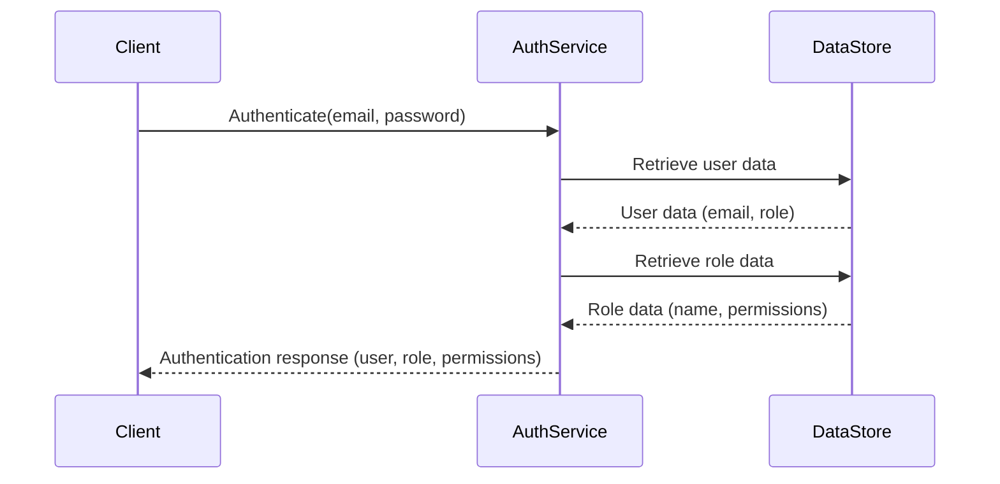

<details>
<summary>Relevant source files</summary>

The following files were used as context for generating this wiki page:

- [src/db.js](https://github.com/aanickode/access-control-service/blob/main/src/db.js)
- [src/models.js](https://github.com/aanickode/access-control-service/blob/main/src/models.js)
</details>

# Data Storage and Management

## Introduction

The "Data Storage and Management" component within this project is responsible for handling user data and role-based access control. It defines the data models for users and roles, as well as providing a simple in-memory data store for storing and retrieving user and role information.

Sources: [src/db.js](), [src/models.js]()

## Data Models

### User Model

The `User` model represents a user entity within the system. It consists of the following fields:

| Field | Type    | Description                  |
|-------|---------|------------------------------|
| email | string  | The user's email address     |
| role  | string  | The name of the user's role  |

Sources: [src/models.js:1-4]()

### Role Model

The `Role` model defines a role within the system, which is associated with a set of permissions. It has the following fields:

| Field       | Type     | Description                                |
|-------------|----------|-------------------------------------------|
| name        | string   | The name of the role                      |
| permissions | string[] | An array of permission strings for the role |

Sources: [src/models.js:6-9]()

## Data Storage

The project uses an in-memory data store implemented as a JavaScript object called `db`. This data store contains two properties:

1. `users`: An object that maps user email addresses to their respective roles.
2. `roles`: An object that maps role names to their corresponding `Role` objects, which define the permissions associated with each role.

```javascript
const db = {
  users: {
    'admin@internal.company': 'admin',
    'analyst@internal.company': 'analyst',
  },
  roles: roles
};
```

The `roles` object is imported from a JSON configuration file located at `config/roles.json`.

Sources: [src/db.js:1-10]()

## Role-based Access Control

The data models and the in-memory data store facilitate role-based access control within the system. Each user is associated with a specific role, and each role has a set of permissions defined in the `roles` configuration.

By mapping users to their respective roles and defining the permissions for each role, the system can implement access control logic based on the user's role and the required permissions for a particular operation or resource.

Sources: [src/db.js](), [src/models.js]()

## Sequence Diagram: User Authentication and Role Retrieval



The sequence diagram above illustrates a potential flow for user authentication and role retrieval within the system:

1. The client initiates the authentication process by providing the user's email and password to the `AuthService`.
2. The `AuthService` retrieves the user data from the `DataStore` based on the provided email.
3. The `DataStore` returns the user data, including the user's email and associated role.
4. The `AuthService` then retrieves the role data from the `DataStore` based on the user's role.
5. The `DataStore` returns the role data, including the role name and associated permissions.
6. Finally, the `AuthService` sends the authentication response back to the client, containing the user information, role, and permissions.

Note: This sequence diagram is a simplified representation based on the provided source files and assumes the existence of an `AuthService` component that interacts with the `DataStore`.

Sources: [src/db.js](), [src/models.js]()

## Conclusion

The "Data Storage and Management" component in this project provides a simple in-memory data store for storing and retrieving user and role information. It defines the data models for users and roles, facilitating role-based access control within the system. By associating users with specific roles and defining permissions for each role, the system can implement access control logic based on the user's role and the required permissions for various operations or resources.