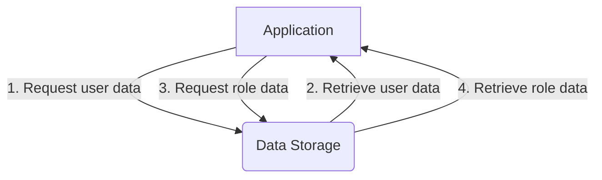

<details>
<summary>Relevant source files</summary>

The following files were used as context for generating this wiki page:

- [src/db.js](https://github.com/aanickode/access-control-service/blob/main/src/db.js)
- [config/roles.json](config/roles.json)

</details>

# Data Storage and Management

## Introduction

The "Data Storage and Management" component within this project is responsible for managing user accounts, roles, and their associated permissions. It serves as a centralized data store, providing access control functionality to other parts of the application. The data is currently stored in-memory using JavaScript objects, but this could potentially be replaced with a more robust database solution in the future.

## Data Model

The data model consists of two main entities: `users` and `roles`. The `users` object is a simple key-value store, where the keys represent email addresses, and the values represent the corresponding user roles. The `roles` object defines the available roles and their associated permissions.

### Users

The `users` object is defined in the `src/db.js` file:

```javascript
const db = {
  users: {
    'admin@internal.company': 'admin',
    'analyst@internal.company': 'analyst',
  },
  // ...
};
```

Sources: [src/db.js:3-6]()

### Roles

The `roles` object is imported from the `config/roles.json` file:

```javascript
import roles from '../config/roles.json' assert { type: 'json' };

const db = {
  // ...
  roles: roles
};
```

Sources: [src/db.js:1,8]()

The `roles.json` file defines the available roles and their associated permissions:

```json
{
  "admin": ["read", "write", "delete"],
  "analyst": ["read"]
}
```

Sources: [config/roles.json]()

## Data Flow

The data flow for accessing and managing user accounts and roles is as follows:



1. The application requests user data from the Data Storage component.
2. The Data Storage component retrieves the requested user data and returns it to the application.
3. The application requests role data from the Data Storage component.
4. The Data Storage component retrieves the requested role data and returns it to the application.

Sources: [src/db.js]()

## Data Access

The Data Storage component exposes a default export containing the `users` and `roles` objects:

```javascript
export default db;
```

Sources: [src/db.js:10]()

Other parts of the application can import this default export to access the user and role data:

```javascript
import db from './db';

const userData = db.users;
const roleData = db.roles;
```

Sources: [src/db.js:10]()

## Limitations and Future Improvements

The current implementation of the Data Storage component uses in-memory JavaScript objects, which may not be suitable for larger-scale applications or scenarios requiring persistent data storage. Future improvements could include integrating a more robust database solution, such as a relational database (e.g., PostgreSQL, MySQL) or a NoSQL database (e.g., MongoDB, Couchbase).

Additionally, the current data model is relatively simple and may need to be extended to accommodate more complex requirements, such as user profiles, role hierarchies, or permission granularity.

Sources: [src/db.js](), [config/roles.json]()