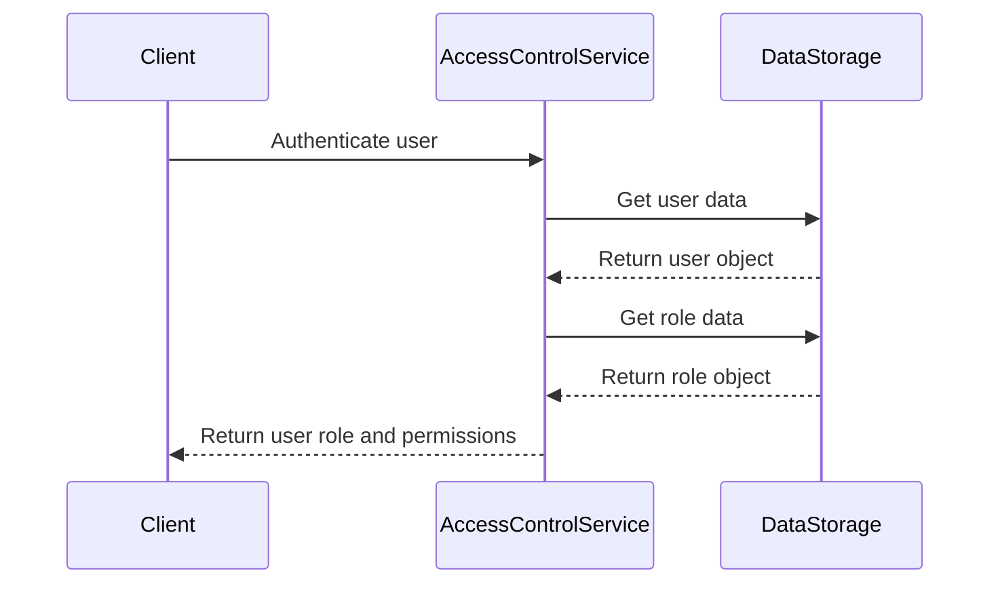

<details>
<summary>Relevant source files</summary>

The following files were used as context for generating this wiki page:

- [src/db.js](https://github.com/aanickode/access-control-service/blob/main/src/db.js)
- [src/models.js](https://github.com/aanickode/access-control-service/blob/main/src/models.js)
</details>

# Data Storage and Management

## Introduction

This wiki page covers the data storage and management aspects of the project. The project appears to be an access control system that manages user roles and permissions. The data storage is implemented using a simple in-memory data structure, which serves as a mock database for the application.

The key components involved in data storage and management are:

1. `db` object: A JavaScript object that acts as an in-memory database, storing user and role information.
2. `User` and `Role` models: Data models defining the structure of user and role objects.

Sources: [src/db.js](), [src/models.js]()

## Data Models

The project defines two data models: `User` and `Role`. These models specify the structure and data types of the respective entities.

### User Model

The `User` model defines the following properties:

| Property | Type     | Description |
|----------|----------|-------------|
| `email`  | `string` | The user's email address, which serves as the unique identifier. |
| `role`   | `string` | The name of the role assigned to the user. |

Sources: [src/models.js:1-4]()

### Role Model

The `Role` model defines the following properties:

| Property     | Type       | Description |
|--------------|------------|-------------|
| `name`       | `string`   | The name of the role. |
| `permissions`| `string[]` | An array of strings representing the permissions granted to the role. |

Sources: [src/models.js:5-8]()

## Data Storage

The project uses an in-memory JavaScript object called `db` to store user and role data. This object serves as a mock database for the application.

```javascript
const db = {
  users: {
    'admin@internal.company': 'admin',
    'analyst@internal.company': 'analyst',
  },
  roles: roles
};
```

The `db` object has two properties:

1. `users`: An object that maps user email addresses (keys) to their respective role names (values).
2. `roles`: An object containing role definitions, which are imported from a separate `roles.json` file.

Sources: [src/db.js:3-9]()

## Role Configuration

The project imports role definitions from an external `roles.json` file. The structure and content of this file are not provided in the given source files.

```javascript
import roles from '../config/roles.json' assert { type: 'json' };
```

Sources: [src/db.js:1]()

## Sequence Diagram: Data Access

The following sequence diagram illustrates a hypothetical scenario where a user's role and permissions are retrieved from the in-memory data storage:



In this scenario:

1. The client (e.g., a web application or API) initiates user authentication with the `AccessControlService`.
2. The `AccessControlService` retrieves the user data from the `DataStorage` (the `db` object).
3. The `DataStorage` returns the user object, which includes the user's role.
4. The `AccessControlService` then retrieves the role data from the `DataStorage`.
5. The `DataStorage` returns the role object, which includes the associated permissions.
6. Finally, the `AccessControlService` sends the user's role and permissions back to the client.

Sources: [src/db.js](), [src/models.js]()

## Summary

The project implements a simple in-memory data storage system using a JavaScript object called `db`. This object stores user and role information, where users are associated with specific roles, and roles define the permissions granted to users. The data models for users and roles are defined in the `src/models.js` file, specifying the structure and data types of the respective entities. The role definitions are imported from an external `roles.json` file, but the content of this file is not provided in the given source files.

While this implementation serves as a mock database for the access control system, in a production environment, a more robust and persistent data storage solution, such as a relational database or a NoSQL database, would likely be used.

Sources: [src/db.js](), [src/models.js]()