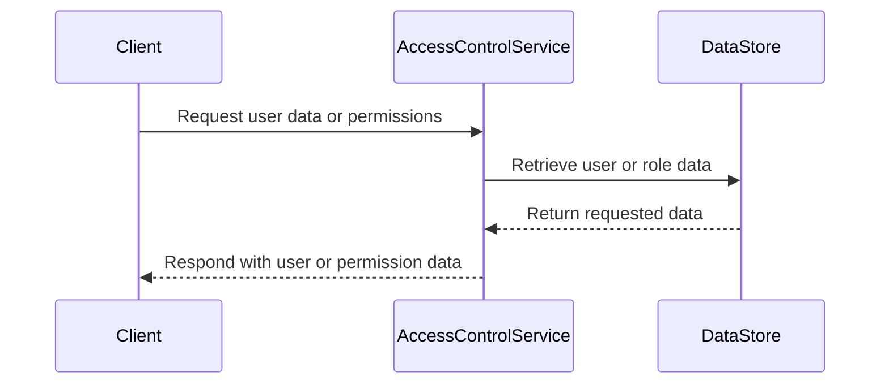

<details>
<summary>Relevant source files</summary>

The following files were used as context for generating this wiki page:

- [src/db.js](https://github.com/aanickode/access-control-service/blob/main/src/db.js)
- [src/models.js](https://github.com/aanickode/access-control-service/blob/main/src/models.js)
</details>

# Data Storage and Management

## Introduction

The "Data Storage and Management" component is responsible for handling user data and role-based access control within the project. It defines the data models for users and roles, and provides a simple in-memory data store for storing and retrieving this information.

Sources: [src/db.js](), [src/models.js]()

## Data Models

### User Model

The `User` model represents a user entity within the system. It has the following properties:

```javascript
export const User = {
  email: 'string',
  role: 'string'
};
```

- `email` (string): The email address of the user, which serves as a unique identifier.
- `role` (string): The name of the role assigned to the user, which determines their access permissions.

Sources: [src/models.js:1-4]()

### Role Model

The `Role` model defines the access permissions associated with a particular role. It has the following properties:

```javascript
export const Role = {
  name: 'string',
  permissions: ['string']
};
```

- `name` (string): The name of the role, which is used to associate users with a set of permissions.
- `permissions` (array of strings): A list of permission strings that define the access rights granted to users with this role.

Sources: [src/models.js:6-9]()

## Data Store

The project uses a simple in-memory data store implemented in the `db.js` file. The data store contains two main objects:

1. `users`: An object that maps user email addresses to their respective roles.
2. `roles`: An object that maps role names to their corresponding permissions.

```javascript
const db = {
  users: {
    'admin@internal.company': 'admin',
    'analyst@internal.company': 'analyst',
  },
  roles: roles
};
```

The `roles` object is imported from a JSON configuration file (`roles.json`), which likely defines the available roles and their associated permissions.

Sources: [src/db.js:1-9]()

## Data Flow

The data flow within the "Data Storage and Management" component can be represented by the following sequence diagram:



1. The client (e.g., another component or service) sends a request to the `AccessControlService` to retrieve user data or permissions.
2. The `AccessControlService` interacts with the `DataStore` to fetch the requested user or role data.
3. The `DataStore` returns the requested data to the `AccessControlService`.
4. The `AccessControlService` processes the data as needed and responds to the client with the requested information.

Sources: [src/db.js](), [src/models.js]()

## Limitations and Future Improvements

While the current implementation provides a basic data store for user and role information, it has several limitations:

- **In-Memory Storage**: The data is stored in-memory, which means it will be lost when the application restarts or the server is restarted. A persistent storage solution, such as a database, would be required for production use.
- **Static Data**: The user and role data is hardcoded or loaded from a static configuration file. A more dynamic and scalable solution would be needed to manage user accounts and roles programmatically.
- **Security Considerations**: The current implementation does not include any security measures, such as password hashing or authentication mechanisms. In a production environment, proper security measures would be necessary to protect user data and enforce access controls.

To address these limitations, future improvements could include:

- Integrating a persistent database or storage solution for user and role data.
- Implementing user account management functionality, including user registration, password management, and role assignment.
- Enhancing security by incorporating authentication mechanisms, such as JSON Web Tokens (JWT) or OAuth, and implementing proper password hashing and storage.
- Developing an administrative interface or API for managing user accounts and roles dynamically.
- Introducing more advanced access control mechanisms, such as hierarchical roles or attribute-based access control (ABAC).

Sources: [src/db.js](), [src/models.js]()