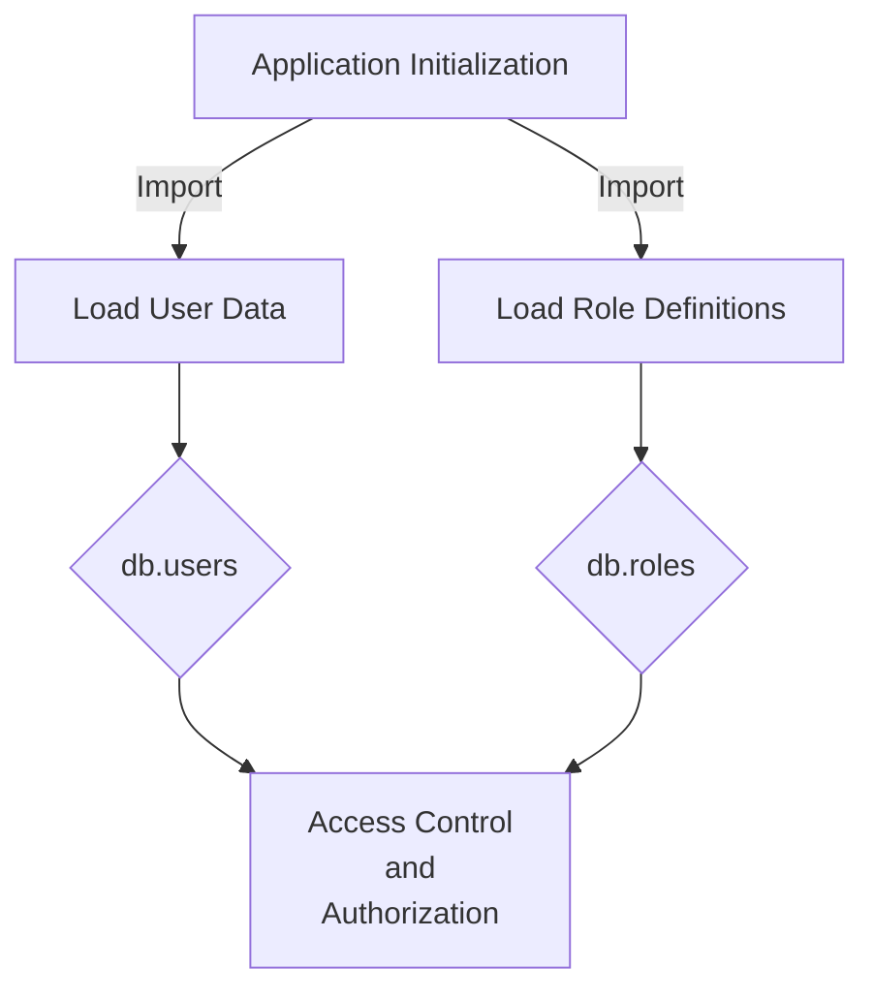
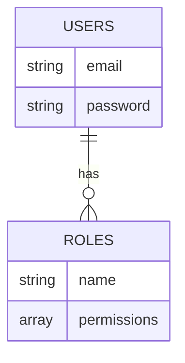

<details>
<summary>Relevant source files</summary>

The following files were used as context for generating this wiki page:

- [src/db.js](https://github.com/aanickode/access-control-service/blob/main/src/db.js)
- [config/roles.json](config/roles.json)

</details>

# Data Storage and Management

## Introduction

The "Data Storage and Management" component within this project is responsible for managing user data and role-based access control (RBAC) rules. It serves as a centralized data store for user credentials and role definitions, facilitating authentication and authorization mechanisms. The data is currently stored in-memory using JavaScript objects, but the architecture allows for future integration with persistent storage solutions like databases.

## Data Structures

### User Data

The user data is stored in an object called `db.users`, which maps user email addresses (keys) to their corresponding passwords (values). This simple structure represents the user credentials for authentication purposes.

```javascript
const db = {
  users: {
    'admin@internal.company': 'admin',
    'analyst@internal.company': 'analyst',
  },
  // ...
};
```

Sources: [src/db.js:3-6]()

### Role Definitions

The role definitions are stored in a separate JSON file (`roles.json`) and imported into the `db` object as `db.roles`. This object contains key-value pairs, where the keys represent role names, and the values are arrays of permissions associated with each role.

```javascript
const db = {
  // ...
  roles: roles
};
```

Sources: [src/db.js:7](), [config/roles.json]()

## Data Flow

The data flow within the "Data Storage and Management" component is relatively straightforward:

1. User data and role definitions are imported and stored in the `db` object during application initialization.
2. Other components or modules can access and utilize this data for authentication, authorization, and access control purposes.



Sources: [src/db.js]()

## Potential Enhancements

While the current implementation uses in-memory data structures, a more robust and scalable solution would involve integrating with a persistent data storage system, such as a relational database or a NoSQL database. This would allow for better data management, scalability, and durability.

Additionally, the current user data structure only stores passwords in plain text, which is a security vulnerability. Implementing secure password hashing and salting mechanisms would greatly improve the security of the application.



Sources: [src/db.js](), [config/roles.json]()

## Conclusion

The "Data Storage and Management" component in this project provides a simple yet functional way to manage user data and role-based access control rules. While the current implementation is suitable for small-scale applications, integrating with a persistent data storage solution and implementing secure password handling mechanisms would be necessary for larger-scale or production-ready systems.