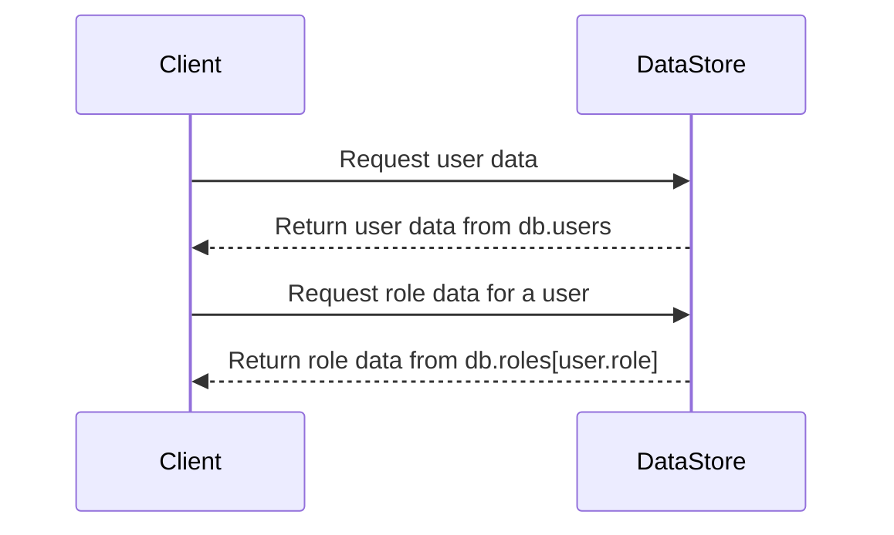

<details>
<summary>Relevant source files</summary>

The following files were used as context for generating this wiki page:

- [src/db.js](https://github.com/aanickode/access-control-service/blob/main/src/db.js)
- [src/models.js](https://github.com/aanickode/access-control-service/blob/main/src/models.js)
</details>

# Data Storage and Management

## Introduction

The "Data Storage and Management" component within this project is responsible for handling user data and role-based access control. It defines the data models for users and roles, as well as providing a simple in-memory data store for storing and retrieving this information.

Sources: [src/db.js](), [src/models.js]()

## Data Models

### User Model

The `User` model represents a user entity within the system. It consists of the following fields:

| Field | Type    | Description                  |
|-------|---------|------------------------------|
| email | string  | The user's email address     |
| role  | string  | The name of the user's role  |

Source: [src/models.js:1-4]()

### Role Model

The `Role` model defines a role within the system, which is associated with a set of permissions. It has the following fields:

| Field       | Type     | Description                                  |
|-------------|----------|----------------------------------------------|
| name        | string   | The name of the role                         |
| permissions | string[] | An array of permission strings for the role |

Source: [src/models.js:6-9]()

## Data Storage

The project uses an in-memory data store implemented as a JavaScript object called `db`. This data store contains two properties:

1. `users`: An object that maps user email addresses to their respective roles.
2. `roles`: An object that maps role names to their corresponding `Role` objects, which define the permissions associated with each role.

```javascript
const db = {
  users: {
    'admin@internal.company': 'admin',
    'analyst@internal.company': 'analyst',
  },
  roles: roles
};
```

The `roles` object is imported from a JSON configuration file (`roles.json`), which is not provided in the given source files.

Source: [src/db.js:1-10]()

## Data Flow

The data flow for retrieving user and role information can be represented by the following sequence diagram:



1. The client requests user data from the `DataStore`.
2. The `DataStore` retrieves the user data from the `db.users` object and returns it to the client.
3. The client requests role data for a specific user.
4. The `DataStore` looks up the user's role in `db.users`, retrieves the corresponding `Role` object from `db.roles`, and returns it to the client.

Sources: [src/db.js](), [src/models.js]()

## Limitations and Future Improvements

While the current implementation provides a simple data store for user and role information, it has several limitations:

- **In-memory storage**: The data is stored in-memory, which means it will be lost when the application restarts or the server is restarted. A persistent storage solution, such as a database, would be required for production use.
- **Static data**: The user and role data is hard-coded in the source files. A more flexible approach would be to allow dynamic management of users and roles, such as through an administrative interface or API.
- **Limited role management**: The current implementation does not provide functionality for creating, updating, or deleting roles. A more robust role management system would be needed for complex access control requirements.
- **No authentication or authorization**: The current implementation does not include any mechanisms for user authentication or authorization based on roles and permissions. These features would need to be implemented for a production-ready access control system.

Sources: [src/db.js](), [src/models.js]()