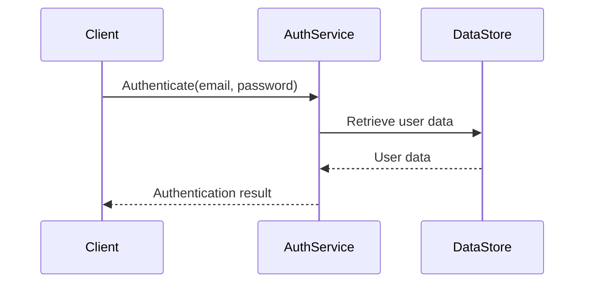

<details>
<summary>Relevant source files</summary>

The following files were used as context for generating this wiki page:

- [src/db.js](https://github.com/aanickode/access-control-service/blob/main/src/db.js)
- [src/models.js](https://github.com/aanickode/access-control-service/blob/main/src/models.js)
</details>

# Data Storage and Management

## Introduction

The "Data Storage and Management" component within this project is responsible for managing user data and role-based access control. It defines the data models for users and roles, and provides a simple in-memory data store for storing and retrieving this information.

Sources: [src/db.js](), [src/models.js]()

## Data Models

### User Model

The `User` model represents a user within the system. It has the following properties:

```javascript
export const User = {
  email: 'string',
  role: 'string'
};
```

- `email` (string): The email address of the user, which serves as a unique identifier.
- `role` (string): The name of the role assigned to the user, which determines their access permissions.

Sources: [src/models.js:1-4]()

### Role Model

The `Role` model defines the access permissions associated with a particular role. It has the following properties:

```javascript
export const Role = {
  name: 'string',
  permissions: ['string']
};
```

- `name` (string): The name of the role, which is used to associate users with a set of permissions.
- `permissions` (array of strings): A list of permission strings that define the access rights granted to users with this role.

Sources: [src/models.js:6-9]()

## Data Store

The project uses an in-memory data store implemented in the `db.js` file. This data store consists of two main components:

1. `users` object: A key-value store where the keys are user email addresses, and the values are the corresponding user roles.
2. `roles` object: An object loaded from the `roles.json` configuration file, which defines the available roles and their associated permissions.

```javascript
import roles from '../config/roles.json' assert { type: 'json' };

const db = {
  users: {
    'admin@internal.company': 'admin',
    'analyst@internal.company': 'analyst',
  },
  roles: roles
};

export default db;
```

Sources: [src/db.js:1-11]()

## Role-based Access Control

The project implements a role-based access control (RBAC) system, where users are assigned roles, and each role has a set of associated permissions. The `roles.json` configuration file defines the available roles and their corresponding permissions.

For example, if the `roles.json` file contains the following:

```json
{
  "admin": ["read", "write", "delete"],
  "analyst": ["read"]
}
```

Then a user with the "admin" role would have read, write, and delete permissions, while a user with the "analyst" role would only have read permissions.

Sources: [src/db.js:3](), [src/models.js:6-9]()

## Sequence Diagram: User Authentication



This sequence diagram illustrates the high-level flow of user authentication within the system:

1. The client (e.g., a web application or API client) initiates the authentication process by calling the `Authenticate` function of the `AuthService` with the user's email and password.
2. The `AuthService` retrieves the user data from the `DataStore` based on the provided email address.
3. The `DataStore` returns the user data, including the user's role, to the `AuthService`.
4. The `AuthService` validates the provided password and returns the authentication result (success or failure) to the client.

Note that this is a simplified example, and the actual implementation may involve additional steps or components, such as password hashing, token generation, or integration with external authentication providers.

Sources: [src/db.js](), [src/models.js]()

## Limitations and Future Improvements

While the current implementation provides a basic data storage and management system for user and role data, it has several limitations:

- **In-memory data store**: The data store is currently implemented as an in-memory object, which means that data will be lost when the application restarts or the server is restarted. A persistent data store, such as a database or file-based storage, should be implemented for production use.
- **Lack of data validation**: The current implementation does not perform any validation or sanitization of user input, which could lead to security vulnerabilities or data inconsistencies.
- **Limited scalability**: As the number of users and roles grows, the in-memory data store may become inefficient and cause performance issues.
- **No support for user management**: The current implementation does not provide functionality for creating, updating, or deleting users or roles.

To address these limitations, future improvements could include:

- Implementing a persistent data store, such as a relational database or a NoSQL database, to ensure data durability and scalability.
- Adding data validation and sanitization mechanisms to ensure data integrity and security.
- Implementing user management functionality, including the ability to create, update, and delete users and roles.
- Integrating with external authentication providers, such as OAuth or SAML, for more robust and secure authentication.
- Implementing caching mechanisms to improve performance for frequently accessed data.
- Adding support for more advanced access control models, such as attribute-based access control (ABAC) or policy-based access control (PBAC).

Sources: [src/db.js](), [src/models.js]()