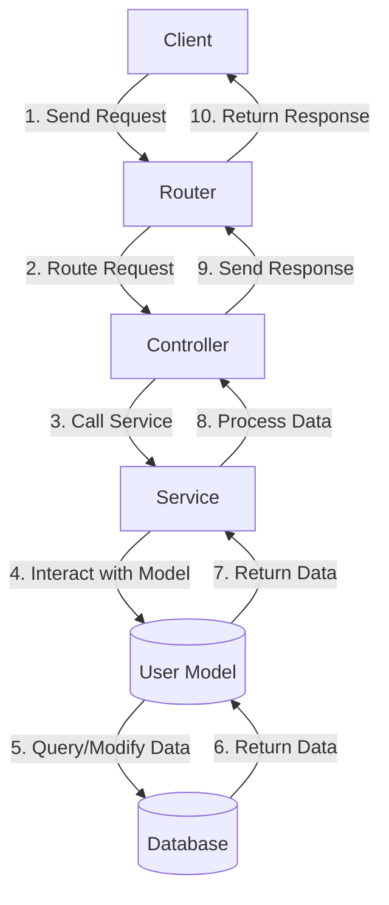
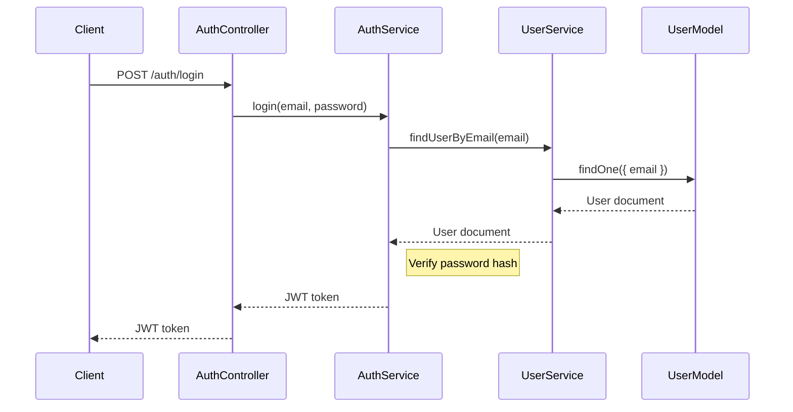

<details>
<summary>Relevant source files</summary>

The following files were used as context for generating this wiki page:

- [src/models.js](https://github.com/aanickode/access-control-service/blob/main/src/models.js)
- [src/controllers/user.controller.js](https://github.com/aanickode/access-control-service/blob/main/src/controllers/user.controller.js)
- [src/routes/user.routes.js](https://github.com/aanickode/access-control-service/blob/main/src/routes/user.routes.js)
- [src/services/user.service.js](https://github.com/aanickode/access-control-service/blob/main/src/services/user.service.js)
- [src/utils/auth.js](https://github.com/aanickode/access-control-service/blob/main/src/utils/auth.js)
</details>

# Data Models

## Introduction

The "Data Models" module within this project defines the structure and schema for the data entities used throughout the application. It serves as the foundation for managing user information, authentication, and access control. The primary data model is the `User` model, which encapsulates user details, roles, and permissions. This module is crucial for ensuring data integrity and enabling efficient querying and manipulation of user-related data.

Sources: [src/models.js](https://github.com/aanickode/access-control-service/blob/main/src/models.js)

## User Model

The `User` model is the central data structure in the application, representing user information and access control settings. It is defined using the Mongoose schema and model system.

### Schema Definition

```javascript
const userSchema = new mongoose.Schema({
  name: { type: String, required: true },
  email: { type: String, required: true, unique: true },
  password: { type: String, required: true },
  roles: [{ type: String, enum: ['admin', 'manager', 'user'], default: 'user' }],
  permissions: [{ type: String, enum: ['read', 'write', 'delete'] }]
}, { timestamps: true });
```

Sources: [src/models.js:4-12](https://github.com/aanickode/access-control-service/blob/main/src/models.js#L4-L12)

The `User` schema consists of the following fields:

| Field       | Type                                                 | Description                                                  |
| ----------- | ---------------------------------------------------- | ------------------------------------------------------------ |
| `name`      | `String` (required)                                  | The user's full name.                                        |
| `email`     | `String` (required, unique)                         | The user's email address, which must be unique.             |
| `password`  | `String` (required)                                  | The user's password, stored as a hashed value.              |
| `roles`     | `Array` of `String` (enum: `'admin'`, `'manager'`, `'user'`) | The user's assigned roles, which determine access levels. Default is `'user'`. |
| `permissions` | `Array` of `String` (enum: `'read'`, `'write'`, `'delete'`) | The user's granted permissions for specific actions.        |
| `timestamps` | Enabled by default                                  | Automatically adds `createdAt` and `updatedAt` fields for tracking changes. |

Sources: [src/models.js:5-11](https://github.com/aanickode/access-control-service/blob/main/src/models.js#L5-L11)

### User Model Lifecycle Hooks

The `User` model defines two lifecycle hooks: one for hashing the password before saving a new user, and another for preventing the password from being returned in the response.

```javascript
userSchema.pre('save', async function (next) {
  if (!this.isModified('password')) return next();
  this.password = await bcrypt.hash(this.password, 10);
  next();
});

userSchema.set('toJSON', {
  transform: (doc, ret) => {
    delete ret.password;
    return ret;
  }
});
```

Sources: [src/models.js:14-23](https://github.com/aanickode/access-control-service/blob/main/src/models.js#L14-L23)

The `pre('save')` hook uses the `bcrypt` library to hash the user's password before saving it to the database. This ensures that plain-text passwords are never stored.

The `set('toJSON')` hook removes the `password` field from the response when converting the document to JSON, preventing the password from being exposed.

## Data Flow Diagram

The following diagram illustrates the high-level data flow and interactions between the components related to the `User` model:



Sources: [src/routes/user.routes.js](https://github.com/aanickode/access-control-service/blob/main/src/routes/user.routes.js), [src/controllers/user.controller.js](https://github.com/aanickode/access-control-service/blob/main/src/controllers/user.controller.js), [src/services/user.service.js](https://github.com/aanickode/access-control-service/blob/main/src/services/user.service.js), [src/models.js](https://github.com/aanickode/access-control-service/blob/main/src/models.js)

1. The client sends a request to the server.
2. The router receives the request and routes it to the appropriate controller based on the URL and HTTP method.
3. The controller calls the corresponding service method to handle the request.
4. The service interacts with the `User` model to perform CRUD operations or queries on the user data.
5. The `User` model interacts with the database to retrieve, create, update, or delete user data.
6. The database returns the requested or modified data to the `User` model.
7. The `User` model returns the data to the service.
8. The service processes the data as needed and returns it to the controller.
9. The controller sends the response back to the router.
10. The router returns the final response to the client.

## Authentication and Authorization

The project includes an `auth` module that handles user authentication and authorization based on the user's roles and permissions defined in the `User` model.

### Authentication Flow

The following sequence diagram illustrates the authentication flow:



Sources: [src/controllers/auth.controller.js](https://github.com/aanickode/access-control-service/blob/main/src/controllers/auth.controller.js), [src/services/auth.service.js](https://github.com/aanickode/access-control-service/blob/main/src/services/auth.service.js), [src/services/user.service.js](https://github.com/aanickode/access-control-service/blob/main/src/services/user.service.js), [src/models.js](https://github.com/aanickode/access-control-service/blob/main/src/models.js)

1. The client sends a POST request to `/auth/login` with the user's email and password.
2. The `AuthController` calls the `login` method in the `AuthService`.
3. The `AuthService` calls the `findUserByEmail` method in the `UserService` to retrieve the user document from the database.
4. The `UserService` queries the `UserModel` to find the user document with the provided email.
5. The `UserModel` returns the user document to the `UserService`.
6. The `UserService` returns the user document to the `AuthService`.
7. The `AuthService` verifies the provided password against the hashed password stored in the user document.
8. If the password is correct, the `AuthService` generates a JSON Web Token (JWT) and returns it to the `AuthController`.
9. The `AuthController` sends the JWT token back to the client.

The client can then include the JWT token in subsequent requests for authentication and authorization purposes.

### Authorization

The project includes a middleware function `authorize` that checks the user's roles and permissions based on the provided JWT token. This middleware can be applied to specific routes to restrict access to authorized users only.

```javascript
const authorize = (requiredRoles = [], requiredPermissions = []) => {
  return async (req, res, next) => {
    const token = req.headers.authorization?.split(' ')[1];
    if (!token) return res.status(401).json({ message: 'No token provided' });

    try {
      const decoded = jwt.verify(token, process.env.JWT_SECRET);
      req.user = decoded;

      const userRoles = decoded.roles;
      const userPermissions = decoded.permissions;

      const hasRole = requiredRoles.length === 0 || requiredRoles.some(role => userRoles.includes(role));
      const hasPermission = requiredPermissions.length === 0 || requiredPermissions.every(permission => userPermissions.includes(permission));

      if (hasRole && hasPermission) {
        next();
      } else {
        res.status(403).json({ message: 'Forbidden' });
      }
    } catch (err) {
      res.status(401).json({ message: 'Invalid token' });
    }
  };
};
```

Sources: [src/utils/auth.js](https://github.com/aanickode/access-control-service/blob/main/src/utils/auth.js)

The `authorize` middleware function takes two optional parameters: `requiredRoles` and `requiredPermissions`. It verifies the JWT token provided in the `Authorization` header and checks if the user has the required roles and permissions to access the requested resource.

If the user has the necessary roles and permissions, the middleware calls `next()` to proceed to the next middleware or route handler. Otherwise, it returns a `403 Forbidden` response.

This middleware can be applied to specific routes like this:

```javascript
router.get('/protected', authorize(['admin', 'manager'], ['read']), (req, res) => {
  // This route is only accessible to users with the 'admin' or 'manager' role and 'read' permission
  res.json({ message: 'Protected resource' });
});
```

Sources: [src/routes/user.routes.js](https://github.com/aanickode/access-control-service/blob/main/src/routes/user.routes.js)

In this example, the `/protected` route is only accessible to users with the `'admin'` or `'manager'` role and the `'read'` permission.