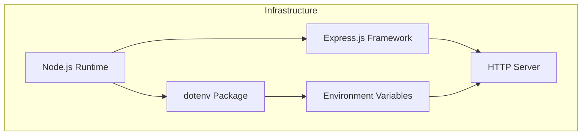

<details>
<summary>Relevant source files</summary>

The following files were used as context for generating this wiki page:

- [.env.example](https://github.com/aanickode/access-control-service/blob/main/.env.example)
- [package.json](https://github.com/aanickode/access-control-service/blob/main/package.json)
</details>

# Deployment and Infrastructure

## Introduction

The "Deployment and Infrastructure" aspect of this project focuses on the configuration and setup required to run the Access Control Service application. The service is built using Node.js and the Express.js framework, allowing it to handle HTTP requests and responses. This section covers the necessary environment variables, dependencies, and scripts for deploying and running the application.
Sources: [.env.example](), [package.json]()

## Environment Configuration

The application relies on environment variables for configuring various settings. The `.env.example` file serves as a template for defining these variables.

### Port Configuration

The `PORT` environment variable specifies the port number on which the application will listen for incoming HTTP requests.

```
PORT=8080
```

This configuration sets the default port to `8080`. However, during deployment, this value can be overridden by setting the `PORT` environment variable to a different port number as needed.
Sources: [.env.example:1]()

## Application Dependencies

The project's dependencies are listed in the `package.json` file, which is used by the Node.js package manager (npm) to install and manage the required packages.

```json
"dependencies": {
  "dotenv": "^16.0.3",
  "express": "^4.18.2"
}
```

The application has the following dependencies:

- **dotenv**: This package is used for loading environment variables from a `.env` file into the `process.env` object.
- **express**: Express.js is a popular web application framework for Node.js, used for building APIs and handling HTTP requests and responses.

Sources: [package.json:8-11]()

## Application Scripts

The `package.json` file also defines scripts for running the application.

```json
"scripts": {
  "start": "node src/index.js"
}
```

The `start` script is used to launch the application by executing the `index.js` file located in the `src` directory.
Sources: [package.json:5-7]()

## Deployment Process

To deploy and run the Access Control Service application, follow these steps:

1. Install the required dependencies by running `npm install` in the project directory.
2. Create a `.env` file in the project root directory and configure the desired `PORT` environment variable.
3. Run the application using the `npm start` command, which executes the `start` script defined in `package.json`.

The application will start listening for incoming HTTP requests on the configured port.

## Infrastructure Overview



The infrastructure for the Access Control Service application consists of the following components:

- **Node.js Runtime**: The application runs on the Node.js runtime environment, which allows it to execute JavaScript code on the server-side.
- **Express.js Framework**: Express.js is a web application framework for Node.js, providing a set of features and utilities for building web applications and APIs.
- **dotenv Package**: The `dotenv` package is used to load environment variables from a `.env` file into the `process.env` object, allowing the application to access and use these variables.
- **HTTP Server**: The Express.js framework creates an HTTP server that listens for incoming requests on the configured port.
- **Environment Variables**: The application relies on environment variables, such as the `PORT` variable, to configure various settings.

Sources: [package.json](), [.env.example]()

In summary, the deployment and infrastructure of the Access Control Service application involve setting up the Node.js runtime environment, installing the required dependencies (Express.js and dotenv), configuring environment variables, and running the application using the provided scripts. The application listens for incoming HTTP requests on the specified port, utilizing the Express.js framework and the configured environment variables.