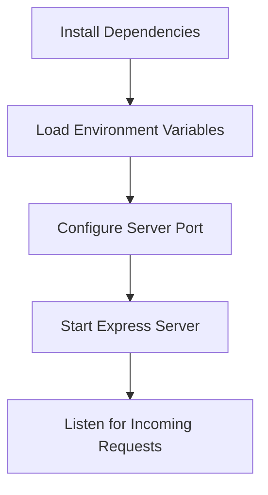

<details>
<summary>Relevant source files</summary>

The following files were used as context for generating this wiki page:

- [.env.example](https://github.com/aanickode/access-control-service/blob/main/.env.example)
- [package.json](https://github.com/aanickode/access-control-service/blob/main/package.json)
</details>

# Deployment and Infrastructure

## Introduction

The "Deployment and Infrastructure" aspect of this project focuses on the configuration and setup required to run the Access Control Service application. The service is built using Node.js and the Express.js framework, and it relies on environment variables for configuring the server port.
Sources: [package.json](https://github.com/aanickode/access-control-service/blob/main/package.json), [.env.example](https://github.com/aanickode/access-control-service/blob/main/.env.example)

## Server Configuration

### Environment Variables

The application uses environment variables to configure various settings. The `.env.example` file provides an example of the environment variables required by the application.

```
PORT=8080
```

This environment variable specifies the port on which the server should listen for incoming requests. The default value is set to `8080`.
Sources: [.env.example:1](https://github.com/aanickode/access-control-service/blob/main/.env.example#L1)

### Server Startup

The application is started by running the `start` script defined in the `package.json` file.

```json
{
  "scripts": {
    "start": "node src/index.js"
  }
}
```

This script starts the application by executing the `index.js` file located in the `src` directory.
Sources: [package.json:5](https://github.com/aanickode/access-control-service/blob/main/package.json#L5)

## Dependencies

The application relies on the following dependencies, which are listed in the `package.json` file:

```json
{
  "dependencies": {
    "dotenv": "^16.0.3",
    "express": "^4.18.2"
  }
}
```

- **dotenv**: This package is used for loading environment variables from a `.env` file into the `process.env` object.
- **express**: This is the core web application framework used for building the Access Control Service.

Sources: [package.json:7-10](https://github.com/aanickode/access-control-service/blob/main/package.json#L7-L10)

## Deployment Flow

The deployment process for the Access Control Service can be summarized as follows:



1. Install the required dependencies listed in the `package.json` file.
2. Load the environment variables from the `.env` file using the `dotenv` package.
3. Configure the server port using the `PORT` environment variable.
4. Start the Express.js server by executing the `index.js` file.
5. The server listens for incoming requests on the configured port.

Sources: [package.json](https://github.com/aanickode/access-control-service/blob/main/package.json), [.env.example](https://github.com/aanickode/access-control-service/blob/main/.env.example)

## Summary

The "Deployment and Infrastructure" aspect of this project focuses on configuring the server environment and starting the Express.js application. The application relies on environment variables for server configuration and uses the `dotenv` package to load these variables from a `.env` file. The server listens for incoming requests on the configured port, which is specified by the `PORT` environment variable.