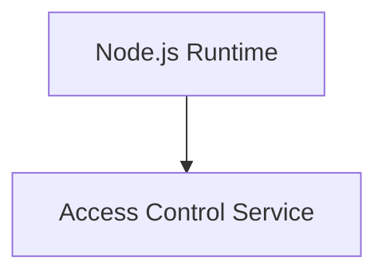
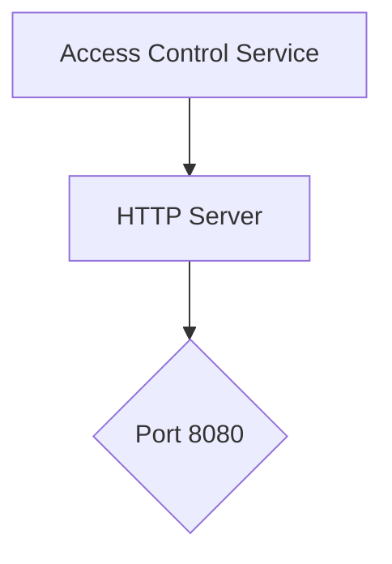
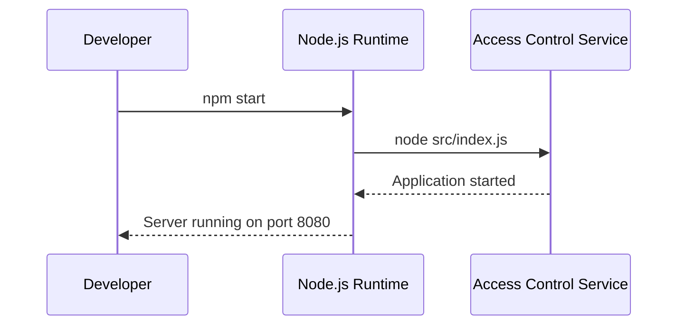

<details>
<summary>Relevant source files</summary>

The following files were used as context for generating this wiki page:

- [.env.example](https://github.com/aanickode/access-control-service/blob/main/.env.example)
- [package.json](https://github.com/aanickode/access-control-service/blob/main/package.json)
</details>

# Deployment and Infrastructure

## Introduction

The "Deployment and Infrastructure" aspect of this project primarily deals with the configuration and setup required to run the Access Control Service application. It covers the application's runtime environment, dependencies, and the server configuration necessary for deployment.

Sources: [package.json](), [.env.example]()

## Application Runtime Environment

The Access Control Service is a Node.js application, as indicated by the presence of the `package.json` file and the use of the `node` command to start the application.



Sources: [package.json]()

## Dependencies

The application relies on the following third-party dependencies, which are specified in the `package.json` file:

| Dependency | Description |
| --- | --- |
| dotenv | A module that loads environment variables from a `.env` file into `process.env`. |
| express | A fast and minimalist web application framework for Node.js. |

Sources: [package.json]()

## Server Configuration

### Port

The application listens for incoming requests on a specific port, which can be configured using the `PORT` environment variable. The default port is set to `8080` in the provided `.env.example` file.



Sources: [.env.example:1]()

## Application Startup

The application can be started by running the following command:

```
node src/index.js
```

This command is defined in the `scripts.start` field of the `package.json` file.



Sources: [package.json:5]()

## Summary

The "Deployment and Infrastructure" aspect of this project covers the basic setup and configuration required to run the Access Control Service application. It includes the Node.js runtime environment, third-party dependencies, server configuration (specifically the port), and the application startup process. While the provided source files do not contain detailed information about the deployment process or infrastructure, they provide the necessary context for setting up the application's runtime environment.