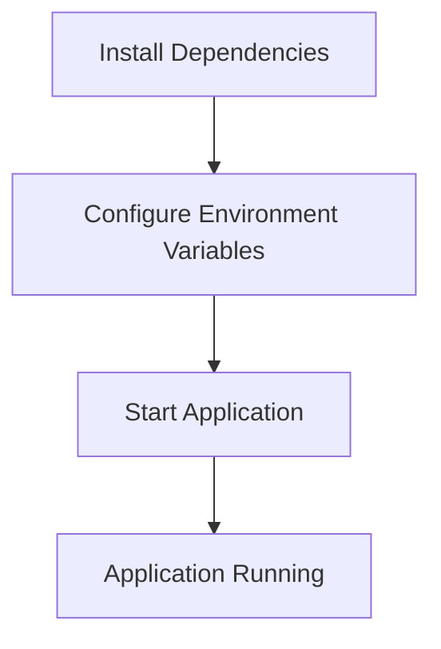

<details>
<summary>Relevant source files</summary>

The following files were used as context for generating this wiki page:

- [.env.example](https://github.com/aanickode/access-control-service/blob/main/.env.example)
- [package.json](https://github.com/aanickode/access-control-service/blob/main/package.json)
</details>

# Deployment and Infrastructure

## Introduction

The "Deployment and Infrastructure" aspect of this project focuses on the configuration and setup required to run the Access Control Service application. It covers the application's runtime environment, dependencies, and the process of starting the service. Based on the provided source files, this service appears to be a Node.js application built with Express.js framework. 
Sources: [package.json](https://github.com/aanickode/access-control-service/blob/main/package.json)

## Application Configuration

### Environment Variables

The application uses environment variables for configuration purposes. The `.env.example` file provides an example of the environment variables that can be set.

```
PORT=8080
```

This file defines a single environment variable `PORT` with a default value of `8080`. This variable likely specifies the port number on which the application will listen for incoming requests.
Sources: [.env.example](https://github.com/aanickode/access-control-service/blob/main/.env.example)

## Application Dependencies

The project's dependencies are listed in the `package.json` file, which is a standard file used by Node.js projects to manage dependencies and scripts.

```json
"dependencies": {
  "dotenv": "^16.0.3",
  "express": "^4.18.2"
}
```

The application has two main dependencies:

1. **dotenv**: A module that loads environment variables from a `.env` file into `process.env`.
2. **express**: A popular web application framework for Node.js, used for building APIs and web servers.

Sources: [package.json](https://github.com/aanickode/access-control-service/blob/main/package.json)

## Application Startup

The `package.json` file also defines a script for starting the application:

```json
"scripts": {
  "start": "node src/index.js"
}
```

The `start` script runs the command `node src/index.js`, which likely starts the main entry point of the application located in the `src/index.js` file.
Sources: [package.json](https://github.com/aanickode/access-control-service/blob/main/package.json)

## Deployment Flow

Based on the provided information, the deployment flow for this application can be summarized as follows:



1. Install the required dependencies listed in `package.json` using a package manager like `npm` or `yarn`.
2. Configure the environment variables, such as the `PORT` variable, by creating a `.env` file or setting them in the system environment.
3. Start the application by running the `start` script defined in `package.json`, which executes the main entry point file (`src/index.js`).
4. The application should now be running and listening for incoming requests on the configured port.

Sources: [.env.example](https://github.com/aanickode/access-control-service/blob/main/.env.example), [package.json](https://github.com/aanickode/access-control-service/blob/main/package.json)

## Conclusion

The "Deployment and Infrastructure" aspect of this project covers the basic setup and configuration required to run the Access Control Service application. It involves installing dependencies, setting environment variables, and starting the application using the provided scripts. The application is built with Node.js and Express.js framework, and it listens for incoming requests on a configurable port.