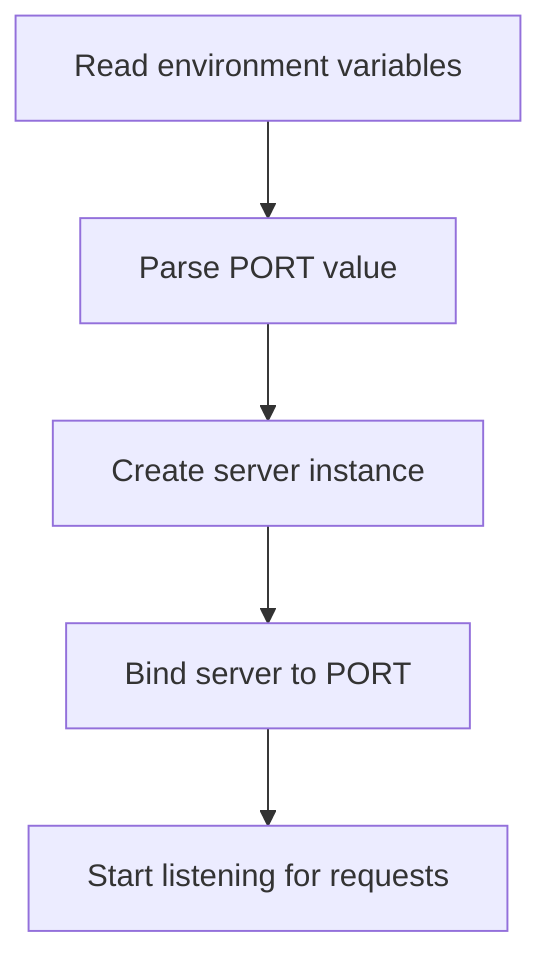

<details>
<summary>Relevant source files</summary>

The following file was used as context for generating this wiki page:

- [.env.example](https://github.com/aanickode/access-control-service/blob/main/.env.example)

</details>

# Deployment and Infrastructure

## Introduction

The deployment and infrastructure setup for this project appears to be relatively straightforward. Based on the provided `.env.example` file, the application is designed to run on a single server or instance, listening on a configurable port. The lack of additional configuration files or deployment scripts suggests a simple, monolithic deployment approach, potentially suitable for smaller-scale applications or initial development stages.

## Application Server

### Server Configuration

The application server is configured to listen on a specific port, which can be set using the `PORT` environment variable. The default value for `PORT` is `8080`, as shown in the `.env.example` file.

```
PORT=8080
```

Sources: [.env.example:1]()

### Server Startup

While the provided files do not include the actual server startup code, it is reasonable to assume that the application server will read the `PORT` environment variable and bind to the specified port during initialization.

A typical server startup process might involve the following steps:



Sources: [.env.example:1]() (Inferred from the presence of the `PORT` environment variable)

## Infrastructure and Deployment

Based on the limited information available in the provided file, it is difficult to determine the specific infrastructure and deployment details for this project. However, some potential scenarios can be inferred:

1. **Local Development**: For local development purposes, the application can be run directly on the developer's machine, with the `PORT` environment variable set to the desired value (e.g., `8080`).

2. **Single Server Deployment**: The application could be deployed on a single server or virtual machine, with the `PORT` environment variable configured to the desired value during the deployment process.

3. **Container-based Deployment**: The application might be containerized (e.g., using Docker) and deployed to a container orchestration platform (e.g., Kubernetes). In this case, the `PORT` environment variable would be set within the container configuration.

Without additional deployment scripts, infrastructure-as-code files, or configuration management tools, it is challenging to provide more specific details about the deployment and infrastructure setup for this project.

## Conclusion

While the provided `.env.example` file offers limited information, it suggests a relatively simple deployment and infrastructure setup for this project. The application is designed to run on a single server or instance, with the ability to configure the listening port via an environment variable. However, the lack of additional deployment-related files makes it difficult to provide more comprehensive details about the infrastructure and deployment processes.