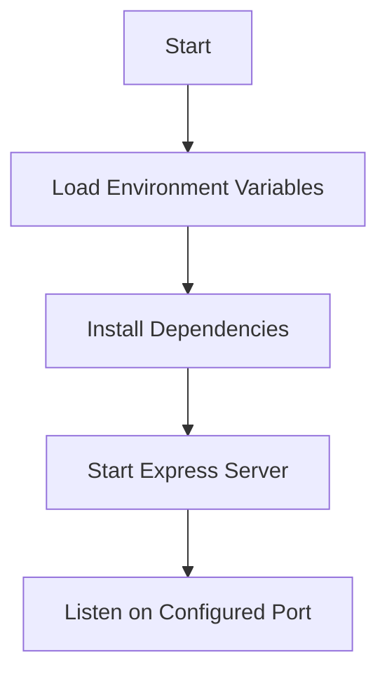

<details>
<summary>Relevant source files</summary>

The following files were used as context for generating this wiki page:

- [.env.example](https://github.com/aanickode/access-control-service/blob/main/.env.example)
- [package.json](https://github.com/aanickode/access-control-service/blob/main/package.json)
</details>

# Deployment and Infrastructure

## Introduction

The "Deployment and Infrastructure" aspect of this project revolves around the setup and configuration required to run the Access Control Service application. Based on the provided source files, this service appears to be a Node.js Express application that listens on a specified port for incoming requests. The deployment and infrastructure components facilitate the hosting and execution of this service.

Sources: [.env.example](), [package.json]()

## Application Configuration

### Environment Variables

The application utilizes environment variables for configuration purposes. The [.env.example](.env.example) file provides an example of the environment variables that need to be set.

```
PORT=8080
```

This environment variable specifies the port on which the application should listen for incoming requests. The default value is set to `8080`.

Sources: [.env.example:1]()

## Application Dependencies

The application's dependencies are managed through the [package.json](package.json) file, which is a standard file used in Node.js projects to specify project metadata and dependencies.

```json
{
  "dependencies": {
    "dotenv": "^16.0.3",
    "express": "^4.18.2"
  }
}
```

The application relies on the following dependencies:

- `dotenv`: A module that loads environment variables from a `.env` file into `process.env`.
- `express`: A fast and minimalist web application framework for Node.js.

Sources: [package.json:7-10]()

## Application Entry Point

The [package.json](package.json) file also specifies the entry point for the application through the `start` script:

```json
{
  "scripts": {
    "start": "node src/index.js"
  }
}
```

This script indicates that the application's entry point is located at `src/index.js`. When running the `npm start` command, Node.js will execute the code in this file, which likely sets up and starts the Express server.

Sources: [package.json:5-7]()

## Deployment and Infrastructure Flow

Based on the provided source files, the deployment and infrastructure flow for this application can be summarized as follows:



1. The application starts by loading the environment variables from the `.env` file using the `dotenv` module.
2. The required dependencies (`dotenv` and `express`) are installed using the package manager (e.g., npm or yarn).
3. The Express server is set up and started, likely in the `src/index.js` file.
4. The Express server listens for incoming requests on the port specified by the `PORT` environment variable (default: 8080).

Sources: [.env.example](), [package.json]()

## Conclusion

The "Deployment and Infrastructure" aspect of this project focuses on setting up the necessary environment and dependencies for running the Access Control Service application, which is a Node.js Express server. The application's configuration is managed through environment variables, and its dependencies are specified in the `package.json` file. The deployment process involves loading the environment variables, installing the required dependencies, and starting the Express server to listen for incoming requests on the configured port.