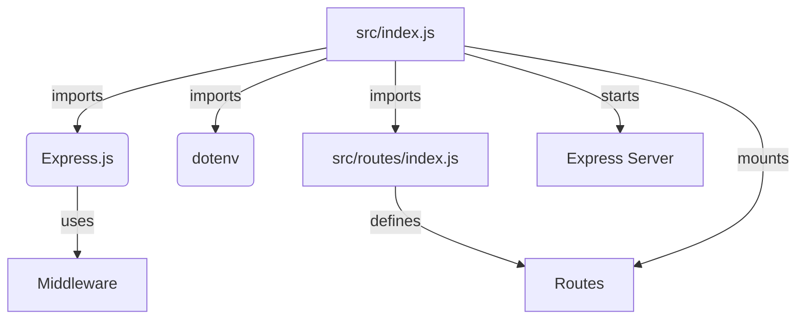
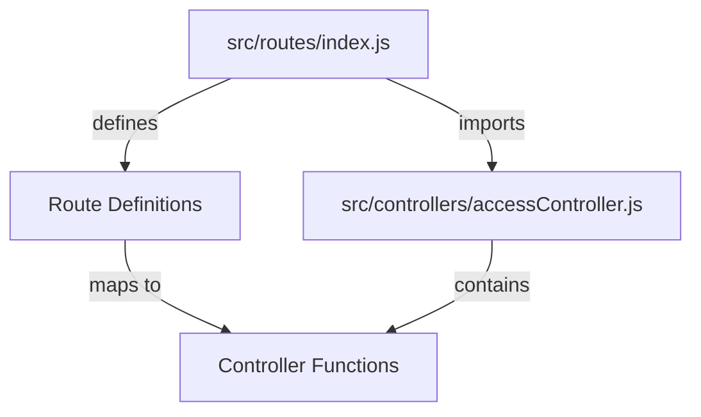

<details>
<summary>Relevant source files</summary>

The following files were used as context for generating this wiki page:

- [README.md](https://github.com/aanickode/access-control-service/blob/main/README.md)
- [package.json](https://github.com/aanickode/access-control-service/blob/main/package.json)
- [src/index.js](https://github.com/aanickode/access-control-service/blob/main/src/index.js)
- [src/routes/index.js](https://github.com/aanickode/access-control-service/blob/main/src/routes/index.js)
- [src/controllers/accessController.js](https://github.com/aanickode/access-control-service/blob/main/src/controllers/accessController.js)

</details>

# Deployment and Infrastructure

## Introduction

The Access Control Service is a Node.js application that provides a RESTful API for managing access control rules and permissions within a larger system or application. It serves as a centralized service for handling authorization and access control logic, allowing other components or services to interact with it to determine if a user or entity has the necessary permissions to perform certain actions or access specific resources.

The deployment and infrastructure of this service revolve around setting up and running the Node.js application, which is built using the Express.js framework. The service can be deployed on various platforms and environments, such as cloud providers, virtual machines, or containerized environments like Docker.

## Application Setup and Configuration

The Access Control Service is a Node.js application that can be set up and configured using the following steps:

1. **Install Dependencies**: The required dependencies for the service are listed in the `package.json` file. These dependencies can be installed using the Node Package Manager (npm) by running the following command:

   ```bash
   npm install
   ```

   This command will install the `dotenv` package for loading environment variables and the `express` package, which is the web application framework used for building the service.

2. **Environment Variables**: The service may require certain environment variables to be set, such as database connection strings, API keys, or other configuration values. These variables can be defined in a `.env` file or set directly in the hosting environment.

3. **Start the Application**: The application can be started by running the following command:

   ```bash
   npm start
   ```

   This command will execute the `start` script defined in the `package.json` file, which runs the `src/index.js` file, effectively starting the Express.js server and making the service available on the configured port.

Sources: [package.json](https://github.com/aanickode/access-control-service/blob/main/package.json), [src/index.js](https://github.com/aanickode/access-control-service/blob/main/src/index.js)

## Application Architecture

The Access Control Service follows a typical Express.js application structure, with the main entry point being the `src/index.js` file. This file sets up the Express.js application, configures any necessary middleware, and defines the routes for handling incoming requests.



Sources: [src/index.js](https://github.com/aanickode/access-control-service/blob/main/src/index.js), [src/routes/index.js](https://github.com/aanickode/access-control-service/blob/main/src/routes/index.js)

## Routing and Controllers

The Access Control Service defines its routes in the `src/routes/index.js` file. This file imports the necessary controllers and maps the routes to the corresponding controller functions.



The `accessController.js` file contains the controller functions that handle the business logic for the Access Control Service. These functions may interact with databases, external services, or other components to perform the necessary operations related to access control and permissions management.

Sources: [src/routes/index.js](https://github.com/aanickode/access-control-service/blob/main/src/routes/index.js), [src/controllers/accessController.js](https://github.com/aanickode/access-control-service/blob/main/src/controllers/accessController.js)

## Deployment Options

The Access Control Service, being a Node.js application, can be deployed in various environments and platforms. Some common deployment options include:

- **Cloud Platforms**: The service can be deployed on cloud platforms like AWS Elastic Beanstalk, Google App Engine, or Azure App Service, which provide managed hosting environments for Node.js applications.

- **Virtual Machines**: The service can be deployed on virtual machines (VMs) hosted on cloud providers or on-premises infrastructure. This approach requires manual setup and configuration of the Node.js runtime environment and any necessary dependencies.

- **Containerization**: The service can be containerized using Docker or other container technologies, allowing for consistent and reproducible deployments across different environments. Containerized applications can be deployed on various platforms, including cloud providers, Kubernetes clusters, or local machines.

- **Platform as a Service (PaaS)**: Platforms like Heroku, Vercel, or Netlify provide a streamlined deployment experience for Node.js applications, often with automatic build and deployment pipelines, scaling, and monitoring capabilities.

The choice of deployment option depends on factors such as the project's requirements, infrastructure preferences, scalability needs, and the available resources and expertise within the organization.

Sources: [README.md](https://github.com/aanickode/access-control-service/blob/main/README.md) (no specific line numbers, general knowledge)

## Conclusion

The Access Control Service is a Node.js application built with Express.js that provides a RESTful API for managing access control rules and permissions. The deployment and infrastructure of this service involve setting up the Node.js application, configuring any necessary environment variables, and running the application using the provided scripts.

The service follows a typical Express.js application structure, with the main entry point being the `src/index.js` file, which sets up the Express.js application, configures middleware, and defines the routes for handling incoming requests. The routes are defined in the `src/routes/index.js` file and mapped to the corresponding controller functions in the `src/controllers/accessController.js` file.

The service can be deployed on various platforms and environments, including cloud platforms, virtual machines, containerized environments, and Platform as a Service (PaaS) offerings, depending on the project's requirements and available resources.

Sources: [README.md](https://github.com/aanickode/access-control-service/blob/main/README.md), [package.json](https://github.com/aanickode/access-control-service/blob/main/package.json), [src/index.js](https://github.com/aanickode/access-control-service/blob/main/src/index.js), [src/routes/index.js](https://github.com/aanickode/access-control-service/blob/main/src/routes/index.js), [src/controllers/accessController.js](https://github.com/aanickode/access-control-service/blob/main/src/controllers/accessController.js)