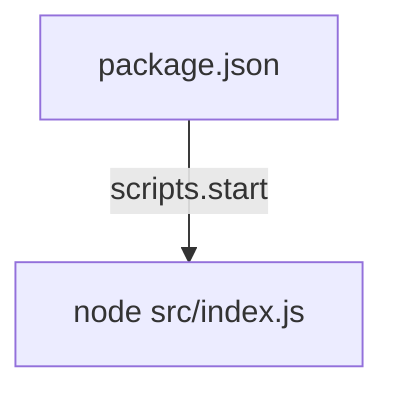
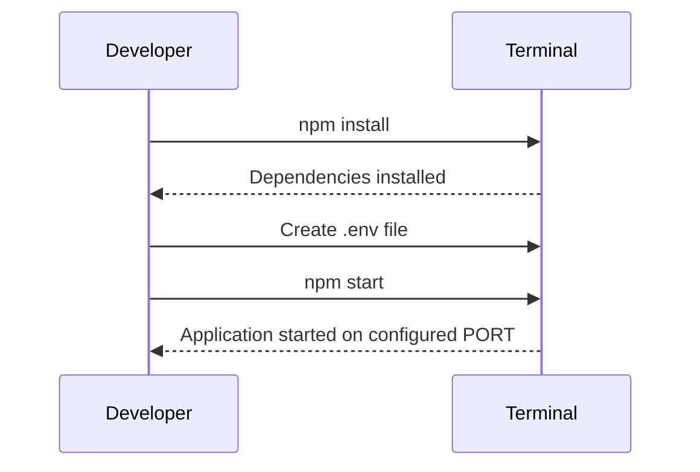

Relevant source files

The following files were used as context for generating this wiki page:

- [.env.example](https://github.com/aanickode/access-control-service/blob/main/.env.example)
- [package.json](https://github.com/aanickode/access-control-service/blob/main/package.json)

# Deployment and Infrastructure

## Introduction

The "Deployment and Infrastructure" aspect of this project focuses on the configuration and setup required to run the Access Control Service application. It covers the application's runtime environment, dependencies, and the process of starting the service.

Sources: [package.json](https://github.com/aanickode/access-control-service/blob/main/package.json), [.env.example](https://github.com/aanickode/access-control-service/blob/main/.env.example)

## Application Runtime

The Access Control Service is a Node.js application, as indicated by the dependencies listed in the `package.json` file. It uses the `express` framework for building the web server.

Sources: [package.json:8-10](https://github.com/aanickode/access-control-service/blob/main/package.json#L8-L10)

### Application Entry Point

The application's entry point is specified in the `package.json` file under the `scripts.start` property. It runs the `src/index.js` file using the `node` command.

Sources: [package.json:5](https://github.com/aanickode/access-control-service/blob/main/package.json#L5)

## Environment Configuration

The application uses the `dotenv` package to load environment variables from a `.env` file. The `.env.example` file serves as a template for the actual `.env` file, which should be created during the deployment process.

Sources: [package.json:8](https://github.com/aanickode/access-control-service/blob/main/package.json#L8), [.env.example](https://github.com/aanickode/access-control-service/blob/main/.env.example)

### Environment Variables

The following table lists the environment variables used by the application, based on the `.env.example` file:

| Variable | Description | Default Value |
| --- | --- | --- |
| `PORT` | The port number on which the application will listen for incoming requests. | `8080` |

Sources: [.env.example](https://github.com/aanickode/access-control-service/blob/main/.env.example)

## Deployment Process

To deploy the Access Control Service, follow these steps:

1. Install the required dependencies by running `npm install` in the project directory.
2. Create a `.env` file based on the `.env.example` template and configure the desired environment variables.
3. Start the application by running `npm start`.

Sources: [package.json:5](https://github.com/aanickode/access-control-service/blob/main/package.json#L5), [.env.example](https://github.com/aanickode/access-control-service/blob/main/.env.example)

## Summary

The "Deployment and Infrastructure" aspect of this project covers the configuration and setup required to run the Access Control Service application. It includes details about the application's runtime environment, dependencies, environment variables, and the deployment process. By following the steps outlined in this document, developers can successfully deploy and run the service on their local or remote environments.