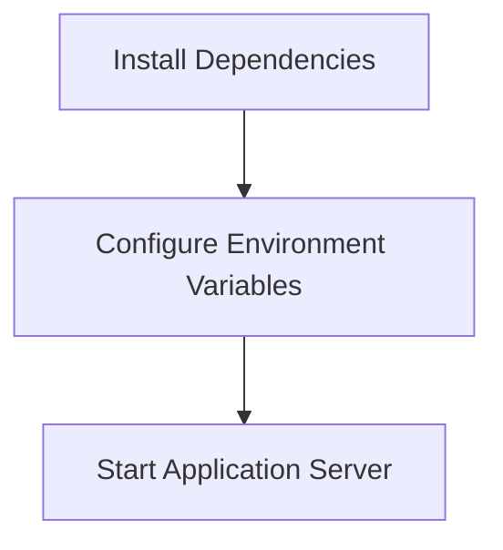

<details>
<summary>Relevant source files</summary>

The following files were used as context for generating this wiki page:

- [.env.example](https://github.com/aanickode/access-control-service/blob/main/.env.example)
- [package.json](https://github.com/aanickode/access-control-service/blob/main/package.json)
</details>

# Deployment and Infrastructure

## Introduction

The "Deployment and Infrastructure" aspect of this project focuses on the configuration and setup required to run the Access Control Service application. This service is built using Node.js and the Express.js framework, and it is designed to be deployed as a standalone server application. The deployment process involves setting up the necessary environment variables and dependencies, and then starting the application server.

Sources: [package.json](https://github.com/aanickode/access-control-service/blob/main/package.json), [.env.example](https://github.com/aanickode/access-control-service/blob/main/.env.example)

## Environment Configuration

The application relies on environment variables for configuring various settings, such as the server port. The `.env.example` file provides a template for the required environment variables.

```
PORT=8080
```

This configuration specifies that the application server should listen on port 8080 by default.

Sources: [.env.example](https://github.com/aanickode/access-control-service/blob/main/.env.example)

## Application Dependencies

The project's dependencies are listed in the `package.json` file, which is used by the Node.js package manager (npm) to install and manage the required packages.

```json
{
  "dependencies": {
    "dotenv": "^16.0.3",
    "express": "^4.18.2"
  }
}
```

The two main dependencies are:

1. **dotenv**: This package is used to load environment variables from a `.env` file into the Node.js process.
2. **express**: This is the core web application framework used to build the Access Control Service.

Sources: [package.json](https://github.com/aanickode/access-control-service/blob/main/package.json)

## Application Startup

The `package.json` file also defines a `start` script that is used to launch the application server.

```json
{
  "scripts": {
    "start": "node src/index.js"
  }
}
```

This script runs the `index.js` file located in the `src` directory, which is likely the entry point of the application.

Sources: [package.json](https://github.com/aanickode/access-control-service/blob/main/package.json)

## Deployment Process

Based on the provided source files, the deployment process for the Access Control Service can be summarized as follows:

1. Install the required dependencies by running `npm install` in the project directory.
2. Create a `.env` file in the project root directory and configure the required environment variables (e.g., `PORT`).
3. Start the application server by running `npm start`.



Sources: [package.json](https://github.com/aanickode/access-control-service/blob/main/package.json), [.env.example](https://github.com/aanickode/access-control-service/blob/main/.env.example)

## Conclusion

The "Deployment and Infrastructure" aspect of this project is relatively straightforward, as it involves setting up a Node.js application with a few dependencies and configuring environment variables for the server port. The provided source files give a high-level overview of the deployment process, but more details about the application's architecture, functionality, and additional configuration options may be required for a more comprehensive understanding.