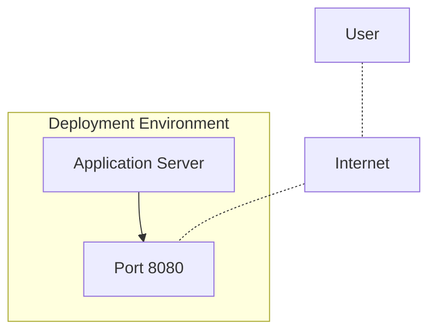

<details>
<summary>Relevant source files</summary>

The following file was used as context for generating this wiki page:

- [.env.example](https://github.com/aanickode/access-control-service/blob/main/.env.example)

</details>

# Deployment and Infrastructure

## Introduction

The provided source file `.env.example` suggests that this project is a web application or service that runs on a server and listens on a specific port for incoming requests. The file contains an environment variable `PORT` with a default value of `8080`, indicating that the application is designed to run on port 8080 unless a different port is specified during deployment or runtime.

## Application Server

### Server Configuration

The application server is configured to listen on a specific port for incoming requests. The port number is defined by the `PORT` environment variable in the `.env.example` file.

```
PORT=8080
```

This configuration allows flexibility in choosing the port during deployment or runtime by setting the `PORT` environment variable to the desired value.

Sources: [.env.example:1]()

### Server Deployment

Based on the provided information, the deployment process for this application likely involves the following steps:

1. Set the `PORT` environment variable to the desired port number for the application server to listen on.
2. Start the application server process, which will bind to the specified port and begin accepting incoming requests.

The deployment environment (e.g., development, staging, production) may influence the choice of port number and other configuration settings.

Sources: [.env.example:1]()

## Mermaid Diagram

The following diagram illustrates the deployment and infrastructure setup based on the information available in the provided source file:



In this diagram, the Application Server listens on Port 8080 within the Deployment Environment. Users access the application through the Internet, which routes requests to the specified port where the Application Server is listening.

Sources: [.env.example:1]()

## Conclusion

Based on the provided `.env.example` file, this project appears to be a web application or service that runs on a server and listens for incoming requests on a configurable port. The default port is set to 8080, but this can be changed during deployment or runtime by setting the `PORT` environment variable to the desired value. The deployment process likely involves starting the application server process and ensuring it binds to the specified port to accept incoming requests from users over the Internet.