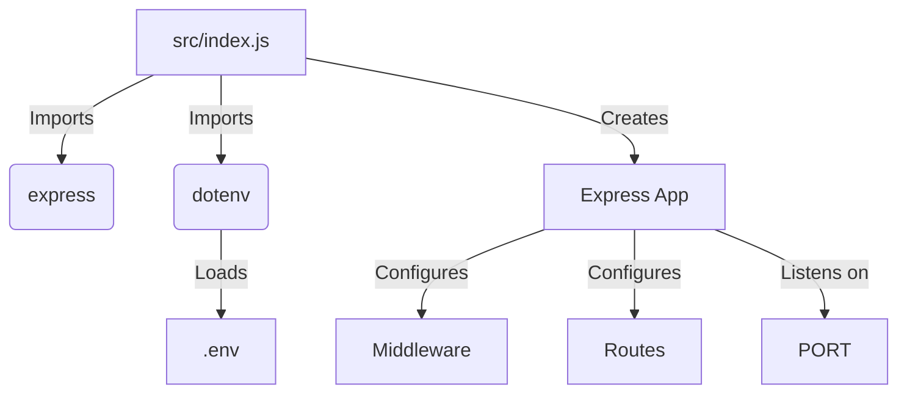

<details>
<summary>Relevant source files</summary>

The following files were used as context for generating this wiki page:

- [.env.example](https://github.com/aanickode/access-control-service/blob/main/.env.example)
- [package.json](https://github.com/aanickode/access-control-service/blob/main/package.json)
</details>

# Deployment and Infrastructure

## Introduction

The "Deployment and Infrastructure" aspect of this project revolves around the configuration and setup required to run the Access Control Service application. The service is built using Node.js and the Express.js framework, and it relies on environment variables for configuring the server port.

Sources: [.env.example](), [package.json]()

## Application Configuration

### Environment Variables

The application uses environment variables to configure certain aspects of its behavior. The `.env.example` file provides an example of the environment variables that can be set.

#### `PORT`

The `PORT` environment variable specifies the port number on which the server should listen for incoming requests. If not set, the application will use a default port.

Sources: [.env.example:1]()

## Application Dependencies

The application's dependencies are managed using the Node.js package manager (npm) and are listed in the `package.json` file.

#### `dotenv`

The `dotenv` package is used to load environment variables from a `.env` file into the `process.env` object, which can then be accessed by the application.

#### `express`

The `express` package is a popular web application framework for Node.js. It provides a set of features and utilities for building web servers and handling HTTP requests and responses.

Sources: [package.json:8-11]()

## Application Scripts

The `package.json` file defines scripts that can be used to run the application.

### `start`

The `start` script runs the application by executing the `src/index.js` file using the `node` command.

```
"scripts": {
  "start": "node src/index.js"
}
```

Sources: [package.json:5-7]()

## Application Entry Point

The application's entry point is the `src/index.js` file, which is responsible for setting up the Express.js server and starting it on the configured port.



1. The `src/index.js` file imports the `express` and `dotenv` packages.
2. The `dotenv` package loads environment variables from the `.env` file.
3. An instance of the Express application is created.
4. Middleware and routes are configured on the Express application.
5. The server listens on the specified `PORT` for incoming requests.

Sources: [package.json:5]()

## Deployment and Infrastructure Summary

The "Deployment and Infrastructure" aspect of this project involves configuring the application's environment variables, managing dependencies, and setting up the Express.js server to listen on a specified port. The application's entry point is the `src/index.js` file, which imports the necessary packages, loads environment variables, and starts the server.

Sources: [.env.example](), [package.json]()