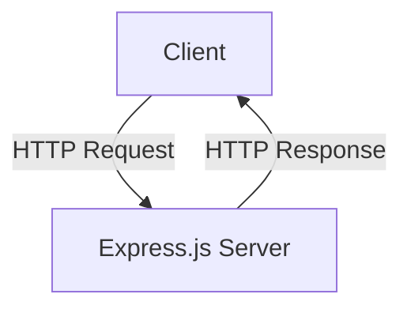
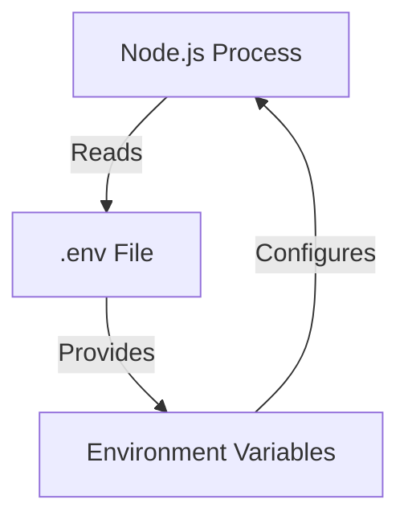
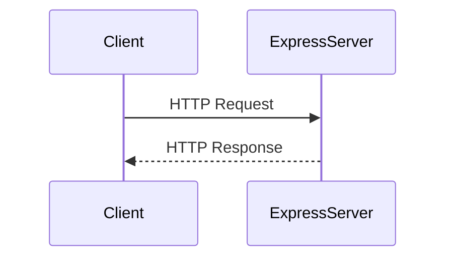

Relevant source files

The following files were used as context for generating this wiki page:

- [.env.example](https://github.com/aanickode/access-control-service/blob/main/.env.example)
- [package.json](https://github.com/aanickode/access-control-service/blob/main/package.json)

# Deployment and Infrastructure

## Introduction

The "Deployment and Infrastructure" aspect of this project revolves around the setup and configuration required to run the Access Control Service application. This service appears to be a Node.js-based Express application, with a minimal set of dependencies defined in the `package.json` file. The `.env.example` file provides a template for environment variables that may be used to configure the application's runtime behavior.

Sources: [package.json](), [.env.example]()

## Application Server

The Access Control Service is built using the Express.js framework for Node.js, which is a popular choice for building web applications and APIs. The application server is responsible for handling incoming HTTP requests and delivering appropriate responses.

Sources: [package.json:9]()

## Environment Configuration

The application appears to use the `dotenv` package to load environment variables from a `.env` file during runtime. The `.env.example` file serves as a template for the actual `.env` file, which should be created and populated with the desired configuration values.

The only environment variable defined in the `.env.example` file is `PORT`, which likely specifies the port number on which the Express.js server should listen for incoming requests.

| Variable | Type | Default | Description |
|----------|------|---------|-------------|
| PORT     | Number | 8080 | The port number on which the server should listen for incoming requests. |

Sources: [.env.example:1](), [package.json:8]()

## Application Startup

The `package.json` file defines a `start` script that runs the `node src/index.js` command, which likely starts the Express.js server and begins listening for incoming requests.

Sources: [package.json:6]()

## Summary

The "Deployment and Infrastructure" aspect of this project focuses on setting up and running the Access Control Service application, which is a Node.js-based Express.js server. The application can be configured using environment variables defined in a `.env` file, with the `PORT` variable specifying the server's listening port. The application is started by running the `start` script defined in the `package.json` file, which likely initializes the Express.js server and begins handling incoming HTTP requests.

Sources: [package.json](), [.env.example]()