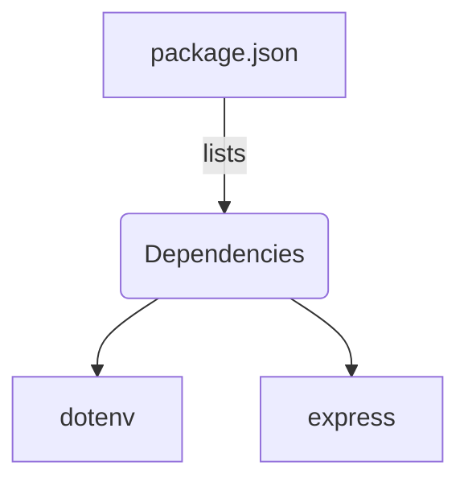
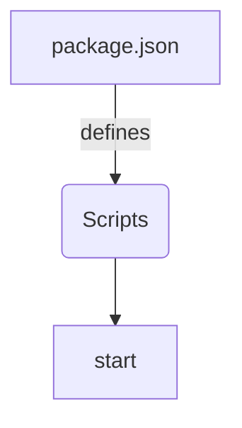

<details>
<summary>Relevant source files</summary>

The following files were used as context for generating this wiki page:

- [.env.example](https://github.com/aanickode/access-control-service/blob/main/.env.example)
- [package.json](https://github.com/aanickode/access-control-service/blob/main/package.json)
</details>

# Deployment and Infrastructure

## Introduction

The "Deployment and Infrastructure" section covers the setup and configuration required to run the Access Control Service application. This service appears to be a Node.js application built using the Express.js framework. The deployment process involves setting up the runtime environment, installing dependencies, and configuring the application to run on a specific port.
Sources: [package.json](), [.env.example]()

## Application Configuration

### Environment Variables

The application uses environment variables for configuration. The `.env.example` file provides an example of the required environment variables.

#### `PORT`

This variable specifies the port number on which the application should listen for incoming requests.

```
PORT=8080
```

Sources: [.env.example:1]()

## Application Dependencies

The application's dependencies are listed in the `package.json` file, which is used by the Node.js package manager (npm) to install and manage the required packages.



Sources: [package.json]()

### dotenv

The `dotenv` package is used to load environment variables from a `.env` file into the `process.env` object in Node.js.
Sources: [package.json:8]()

### express

The `express` package is a popular web application framework for Node.js, used for building APIs and handling HTTP requests.
Sources: [package.json:9]()

## Application Scripts

The `package.json` file also defines scripts for running the application.



Sources: [package.json]()

### start

The `start` script is used to run the application. It executes the `node src/index.js` command, which starts the application using the entry point file `index.js` located in the `src` directory.

```
"scripts": {
    "start": "node src/index.js"
}
```

Sources: [package.json:5-7]()

## Deployment Process

To deploy the Access Control Service application, follow these steps:

1. Install Node.js and npm (Node.js package manager) on the target deployment environment.
2. Clone the application repository or copy the source code to the deployment environment.
3. Navigate to the project directory in the terminal or command prompt.
4. Create a `.env` file based on the `.env.example` file and set the desired `PORT` value.
5. Run `npm install` to install the application dependencies listed in the `package.json` file.
6. Run `npm start` to start the application.

The application will start listening for incoming requests on the configured `PORT`.

## Summary

The "Deployment and Infrastructure" section covers the configuration and setup required to run the Access Control Service application. It involves setting up the runtime environment, installing dependencies using npm, and configuring the application through environment variables. The application is built using Node.js and the Express.js framework, and it listens for incoming requests on a specified port.