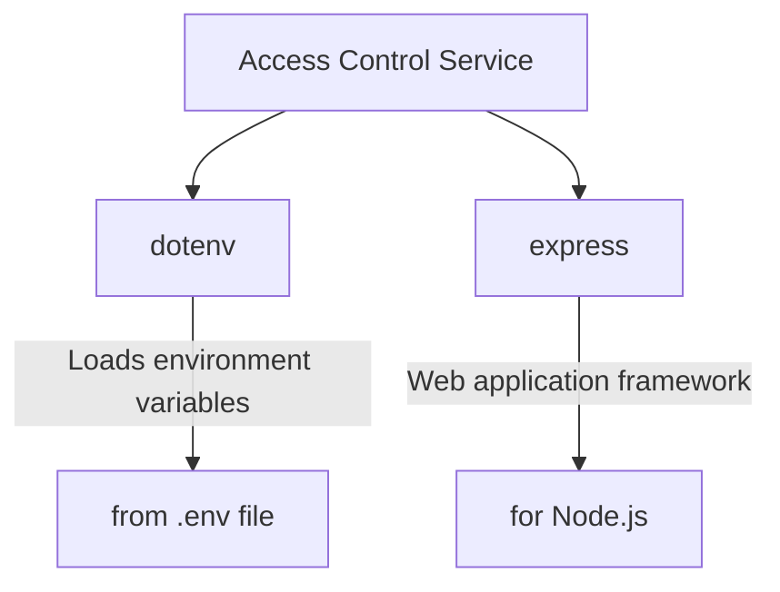

<details>
<summary>Relevant source files</summary>

The following files were used as context for generating this wiki page:

- [.env.example](https://github.com/aanickode/access-control-service/blob/main/.env.example)
- [package.json](https://github.com/aanickode/access-control-service/blob/main/package.json)
</details>

# Deployment and Infrastructure

## Introduction

The "Deployment and Infrastructure" aspect of this project revolves around the configuration and setup required to run the Access Control Service application. This service appears to be a Node.js-based Express application, as evidenced by the dependencies listed in the `package.json` file. The purpose of this wiki page is to provide an overview of the deployment process, infrastructure requirements, and relevant configurations for running the application.

Sources: [package.json]()

## Application Configuration

### Environment Variables

The application utilizes environment variables for configuration purposes. The `.env.example` file serves as a template for setting these variables.

#### Port Configuration

The `PORT` environment variable is used to specify the port on which the application should listen for incoming requests.

```
PORT=8080
```

This configuration indicates that the application will run on port 8080 by default. However, this value can be overridden by setting a different port number in the actual `.env` file during deployment.

Sources: [.env.example:1]()

## Application Dependencies

The application relies on the following third-party dependencies, as specified in the `package.json` file:



1. **dotenv**: This dependency is used to load environment variables from a `.env` file into the `process.env` object in Node.js. This allows the application to access and use these variables during runtime.

2. **express**: Express is a popular web application framework for Node.js. It provides a robust set of features for building web servers and APIs, including routing, middleware, and request handling.

Sources: [package.json:7-10]()

## Application Entry Point

The `package.json` file specifies the entry point for the application:

```json
{
  "scripts": {
    "start": "node src/index.js"
  }
}
```

The `start` script indicates that the application can be started by executing the `src/index.js` file using the `node` command.

Sources: [package.json:5-7]()

## Deployment Process

To deploy the Access Control Service application, follow these steps:

1. **Install Dependencies**: Ensure that Node.js and npm (Node Package Manager) are installed on the target deployment environment. Then, navigate to the project directory and run `npm install` to install the required dependencies listed in the `package.json` file.

2. **Configure Environment Variables**: Create a `.env` file in the project root directory and set the desired values for the environment variables, such as the `PORT` variable.

3. **Start the Application**: Run the `npm start` command, which will execute the `node src/index.js` command specified in the `package.json` file. This will start the application and make it accessible on the configured port.

4. **Access the Application**: Once the application is running, you can access it by visiting `http://localhost:PORT` (replace `PORT` with the configured port number) in a web browser or by sending requests to the appropriate endpoints using tools like cURL or Postman.

Sources: [package.json:5-7](), [package.json:7-10]()

## Summary

This wiki page covered the deployment and infrastructure aspects of the Access Control Service application. It provided an overview of the application configuration using environment variables, the dependencies required for the application to run, and the entry point for starting the application. Additionally, it outlined the steps involved in deploying the application, including installing dependencies, configuring environment variables, starting the application, and accessing it once it's running.