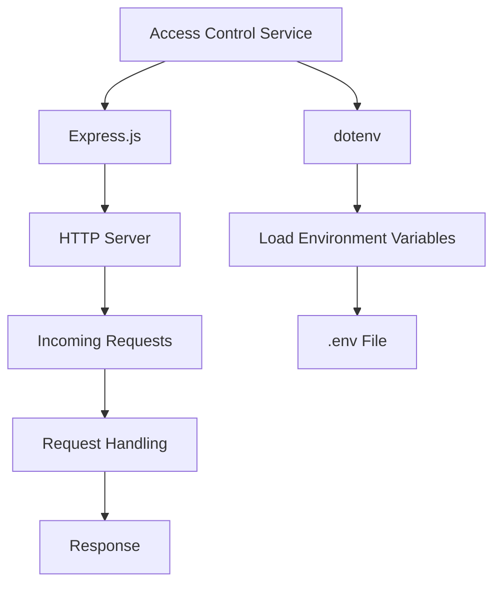

<details>
<summary>Relevant source files</summary>

The following files were used as context for generating this wiki page:

- [.env.example](https://github.com/aanickode/access-control-service/blob/main/.env.example)
- [package.json](https://github.com/aanickode/access-control-service/blob/main/package.json)
</details>

# Deployment and Infrastructure

## Introduction

The "Deployment and Infrastructure" aspect of this project revolves around the setup and configuration required to run the Access Control Service application. This service is built using Node.js and the Express.js framework, and it relies on environment variables for configuring runtime settings such as the server port.
Sources: [.env.example](), [package.json]()

## Application Server

The Access Control Service is a Node.js application that uses the Express.js framework for handling HTTP requests and responses. The application server is responsible for listening on a specified port and serving the application's functionality.

### Server Configuration

The server port is configured using an environment variable defined in the `.env.example` file:

```
PORT=8080
```

This environment variable specifies that the server should listen on port 8080 by default. However, the actual port value can be overridden by setting the `PORT` environment variable during runtime.
Sources: [.env.example]()

### Server Startup

The application server is started by running the `start` script defined in the `package.json` file:

```json
{
  "scripts": {
    "start": "node src/index.js"
  }
}
```

This script executes the `src/index.js` file, which is likely the entry point of the application and responsible for initializing the server and handling incoming requests.
Sources: [package.json]()

## Dependencies

The Access Control Service relies on the following dependencies, which are listed in the `package.json` file:

```json
"dependencies": {
  "dotenv": "^16.0.3",
  "express": "^4.18.2"
}
```

### dotenv

The `dotenv` package is used for loading environment variables from a `.env` file into the Node.js process. This allows the application to access and use environment variables for configuration purposes.
Sources: [package.json]()

### express

The `express` package is a popular web application framework for Node.js. It provides a robust set of features for building web applications and APIs, including routing, middleware, and request handling.
Sources: [package.json]()

## Deployment

Based on the provided source files, there are no specific details regarding the deployment process or infrastructure for this application. However, it is common for Node.js applications to be deployed on various platforms, such as:

- Cloud platforms (e.g., AWS, Google Cloud, Azure)
- Containerization platforms (e.g., Docker, Kubernetes)
- Virtual or physical servers

The deployment process typically involves building the application, configuring the necessary environment variables, and running the `start` script to launch the server.

## Mermaid Diagram



This diagram illustrates the high-level architecture and flow of the Access Control Service application. The service is built using Express.js, which sets up an HTTP server to handle incoming requests. The `dotenv` package is used to load environment variables from the `.env` file, which can be used for configuration purposes within the application.
Sources: [package.json]()