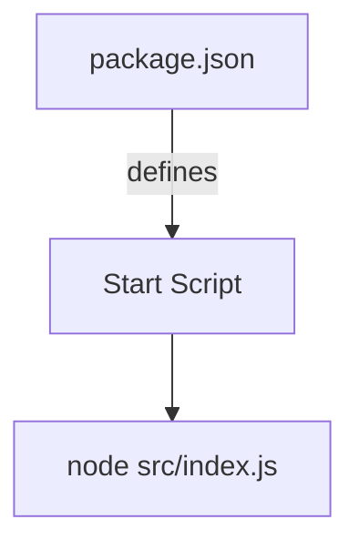
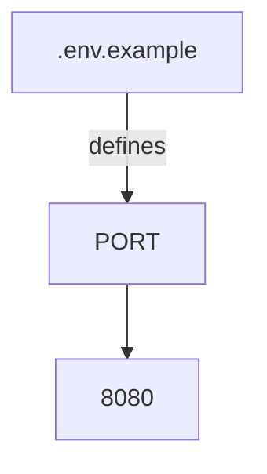

Relevant source files

The following files were used as context for generating this wiki page:

- [.env.example](https://github.com/aanickode/access-control-service/blob/main/.env.example)
- [package.json](https://github.com/aanickode/access-control-service/blob/main/package.json)

# Deployment and Infrastructure

## Introduction

The "Deployment and Infrastructure" aspect of this project focuses on the setup and configuration required to run the Access Control Service application. It covers the runtime environment, dependencies, and the server component responsible for handling incoming requests. This wiki page aims to provide an overview of the deployment and infrastructure components based on the information available in the provided source files.

## Application Server

The Access Control Service application is built using Node.js and the Express.js framework. The server component is responsible for handling incoming HTTP requests and responding accordingly.

### Server Configuration

The server configuration is defined in the `src/index.js` file (not provided). However, based on the `package.json` file, we can infer the following:

The `package.json` file specifies the start script as `"start": "node src/index.js"`. This suggests that the `src/index.js` file is the entry point for the application and likely contains the code to set up and start the server.

Sources: [package.json:5]()

## Environment Variables

The project utilizes environment variables for configuration purposes. The `.env.example` file provides a template for the required environment variables.

Based on the `.env.example` file, the only environment variable defined is `PORT`, which is set to `8080` by default.

Sources: [.env.example:1]()

This suggests that the server is configured to listen on port `8080` unless a different value is provided through the actual `.env` file or other means.

## Dependencies

The project relies on the following dependencies, as specified in the `package.json` file:

| Dependency | Version | Description |
| ---------- | ------- | ----------- |
| dotenv     | ^16.0.3 | Loads environment variables from a `.env` file |
| express    | ^4.18.2 | Web application framework for Node.js |

Sources: [package.json:8-11]()

The `dotenv` package is likely used to load environment variables from the `.env` file, while `express` is the framework used for building the server and handling HTTP requests.

## Summary

Based on the provided source files, the Access Control Service application is a Node.js application that uses the Express.js framework for handling HTTP requests. The server is configured to listen on port `8080` by default, but this can be overridden using an environment variable. The project relies on the `dotenv` and `express` dependencies for loading environment variables and building the server, respectively. However, the specific implementation details of the server and request handling logic are not available in the provided files.