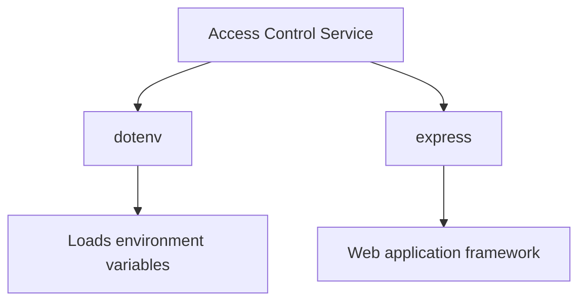
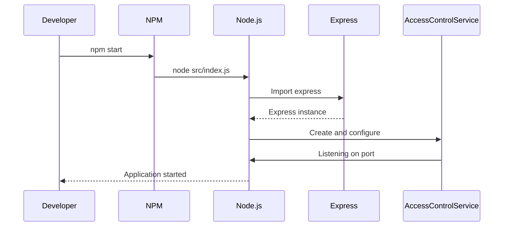

<details>
<summary>Relevant source files</summary>

The following files were used as context for generating this wiki page:

- [.env.example](https://github.com/aanickode/access-control-service/blob/main/.env.example)
- [package.json](https://github.com/aanickode/access-control-service/blob/main/package.json)
</details>

# Deployment and Infrastructure

## Introduction

The "Deployment and Infrastructure" aspect of this project focuses on the configuration and setup required to run the Access Control Service application. It covers the application's runtime environment, dependencies, and the process of starting the service.

Sources: [package.json](), [.env.example]()

## Application Runtime

### Node.js Runtime

The Access Control Service is built using Node.js, a JavaScript runtime environment that allows executing JavaScript code outside of a web browser. The project's `package.json` file specifies the entry point for the application, which is the `src/index.js` file.

Sources: [package.json]()

### Environment Variables

The application utilizes environment variables for configuration purposes. The `.env.example` file serves as a template for setting these variables. In this case, the only environment variable defined is `PORT`, which specifies the port number on which the application should listen for incoming requests.

```
PORT=8080
```

Sources: [.env.example]()

## Application Dependencies

The project's dependencies are listed in the `package.json` file under the `dependencies` section. These dependencies are automatically installed when running `npm install` in the project directory.



1. **dotenv**: This module is used to load environment variables from a `.env` file into the `process.env` object in Node.js. It allows separating configuration settings from the application code.

2. **express**: Express is a popular web application framework for Node.js. It provides a robust set of features for building web servers and APIs, including routing, middleware, and request handling.

Sources: [package.json]()

## Application Startup

To start the Access Control Service, the following command is executed from the project's root directory:

```
npm start
```

This command is defined in the `scripts` section of the `package.json` file and runs the `node src/index.js` command, which starts the application using the entry point specified in the `package.json` file.



1. The developer runs the `npm start` command in the terminal.
2. NPM executes the `node src/index.js` command based on the `scripts` configuration in `package.json`.
3. Node.js loads the `express` module and creates an instance of the Express application.
4. The Access Control Service is created and configured using the Express instance.
5. The Access Control Service starts listening on the specified port (defined by the `PORT` environment variable).
6. Node.js reports that the application has started and is ready to handle incoming requests.

Sources: [package.json]()

## Summary

The "Deployment and Infrastructure" aspect of this project covers the runtime environment, dependencies, and startup process for the Access Control Service application. The application is built using Node.js and the Express web framework, with environment variables used for configuration. The `package.json` file specifies the entry point and dependencies, while the `.env.example` file provides a template for setting environment variables. To start the application, the `npm start` command is executed, which runs the `src/index.js` file and starts the Express server on the specified port.