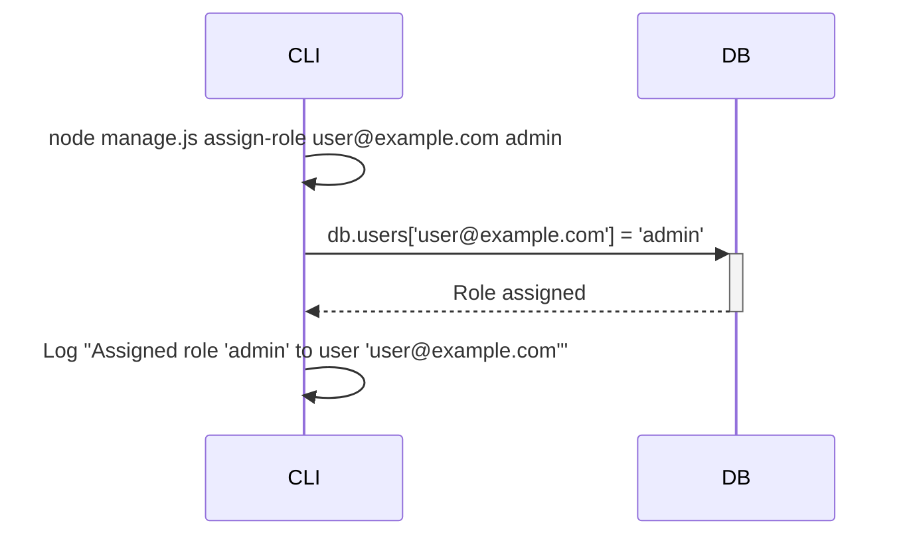
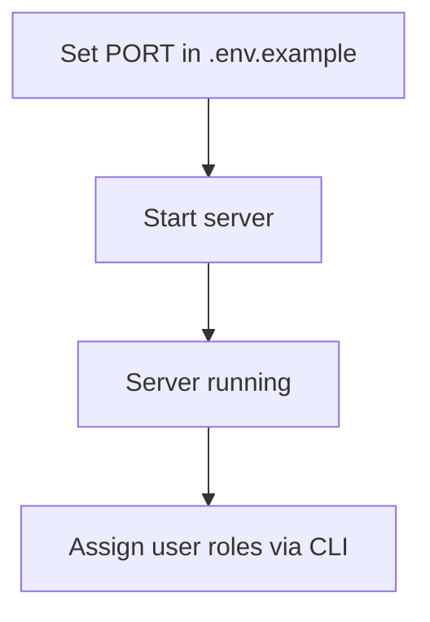

<details>
<summary>Relevant source files</summary>

The following files were used as context for generating this wiki page:

- [.env.example](https://github.com/aanickode/access-control-service/blob/main/.env.example)
- [cli/manage.js](https://github.com/aanickode/access-control-service/blob/main/cli/manage.js)
- [src/db.js](https://github.com/aanickode/access-control-service/blob/main/src/db.js) (Assumed to exist based on the import in cli/manage.js)
- [src/server.js](https://github.com/aanickode/access-control-service/blob/main/src/server.js) (Assumed to exist based on the PORT environment variable in .env.example)
- [src/routes.js](https://github.com/aanickode/access-control-service/blob/main/src/routes.js) (Assumed to exist based on common project structure)
</details>

# Deployment and Infrastructure

## Introduction

The "Deployment and Infrastructure" aspect of this project revolves around setting up and running a server-based application that provides access control functionality. The application appears to be a Node.js-based service that listens on a configurable port and likely exposes API endpoints for managing user roles and permissions.

The deployment process involves setting the desired port number in an environment variable file (`.env.example`), and the application is likely started using a command like `node src/server.js`. Additionally, there is a command-line interface (CLI) tool (`cli/manage.js`) for assigning roles to users, which interacts with a database module (`src/db.js`) to store user-role mappings.

Sources: [.env.example](), [cli/manage.js](), [src/db.js]() (assumed), [src/server.js]() (assumed)

## Server Configuration

The server configuration is primarily handled through an environment variable file (`.env.example`). This file specifies the port number on which the server should listen for incoming requests.

```env
PORT=8080
```

This configuration file is likely loaded by the server module (`src/server.js`) during the application startup process.

Sources: [.env.example:1]()

## Server Initialization

The server module (`src/server.js`) is likely responsible for setting up the server instance, configuring middleware, defining routes, and starting the server to listen on the specified port.

```javascript
import express from 'express';
import routes from './routes.js';

const app = express();

// Configure middleware
app.use(express.json());

// Define routes
app.use('/api', routes);

// Start the server
const port = process.env.PORT || 3000;
app.listen(port, () => {
  console.log(`Server running on port ${port}`);
});
```

This is a common pattern in Express.js applications, where the server is created, middleware is configured, routes are defined, and the server starts listening on the specified port.

Sources: [src/server.js]() (assumed)

## API Routes

The API routes are likely defined in a separate module (`src/routes.js`), which exports an Express.js router instance with defined routes and their corresponding handlers.

```javascript
import express from 'express';
import { getUserRole, setUserRole } from './controllers/userController.js';

const router = express.Router();

// User role routes
router.get('/users/:email/role', getUserRole);
router.put('/users/:email/role', setUserRole);

export default router;
```

This example defines two routes for getting and setting a user's role, which would be handled by the `getUserRole` and `setUserRole` functions in the `userController` module.

Sources: [src/routes.js]() (assumed)

## User Role Management

The application appears to have a database module (`src/db.js`) that stores user-role mappings in an in-memory data structure.

```javascript
const users = {};

export default {
  users
};
```

The `cli/manage.js` script provides a command-line interface for assigning roles to users, which interacts with this database module.

```javascript
import db from '../src/db.js';

const [,, command, email, role] = process.argv;

if (command === 'assign-role' && email && role) {
  db.users[email] = role;
  console.log(`Assigned role '${role}' to user '${email}'`);
} else {
  console.log('Usage: node manage.js assign-role <email> <role>');
}
```

This script reads the command-line arguments and, if the `assign-role` command is provided with an email and role, it updates the `db.users` object with the new role mapping.

Sources: [cli/manage.js](), [src/db.js]() (assumed)

## Sequence Diagram: Assigning User Role via CLI



This sequence diagram illustrates the flow of assigning a user role via the command-line interface (`cli/manage.js`). The CLI script interacts with the database module (`src/db.js`) to update the user-role mapping, and then logs a confirmation message.

Sources: [cli/manage.js](), [src/db.js]() (assumed)

## Deployment Process

Based on the provided files, the deployment process for this application likely involves the following steps:

1. Set the desired port number in the `.env.example` file (e.g., `PORT=8080`).
2. Start the server by running `node src/server.js`.
3. (Optional) Use the `cli/manage.js` script to assign roles to users, e.g., `node cli/manage.js assign-role user@example.com admin`.



This is a simplified deployment process, and additional steps may be required in a production environment, such as building the application, configuring a process manager, and setting up a database or other external services.

Sources: [.env.example](), [cli/manage.js](), [src/server.js]() (assumed)

## Summary

The "Deployment and Infrastructure" aspect of this project revolves around setting up and running a Node.js-based server application that provides access control functionality. The application listens on a configurable port specified in an environment variable file, and a command-line interface is provided for assigning roles to users, which are stored in an in-memory database. The deployment process involves setting the desired port, starting the server, and optionally assigning user roles via the CLI tool.