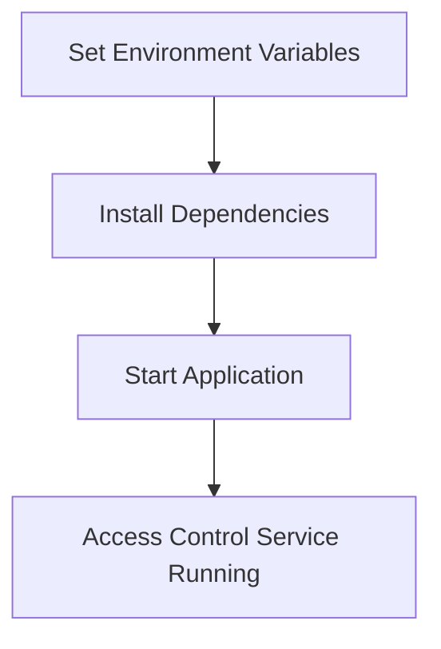

<details>
<summary>Relevant source files</summary>

The following files were used as context for generating this wiki page:

- [.env.example](https://github.com/aanickode/access-control-service/blob/main/.env.example)
- [package.json](https://github.com/aanickode/access-control-service/blob/main/package.json)
</details>

# Deployment and Infrastructure

## Introduction

The "Deployment and Infrastructure" aspect of this project focuses on the configuration and setup required to run the Access Control Service application. The service is built using Node.js and the Express.js framework, providing a web server to handle incoming requests. This section covers the environment variables, dependencies, and scripts necessary for deploying and running the application.

Sources: [package.json](https://github.com/aanickode/access-control-service/blob/main/package.json), [.env.example](https://github.com/aanickode/access-control-service/blob/main/.env.example)

## Environment Configuration

The application relies on environment variables to configure various settings, such as the server port. These variables are typically defined in a `.env` file, which is not committed to the repository for security reasons.

### Environment Variables

| Variable | Description | Default Value |
|----------|-------------|---------------|
| `PORT`   | The port number on which the server will listen for incoming requests. | `8080` |

Sources: [.env.example](https://github.com/aanickode/access-control-service/blob/main/.env.example:1)

## Application Dependencies

The project relies on several third-party dependencies, which are listed in the `package.json` file and installed using the Node Package Manager (npm).

```json
"dependencies": {
  "dotenv": "^16.0.3",
  "express": "^4.18.2"
}
```

- **dotenv**: This library is used to load environment variables from a `.env` file into the `process.env` object, allowing the application to access and use these variables.
- **express**: Express.js is a popular web application framework for Node.js, providing a robust set of features for building web servers and APIs.

Sources: [package.json](https://github.com/aanickode/access-control-service/blob/main/package.json:8-11)

## Application Scripts

The `package.json` file defines a single script for starting the application:

```json
"scripts": {
  "start": "node src/index.js"
}
```

The `start` script runs the `index.js` file located in the `src` directory, which is likely the entry point of the application.

Sources: [package.json](https://github.com/aanickode/access-control-service/blob/main/package.json:5-7)

## Deployment Workflow

Based on the provided files, the deployment workflow for this application would typically involve the following steps:

1. **Environment Setup**: Create a `.env` file in the project root directory and define the required environment variables, such as the `PORT` variable.
2. **Install Dependencies**: Run `npm install` to install the project dependencies listed in the `package.json` file.
3. **Start the Application**: Run `npm start` to start the application, which will execute the `node src/index.js` command and launch the server on the specified port.



Sources: [package.json](https://github.com/aanickode/access-control-service/blob/main/package.json), [.env.example](https://github.com/aanickode/access-control-service/blob/main/.env.example)

## Summary

The "Deployment and Infrastructure" aspect of this project focuses on configuring the environment variables, installing the required dependencies, and running the application using the provided scripts. The application is built with Node.js and Express.js, and it relies on the `dotenv` library to load environment variables from a `.env` file. The deployment process involves setting up the environment variables, installing dependencies, and starting the application using the `npm start` script.