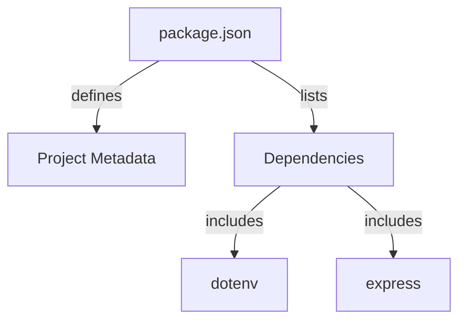

<details>
<summary>Relevant source files</summary>

The following files were used as context for generating this wiki page:

- [.env.example](https://github.com/aanickode/access-control-service/blob/main/.env.example)
- [package.json](https://github.com/aanickode/access-control-service/blob/main/package.json)
</details>

# Deployment and Infrastructure

## Introduction

The "Deployment and Infrastructure" aspect of this project focuses on the configuration and setup required to run the Access Control Service application. It covers the application's runtime environment, dependencies, and the process of starting the service. Based on the provided source files, this service appears to be a Node.js application built with Express.js. 
Sources: [.env.example](), [package.json]()

## Application Environment

### Environment Variables

The application utilizes environment variables for configuration purposes. The `.env.example` file serves as a template for setting these variables.

```
PORT=8080
```

This file defines a single environment variable, `PORT`, which specifies the port number on which the application should listen for incoming requests. The default value is set to `8080`.
Sources: [.env.example:1]()

## Application Dependencies

The application's dependencies are managed through the `package.json` file, which is a standard file used in Node.js projects to specify project metadata and dependencies.



The `package.json` file defines the project's metadata, such as its name and version, and lists the required dependencies. According to the file, the application depends on the following packages:

- **dotenv**: A module that loads environment variables from a `.env` file into `process.env`.
- **express**: A popular web application framework for Node.js, used for building APIs and handling HTTP requests.

Sources: [package.json:1-8](), [package.json:10-12]()

## Application Startup

The `package.json` file also specifies the command to start the application:

```json
{
  "scripts": {
    "start": "node src/index.js"
  }
}
```

To start the application, the `npm start` command should be executed, which runs the `node src/index.js` command. This suggests that the application's entry point is located in the `src/index.js` file (not provided in the given source files).
Sources: [package.json:5-7]()

## Summary

In summary, the "Deployment and Infrastructure" aspect of this project involves setting up the runtime environment for a Node.js application built with Express.js. The application uses environment variables for configuration, with the `.env.example` file providing a template for setting the port number. The `package.json` file specifies the project's dependencies, including `dotenv` for loading environment variables and `express` for handling HTTP requests. To start the application, the `npm start` command should be executed, which runs the entry point file located at `src/index.js`.