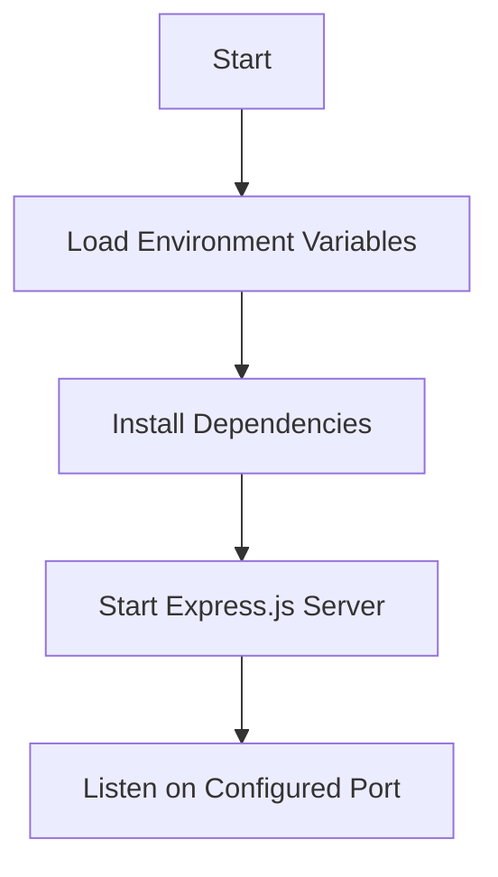

<details>
<summary>Relevant source files</summary>

The following files were used as context for generating this wiki page:

- [package.json](https://github.com/aanickode/access-control-service/blob/main/package.json)
- [.env.example](https://github.com/aanickode/access-control-service/blob/main/.env.example)
</details>

# Deployment and Infrastructure

## Introduction

The "Deployment and Infrastructure" aspect of the Access Control Service project primarily deals with the setup and configuration required to run the application. Based on the provided source files, this service appears to be a Node.js application built using the Express.js framework. The deployment process involves setting up the runtime environment, configuring the application's port, and starting the server.

Sources: [package.json](), [.env.example]()

## Application Configuration

### Environment Variables

The application utilizes environment variables to configure certain settings. The `.env.example` file serves as a template for defining these variables.

```
PORT=8080
```

This file specifies a single environment variable, `PORT`, which determines the port on which the server will listen for incoming requests. The example value is set to `8080`, but this can be modified as needed during deployment.

Sources: [.env.example]()

## Application Dependencies

The project's dependencies are managed using the Node.js package manager (npm) and defined in the `package.json` file.

```json
{
  "dependencies": {
    "dotenv": "^16.0.3",
    "express": "^4.18.2"
  }
}
```

The application has two main dependencies:

1. **dotenv**: This package is used to load environment variables from a `.env` file into the `process.env` object.
2. **express**: Express.js is a popular web application framework for Node.js, used for building the server and handling HTTP requests.

Sources: [package.json]()

## Application Startup

The `package.json` file also defines a script for starting the application:

```json
{
  "scripts": {
    "start": "node src/index.js"
  }
}
```

The `start` script runs the command `node src/index.js`, which likely starts the Express.js server and listens for incoming requests on the configured port.

Sources: [package.json]()



The deployment process for the Access Control Service can be summarized as follows:

1. Load environment variables from the `.env` file using the `dotenv` package.
2. Install the required dependencies (`express` and `dotenv`) using npm.
3. Start the Express.js server by running the `src/index.js` file.
4. The server listens for incoming requests on the configured port (specified by the `PORT` environment variable).

Sources: [package.json](), [.env.example]()

## Conclusion

The "Deployment and Infrastructure" aspect of the Access Control Service project primarily focuses on setting up the runtime environment, configuring the application's port, and starting the Express.js server. The deployment process involves loading environment variables, installing dependencies, and running the application's entry point (`src/index.js`). The server then listens for incoming requests on the configured port, as specified by the `PORT` environment variable.