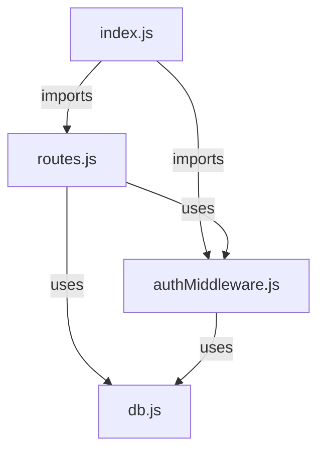
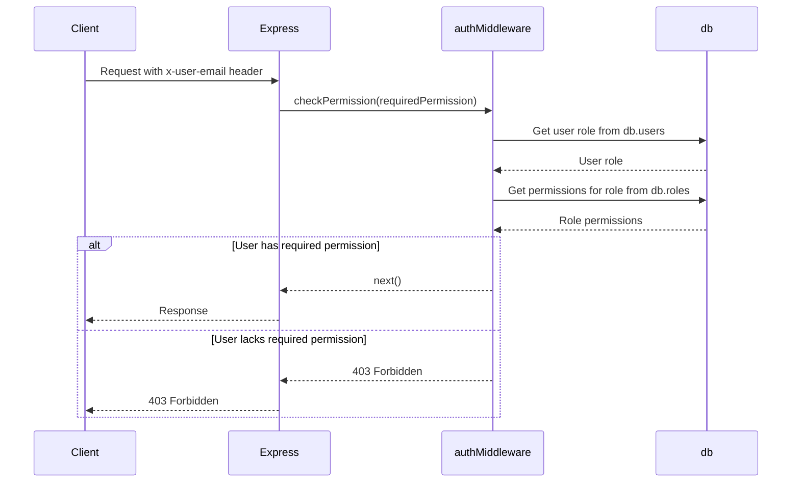

<details>
<summary>Relevant source files</summary>

The following files were used as context for generating this wiki page:

- [src/index.js](https://github.com/aanickode/access-control-service/blob/main/src/index.js)
- [src/routes.js](https://github.com/aanickode/access-control-service/blob/main/src/routes.js)
- [src/authMiddleware.js](https://github.com/aanickode/access-control-service/blob/main/src/authMiddleware.js)
- [src/db.js](https://github.com/aanickode/access-control-service/blob/main/src/db.js)
</details>

# Extending and Customizing

## Introduction

The provided source files implement an Access Control Service, which is a crucial component in managing user permissions and roles within an application or system. This service allows administrators to create and manage roles, assign roles to users, and enforce access control based on the permissions associated with each role.

The Access Control Service is built using Node.js and Express.js, with a simple in-memory data store (`db.js`) to persist user roles and permissions. The service exposes a set of API endpoints (`routes.js`) for managing users, roles, and permissions, and includes an authentication middleware (`authMiddleware.js`) to enforce access control based on the user's assigned role and the required permissions for each endpoint.

Sources: [src/index.js](), [src/routes.js](), [src/authMiddleware.js](), [src/db.js]()

## Architecture Overview

The Access Control Service follows a typical Express.js application structure, with the main entry point (`index.js`) setting up the Express app, importing routes, and starting the server. The `routes.js` file defines the API endpoints and their respective handlers, while the `authMiddleware.js` file contains the `checkPermission` middleware function used to enforce access control.



Sources: [src/index.js](), [src/routes.js](), [src/authMiddleware.js](), [src/db.js]()

## API Endpoints

The Access Control Service exposes the following API endpoints:

| Endpoint | Method | Description | Required Permission |
| --- | --- | --- | --- |
| `/api/users` | GET | Retrieve a list of users and their assigned roles | `view_users` |
| `/api/roles` | POST | Create a new role with specified permissions | `create_role` |
| `/api/permissions` | GET | Retrieve a list of all roles and their associated permissions | `view_permissions` |
| `/api/tokens` | POST | Assign a role to a user | - |

Sources: [src/routes.js:5-27]()

## Authentication and Access Control

The Access Control Service enforces access control through the `checkPermission` middleware function defined in `authMiddleware.js`. This middleware checks the user's email (obtained from the `x-user-email` header) and their assigned role in the `db.users` object. It then verifies if the user's role has the required permission specified in the middleware call.



Sources: [src/authMiddleware.js:1-18]()

## Data Models

The Access Control Service uses a simple in-memory data store (`db.js`) to persist user roles and permissions. The data models are as follows:

### Users

The `db.users` object stores user email addresses as keys and their assigned roles as values.

```javascript
const users = {
  'user1@example.com': 'admin',
  'user2@example.com': 'viewer',
  // ...
};
```

Sources: [src/db.js:3-6]()

### Roles

The `db.roles` object stores role names as keys and their associated permissions as values (an array of strings).

```javascript
const roles = {
  'admin': ['view_users', 'create_role', 'view_permissions'],
  'viewer': ['view_users', 'view_permissions'],
  // ...
};
```

Sources: [src/db.js:8-11]()

## Extending and Customizing

To extend or customize the Access Control Service, developers can modify the existing codebase or build upon the provided functionality. Here are some potential areas for extension and customization:

### Adding New Permissions

To add a new permission, update the `db.roles` object in `db.js` by adding the new permission string to the appropriate role(s). Then, modify the relevant API endpoint handlers in `routes.js` to check for the new permission using the `checkPermission` middleware.

### Implementing Role Inheritance

The current implementation treats roles as flat, independent entities. To introduce role inheritance (e.g., an "admin" role inheriting all permissions from a "viewer" role), modify the `checkPermission` middleware in `authMiddleware.js` to traverse the role hierarchy and aggregate permissions accordingly.

### Integrating with a Persistent Data Store

Replace the in-memory `db.js` with a persistent data store (e.g., a database) by creating a new module or service to handle data storage and retrieval. Update the relevant parts of the codebase (`routes.js`, `authMiddleware.js`) to use the new data store instead of the in-memory `db` object.

### Adding User Management Endpoints

Extend the API by adding new endpoints in `routes.js` for user management operations, such as creating, updating, or deleting users. Ensure proper access control by using the `checkPermission` middleware for these new endpoints.

### Implementing Authentication

The current implementation assumes that the user's email is provided in the `x-user-email` header. To add authentication capabilities, integrate an authentication mechanism (e.g., JSON Web Tokens, sessions) and modify the `checkPermission` middleware in `authMiddleware.js` to validate and extract user information from the authenticated context.

### Improving Error Handling

Enhance the error handling mechanisms by creating a dedicated error handling middleware and implementing more detailed error responses and logging.

Sources: [src/routes.js](), [src/authMiddleware.js](), [src/db.js]()

## Conclusion

The Access Control Service provides a foundation for managing user roles and permissions within an application or system. By understanding the service's architecture, API endpoints, authentication and access control mechanisms, and data models, developers can extend and customize the service to meet their specific requirements, such as adding new permissions, implementing role inheritance, integrating with a persistent data store, adding user management endpoints, implementing authentication, and improving error handling.

Sources: [src/index.js](), [src/routes.js](), [src/authMiddleware.js](), [src/db.js]()