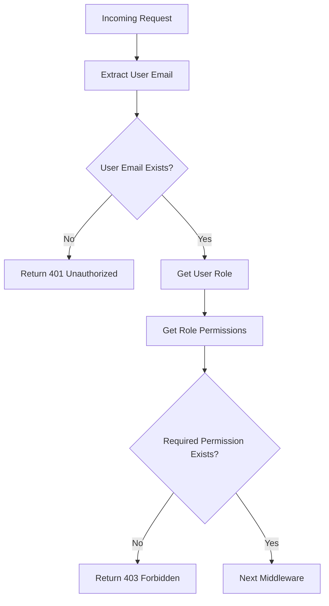

<details>
<summary>Relevant source files</summary>

The following files were used as context for generating this wiki page:

- [src/models.js](https://github.com/aanickode/access-control-service/blob/main/src/models.js)
- [src/authMiddleware.js](https://github.com/aanickode/access-control-service/blob/main/src/authMiddleware.js)
</details>

# Extending and Customizing

## Introduction

The provided source files outline a basic access control system for managing user roles and permissions. This system allows for extending and customizing the authorization logic based on the project's requirements. The `authMiddleware.js` file contains a middleware function `checkPermission` that verifies if a user has the required permission to access a specific resource or perform a certain action. The `models.js` file defines the data models for `User` and `Role` objects, which are likely used to store and manage user and role information.

## Authorization Middleware

The `checkPermission` function in `authMiddleware.js` is a middleware function that can be used to protect routes or resources in an Express.js application. It takes a `requiredPermission` parameter, which represents the permission required to access the protected resource.

### Middleware Flow



1. The middleware first extracts the user's email from the `x-user-email` header of the incoming request. Sources: [src/authMiddleware.js:5-7]()
2. If the user's email is not present or the user is not found in the `db.users` object, the middleware returns a 401 Unauthorized response. Sources: [src/authMiddleware.js:8-10]()
3. If the user's email is found, the middleware retrieves the user's role from the `db.users` object. Sources: [src/authMiddleware.js:12]()
4. The middleware then retrieves the permissions associated with the user's role from the `db.roles` object. If the role is not found, an empty array is used. Sources: [src/authMiddleware.js:13]()
5. If the required permission is not included in the user's role permissions, the middleware returns a 403 Forbidden response. Sources: [src/authMiddleware.js:15-17]()
6. If the user has the required permission, the middleware calls the `next()` function to pass control to the next middleware or route handler. Sources: [src/authMiddleware.js:19]()

### Data Models

The `models.js` file defines the data models for `User` and `Role` objects.

#### User Model

```javascript
export const User = {
  email: 'string',
  role: 'string'
};
```

The `User` model has two properties:

| Property | Type     | Description                                  |
|----------|----------|----------------------------------------------|
| `email`  | `string` | The user's email address (used as a unique identifier) |
| `role`   | `string` | The name of the role assigned to the user   |

Sources: [src/models.js:1-3]()

#### Role Model

```javascript
export const Role = {
  name: 'string',
  permissions: ['string']
};
```

The `Role` model has two properties:

| Property      | Type       | Description                                  |
|----------------|------------|----------------------------------------------|
| `name`         | `string`   | The name of the role                         |
| `permissions`  | `string[]` | An array of permission strings associated with the role |

Sources: [src/models.js:5-7]()

## Extending and Customizing

The provided source files serve as a foundation for implementing an access control system. However, several aspects can be extended or customized based on the project's requirements:

1. **User and Role Data Storage**: The current implementation uses in-memory objects (`db.users` and `db.roles`) to store user and role information. In a real-world scenario, this data would likely be stored in a persistent database. You can extend the system by integrating with a database or other data storage solutions.

2. **User Authentication**: The provided code assumes that the user's email is already available in the request headers. You may need to implement user authentication mechanisms (e.g., JSON Web Tokens, sessions) to securely identify and authenticate users before checking their permissions.

3. **Role and Permission Management**: The current implementation does not provide mechanisms for managing roles and permissions. You can extend the system by adding functionality to create, update, and delete roles and their associated permissions.

4. **Permission Hierarchy and Inheritance**: The current implementation treats permissions as a flat list. You may want to introduce a hierarchical structure for permissions, where certain permissions inherit or imply other permissions. This can be achieved by modifying the `Role` model and updating the permission checking logic in the `checkPermission` middleware.

5. **Advanced Permission Rules**: The current implementation checks if a user has a specific permission. You can extend the system to support more advanced permission rules, such as combining multiple permissions using logical operators (AND, OR) or implementing role-based access control (RBAC) with inheritance and exclusion rules.

6. **Caching and Performance Optimization**: Depending on the size and complexity of your user and role data, you may need to implement caching mechanisms to improve the performance of permission checks, especially for frequently accessed resources.

7. **Logging and Auditing**: You can extend the system to include logging and auditing capabilities, such as logging failed permission checks or tracking user actions based on their permissions.

8. **Error Handling and Customization**: The current implementation returns generic 401 Unauthorized and 403 Forbidden responses. You may want to customize the error responses to provide more detailed information or integrate with a centralized error handling system.

9. **Integration with Other Services**: If your application relies on other services or APIs, you may need to extend the access control system to handle cross-service or cross-application permissions and authentication.

Remember, any extensions or customizations should be thoroughly tested and documented to ensure the integrity and security of the access control system.

## Conclusion

The provided source files offer a basic implementation of an access control system with user roles and permissions. While functional, this implementation serves as a starting point for more robust and feature-rich access control systems. By extending and customizing the system based on project requirements, you can enhance security, scalability, and maintainability, ensuring that access to resources and actions is properly controlled and audited.