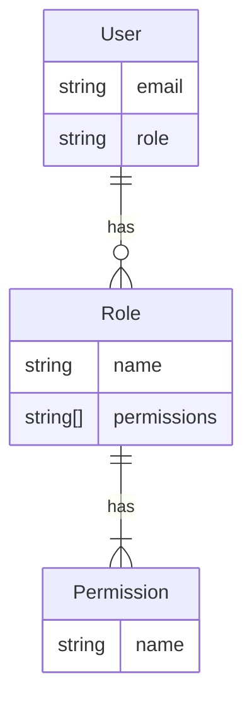
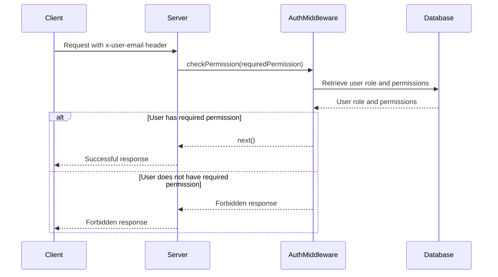
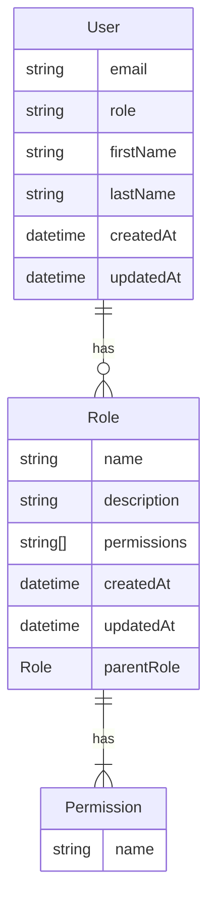
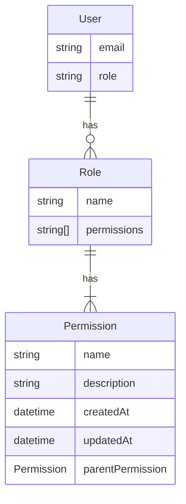

<details>
<summary>Relevant source files</summary>

The following files were used as context for generating this wiki page:

- [src/models.js](https://github.com/aanickode/access-control-service/blob/main/src/models.js)
- [src/authMiddleware.js](https://github.com/aanickode/access-control-service/blob/main/src/authMiddleware.js)
</details>

# Extending and Customizing

## Introduction

The provided source files define a basic access control system for managing user roles and permissions within an application. The `models.js` file defines the data models for `User` and `Role` entities, while the `authMiddleware.js` file contains a middleware function `checkPermission` that verifies if a user has the required permission to access a specific resource or perform a certain action.

This wiki page aims to provide an overview of how this access control system can be extended and customized to meet the specific requirements of the project. It covers the architecture, data flow, and key components involved in the process of extending and customizing the access control functionality.

## Access Control Architecture

The access control system follows a role-based access control (RBAC) model, where users are assigned roles, and roles are associated with specific permissions. The `User` model defines the `email` and `role` properties, while the `Role` model defines the `name` and `permissions` properties.



Sources: [src/models.js](https://github.com/aanickode/access-control-service/blob/main/src/models.js)

## Authentication and Authorization Flow

The `checkPermission` middleware function in `authMiddleware.js` is responsible for verifying if a user has the required permission to access a specific resource or perform a certain action. The flow of the authorization process is as follows:



Sources: [src/authMiddleware.js](https://github.com/aanickode/access-control-service/blob/main/src/authMiddleware.js)

The `checkPermission` middleware function expects the user's email to be present in the `x-user-email` header of the incoming request. It then retrieves the user's role and associated permissions from the `db` (which is likely a mock database in this example). If the user's role has the required permission, the middleware calls `next()` to proceed with the request. Otherwise, it returns a `403 Forbidden` response.

## Extending and Customizing

The current implementation provides a basic foundation for access control, but it can be extended and customized to meet more complex requirements. Here are some potential areas for extension and customization:

### Data Models

The `User` and `Role` models defined in `models.js` are relatively simple. Depending on the project's requirements, these models can be extended with additional properties or relationships. For example, the `User` model could include properties such as `firstName`, `lastName`, `createdAt`, `updatedAt`, or even a reference to a `Department` or `Organization` model.

Similarly, the `Role` model could be extended to include additional metadata, such as `description`, `createdAt`, `updatedAt`, or even hierarchical relationships between roles (e.g., `parentRole`).



Sources: [src/models.js](https://github.com/aanickode/access-control-service/blob/main/src/models.js)

### Permission Management

The current implementation assumes that permissions are stored as strings in the `Role` model. However, in a more complex system, permissions could be modeled as separate entities with additional metadata, such as `description`, `createdAt`, `updatedAt`, or even hierarchical relationships between permissions.



Sources: [src/models.js](https://github.com/aanickode/access-control-service/blob/main/src/models.js)

### Authorization Logic

The `checkPermission` middleware function currently checks if the user's role has the required permission. However, more complex authorization logic could be implemented, such as:

- Checking for multiple required permissions
- Implementing permission inheritance or hierarchies
- Incorporating additional context or metadata into the authorization decision (e.g., resource ownership, time-based restrictions, IP address restrictions)
- Integrating with external authorization systems or services

```mermaid
flowchart TD
    start([Request]) --> getUserRole[Retrieve user role]
    getUserRole --> getPermissions[Retrieve permissions for role]
    getPermissions --> checkPermissions{Check required permissions}
    checkPermissions -->|Has permissions| allowed[Allow request]
    checkPermissions -->|No permissions| denied[Deny request]
    allowed --> end([Response])
    denied --> end([Response])
```

Sources: [src/authMiddleware.js](https://github.com/aanickode/access-control-service/blob/main/src/authMiddleware.js)

### Integration with Authentication Systems

The current implementation assumes that the user's email is provided in the `x-user-email` header. However, in a real-world scenario, the access control system would need to integrate with an authentication system (e.g., JSON Web Tokens, OAuth, SAML) to retrieve and validate the user's identity and associated claims or attributes.

### API Endpoints and Documentation

Depending on the project's requirements, additional API endpoints could be implemented to manage users, roles, and permissions programmatically. These endpoints could allow creating, updating, deleting, and retrieving users, roles, and permissions, as well as assigning roles to users or permissions to roles.

Proper documentation, including API endpoint definitions, request/response formats, and authentication/authorization requirements, would be essential for integrating and using the access control system effectively.

## Conclusion

The provided source files offer a basic foundation for implementing access control within an application. However, real-world scenarios often require more complex and customized solutions. By extending the data models, permission management, authorization logic, and integrating with authentication systems, the access control system can be tailored to meet the specific requirements of the project. Additionally, implementing API endpoints and providing comprehensive documentation can facilitate the integration and management of the access control system within the application's ecosystem.