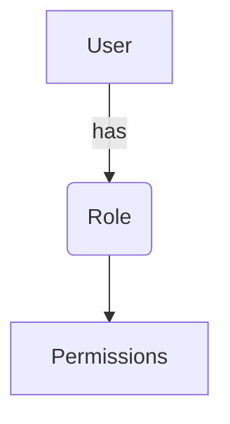
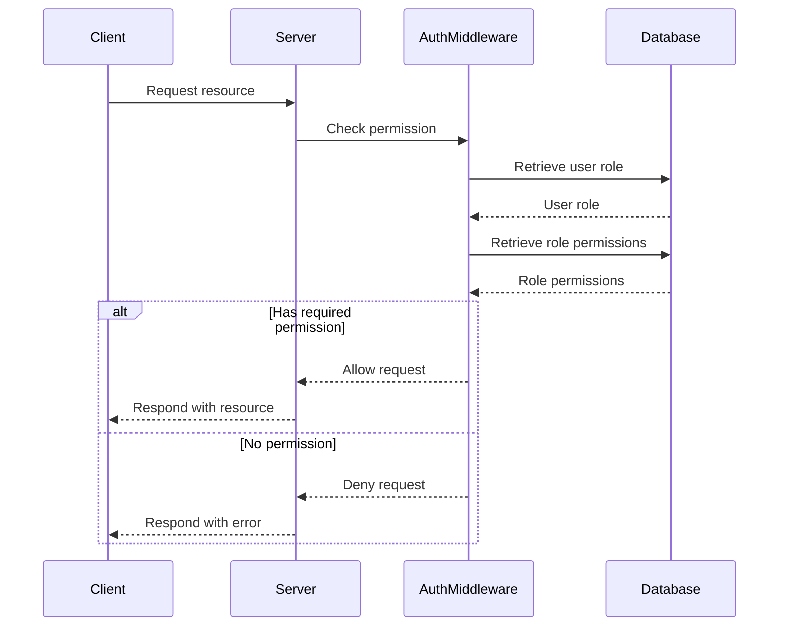

<details>
<summary>Relevant source files</summary>

The following files were used as context for generating this wiki page:

- [src/models.js](https://github.com/aanickode/access-control-service/blob/main/src/models.js)
- [src/routes.js](https://github.com/aanickode/access-control-service/blob/main/src/routes.js)
</details>

# Extending and Customizing

## Introduction

This wiki page covers the "Extending and Customizing" aspect of the project, which primarily deals with managing user roles, permissions, and access control. The project appears to be a service or application that handles user authentication, authorization, and role-based access control (RBAC). It provides APIs for creating roles, assigning roles to users, and retrieving user and permission information.

Sources: [src/routes.js]()

## Role Management

The project allows creating and managing roles, each with a set of associated permissions. Roles are defined as objects with a `name` property (string) and a `permissions` array containing strings representing individual permissions.

```javascript
export const Role = {
  name: 'string',
  permissions: ['string']
};
```

Source: [src/models.js:4-6]()

### Creating Roles

To create a new role, a `POST` request is made to the `/roles` endpoint with the role `name` and `permissions` array in the request body. The `checkPermission` middleware is used to ensure that the requesting user has the `create_role` permission.

```javascript
router.post('/roles', checkPermission('create_role'), (req, res) => {
  const { name, permissions } = req.body;
  if (!name || !Array.isArray(permissions)) {
    return res.status(400).json({ error: 'Invalid role definition' });
  }
  db.roles[name] = permissions;
  res.status(201).json({ role: name, permissions });
});
```

Source: [src/routes.js:9-16]()

### Viewing Permissions

The `/permissions` endpoint allows retrieving a list of all defined roles and their associated permissions. The `checkPermission` middleware ensures that the requesting user has the `view_permissions` permission.

```javascript
router.get('/permissions', checkPermission('view_permissions'), (req, res) => {
  res.json(db.roles);
});
```

Source: [src/routes.js:17-20]()

## User Management

The project also handles user management, specifically assigning roles to users.



Source: [src/models.js]()

### Assigning Roles to Users

To assign a role to a user, a `POST` request is made to the `/tokens` endpoint with the `user` (email) and `role` (name) in the request body. The user-role mapping is then stored in the `db.users` object.

```javascript
router.post('/tokens', (req, res) => {
  const { user, role } = req.body;
  if (!user || !role) {
    return res.status(400).json({ error: 'Missing user or role' });
  }
  db.users[user] = role;
  res.status(201).json({ user, role });
});
```

Source: [src/routes.js:21-28]()

### Viewing Users

The `/users` endpoint allows retrieving a list of all users and their assigned roles. The `checkPermission` middleware ensures that the requesting user has the `view_users` permission.

```javascript
router.get('/users', checkPermission('view_users'), (req, res) => {
  res.json(Object.entries(db.users).map(([email, role]) => ({ email, role })));
});
```

Source: [src/routes.js:5-8]()

## Access Control

The project implements role-based access control (RBAC) by checking the user's permissions before allowing certain actions or accessing certain resources. This is done through the `checkPermission` middleware, which is applied to specific routes.



Source: [src/routes.js]()

## Conclusion

The project provides a basic framework for managing user roles, permissions, and access control. It allows creating and managing roles with associated permissions, assigning roles to users, and checking user permissions before granting access to certain resources or actions. While the implementation is relatively simple, it demonstrates the core concepts of role-based access control (RBAC) and can be extended or customized further based on specific project requirements.