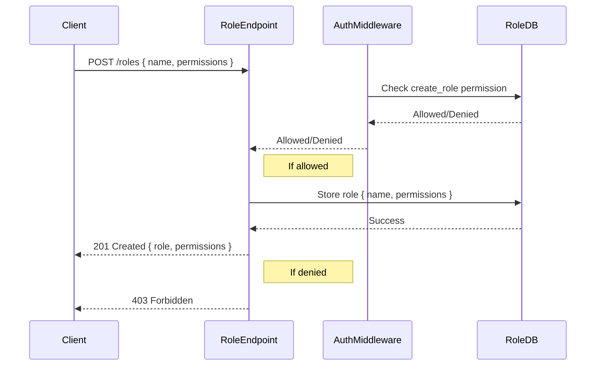

<details>
<summary>Relevant source files</summary>

The following files were used as context for generating this wiki page:

- [src/models.js](https://github.com/aanickode/access-control-service/blob/main/src/models.js)
- [src/routes.js](https://github.com/aanickode/access-control-service/blob/main/src/routes.js)
</details>

# Extending and Customizing

## Introduction

This wiki page covers the process of extending and customizing the access control system within the project. The access control system manages user roles, permissions, and authentication tokens. It provides a set of APIs for creating roles, assigning roles to users, and retrieving user and permission information.

Sources: [src/routes.js]()

## Role Management

### Role Definition

Roles are defined by a `name` (string) and an array of `permissions` (strings). The `Role` model in `src/models.js` defines the structure of a role object.

```javascript
export const Role = {
  name: 'string',
  permissions: ['string']
};
```

Sources: [src/models.js:3-5]()

### Creating a Role

To create a new role, send a `POST` request to the `/roles` endpoint with the role `name` and `permissions` array in the request body. The `create_role` permission is required to access this endpoint.

```javascript
router.post('/roles', checkPermission('create_role'), (req, res) => {
  const { name, permissions } = req.body;
  if (!name || !Array.isArray(permissions)) {
    return res.status(400).json({ error: 'Invalid role definition' });
  }
  db.roles[name] = permissions;
  res.status(201).json({ role: name, permissions });
});
```

Sources: [src/routes.js:8-16]()

### Viewing Permissions

To retrieve a list of all defined roles and their associated permissions, send a `GET` request to the `/permissions` endpoint. The `view_permissions` permission is required to access this endpoint.

```javascript
router.get('/permissions', checkPermission('view_permissions'), (req, res) => {
  res.json(db.roles);
});
```

Sources: [src/routes.js:17-20]()

## User Management

### User Model

Users are defined by an `email` (string) and a `role` (string). The `User` model in `src/models.js` defines the structure of a user object.

```javascript
export const User = {
  email: 'string',
  role: 'string'
};
```

Sources: [src/models.js:1-2]()

### Assigning a Role to a User

To assign a role to a user, send a `POST` request to the `/tokens` endpoint with the `user` (email) and `role` (name) in the request body. This endpoint does not require any specific permission.

```javascript
router.post('/tokens', (req, res) => {
  const { user, role } = req.body;
  if (!user || !role) {
    return res.status(400).json({ error: 'Missing user or role' });
  }
  db.users[user] = role;
  res.status(201).json({ user, role });
});
```

Sources: [src/routes.js:21-28]()

### Viewing Users

To retrieve a list of all users and their assigned roles, send a `GET` request to the `/users` endpoint. The `view_users` permission is required to access this endpoint.

```javascript
router.get('/users', checkPermission('view_users'), (req, res) => {
  res.json(Object.entries(db.users).map(([email, role]) => ({ email, role })));
});
```

Sources: [src/routes.js:4-6]()

## Access Control Middleware

The `checkPermission` middleware function is used to enforce permission-based access control for certain routes. It checks if the user associated with the request has the required permission based on their assigned role.

```javascript
import { checkPermission } from './authMiddleware.js';
```

Sources: [src/routes.js:3]()

The implementation of the `checkPermission` middleware is not provided in the given source files, but it is likely responsible for verifying the user's role and associated permissions against the required permission for the requested route.

## Data Flow Diagram

The following diagram illustrates the high-level data flow and interactions between the different components of the access control system:

```mermaid
graph TD
    Client[Client] -->|POST /tokens| TokenEndpoint[/tokens Endpoint]
    TokenEndpoint -->|Store user-role mapping| UserDB[(User Database)]
    Client -->|POST /roles| RoleEndpoint[/roles Endpoint]
    RoleEndpoint -->|Store role-permissions mapping| RoleDB[(Role Database)]
    Client -->|GET /users| UserEndpoint[/users Endpoint]
    UserEndpoint -->|Retrieve user-role mapping| UserDB
    Client -->|GET /permissions| PermissionEndpoint[/permissions Endpoint]
    PermissionEndpoint -->|Retrieve role-permissions mapping| RoleDB
    AuthMiddleware[Auth Middleware] -->|Check permissions| RoleDB
```

Sources: [src/routes.js]()

## Sequence Diagram: Creating a Role

The following sequence diagram illustrates the flow of creating a new role:



Sources: [src/routes.js:8-16]()

## Extending and Customizing

To extend or customize the access control system, developers can modify the existing code or add new functionality based on the project's requirements. Here are some potential areas for extension:

- **Authentication**: Implement a more robust authentication mechanism, such as JSON Web Tokens (JWT) or OAuth, instead of the current simple user-role mapping.
- **Permission Hierarchy**: Introduce a hierarchical permission structure, allowing for inheritance and more granular control over permissions.
- **Role Assignment**: Implement role assignment based on additional criteria, such as user attributes or organizational structure.
- **Auditing and Logging**: Add auditing and logging capabilities to track changes to roles, permissions, and user assignments.
- **API Versioning**: Introduce versioning for the API endpoints to support backward compatibility and future changes.
- **Data Persistence**: Replace the in-memory data storage with a persistent database solution, such as a relational database or a NoSQL database.
- **Error Handling**: Enhance error handling and provide more detailed error messages for better debugging and user experience.
- **API Documentation**: Generate comprehensive API documentation using tools like Swagger or API Blueprint.

When extending or customizing the system, developers should follow best practices for code organization, maintainability, and security. Additionally, they should ensure that any changes or additions are thoroughly tested and documented.

## Summary

This wiki page covered the key aspects of extending and customizing the access control system within the project. It explained the role and user management processes, including creating roles, assigning roles to users, and retrieving user and permission information. The page also provided data flow and sequence diagrams to illustrate the system's architecture and interactions. Finally, it discussed potential areas for extending and customizing the access control system based on project requirements.