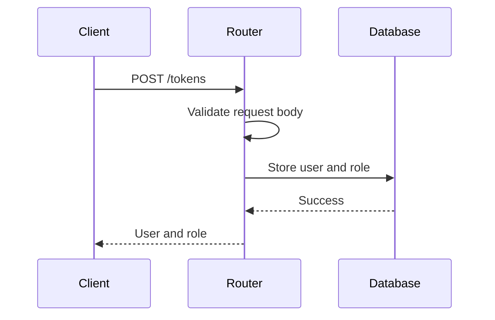

<details>
<summary>Relevant source files</summary>

The following files were used as context for generating this wiki page:

- [src/models.js](https://github.com/aanickode/access-control-service/blob/main/src/models.js)
- [src/routes.js](https://github.com/aanickode/access-control-service/blob/main/src/routes.js)
</details>

# Extending and Customizing

## Introduction

This wiki page covers the process of extending and customizing the access control system within the project. The access control system manages user roles, permissions, and authentication tokens. It provides a set of APIs for retrieving user information, creating roles with associated permissions, and generating authentication tokens for users.

The key components involved in extending and customizing the access control system are the `User` and `Role` data models, and the API routes defined in the `routes.js` file.

Sources: [src/models.js](), [src/routes.js]()

## Data Models

### User Model

The `User` model represents a user in the system and has the following properties:

```javascript
export const User = {
  email: 'string',
  role: 'string'
};
```

- `email`: A string representing the user's email address, which serves as a unique identifier.
- `role`: A string representing the user's role, which determines their permissions.

Sources: [src/models.js:1-4]()

### Role Model

The `Role` model defines a role within the system and its associated permissions:

```javascript
export const Role = {
  name: 'string',
  permissions: ['string']
};
```

- `name`: A string representing the name of the role.
- `permissions`: An array of strings, where each string represents a specific permission granted to the role.

Sources: [src/models.js:6-9]()

## API Routes

The access control system exposes the following API routes:

### Get Users

```mermaid
graph TD
    Client-->|GET /users|Router
    Router-->|checkPermission('view_users')|AuthMiddleware
    AuthMiddleware-->|Allowed|Router
    Router-->|Retrieve users from db|Database
    Database--Users-->Router
    Router--Users-->Client
```

This route retrieves a list of all users in the system, including their email addresses and roles. It requires the `view_users` permission to access.

- **Endpoint**: `GET /users`
- **Permission Required**: `view_users`
- **Response**: An array of user objects with `email` and `role` properties.

Sources: [src/routes.js:6-9]()

### Create Role

```mermaid
graph TD
    Client-->|POST /roles|Router
    Router-->|checkPermission('create_role')|AuthMiddleware
    AuthMiddleware-->|Allowed|Router
    Router-->|Validate request body|Router
    Router-->|Store role in db|Database
    Database--Success-->Router
    Router--Role-->Client
```

This route allows creating a new role with a set of permissions. It requires the `create_role` permission to access.

- **Endpoint**: `POST /roles`
- **Permission Required**: `create_role`
- **Request Body**:
  - `name` (string): The name of the new role.
  - `permissions` (array of strings): The permissions associated with the new role.
- **Response**: The created role object with `name` and `permissions` properties.

Sources: [src/routes.js:10-17]()

### Get Permissions

```mermaid
graph TD
    Client-->|GET /permissions|Router
    Router-->|checkPermission('view_permissions')|AuthMiddleware
    AuthMiddleware-->|Allowed|Router
    Router-->|Retrieve roles from db|Database
    Database--Roles-->Router
    Router--Roles-->Client
```

This route retrieves a list of all roles and their associated permissions. It requires the `view_permissions` permission to access.

- **Endpoint**: `GET /permissions`
- **Permission Required**: `view_permissions`
- **Response**: An object where the keys are role names, and the values are arrays of permissions for each role.

Sources: [src/routes.js:18-21]()

### Generate Token



This route generates an authentication token for a user by associating the user with a role. It does not require any specific permission.

- **Endpoint**: `POST /tokens`
- **Request Body**:
  - `user` (string): The user's email address or identifier.
  - `role` (string): The name of the role to assign to the user.
- **Response**: An object with `user` and `role` properties.

Sources: [src/routes.js:22-29]()

## Extending and Customizing

To extend or customize the access control system, you can modify the existing data models, routes, or middleware functions, or add new ones as needed. Here are some potential areas for extension:

### Adding New Permissions

To add a new permission, you can modify the `Role` model and update the existing roles with the new permission. Alternatively, you can create a new role with the desired set of permissions using the `POST /roles` endpoint.

### Implementing Authentication

The current implementation does not include authentication mechanisms. To add authentication, you could implement middleware functions to validate authentication tokens or credentials, and modify the existing routes to require authentication before granting access.

### Modifying User Data

If you need to store additional user data beyond the `email` and `role`, you can extend the `User` model and update the relevant routes and database interactions accordingly.

### Adding Role Hierarchies

The current implementation treats roles as flat entities. If you need to introduce role hierarchies or inheritance, you may need to modify the `Role` model and update the permission checking logic accordingly.

### Integrating with External Authentication Systems

If you need to integrate with external authentication systems or identity providers, you may need to modify the authentication and token generation processes to interact with those systems.

Sources: [src/models.js](), [src/routes.js]()

## Conclusion

This wiki page covered the key components and APIs involved in extending and customizing the access control system within the project. By understanding the data models, routes, and their interactions, you can modify or enhance the system to meet your specific requirements, such as adding new permissions, implementing authentication mechanisms, or integrating with external systems.