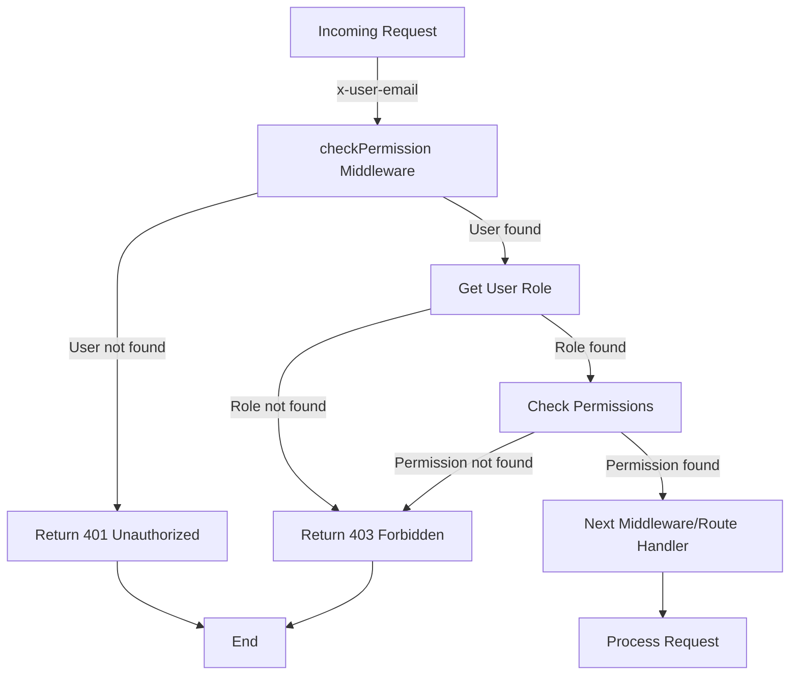
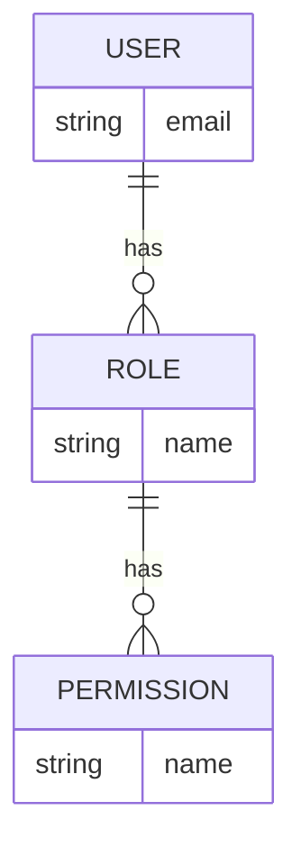

<details>
<summary>Relevant source files</summary>

The following files were used as context for generating this wiki page:

- [src/models.js](https://github.com/aanickode/access-control-service/blob/main/src/models.js)
- [src/authMiddleware.js](https://github.com/aanickode/access-control-service/blob/main/src/authMiddleware.js)
</details>

# Extending and Customizing

## Introduction

The provided source files outline a basic access control system for managing user roles and permissions within an application. The `src/models.js` file defines the data models for `User` and `Role` objects, while `src/authMiddleware.js` contains a middleware function `checkPermission` that validates a user's permissions before allowing access to certain routes or resources.

This wiki page aims to explain how developers can extend and customize this access control system to meet their specific requirements, such as adding new roles, modifying permissions, or integrating with external authentication providers.

## Data Models

The `src/models.js` file defines the following data models:

### User

```javascript
export const User = {
  email: 'string',
  role: 'string'
};
```

The `User` model represents a user in the system, with the following properties:

- `email` (string): The user's email address, which serves as a unique identifier.
- `role` (string): The name of the role assigned to the user.

Sources: [src/models.js:1-3]()

### Role

```javascript
export const Role = {
  name: 'string',
  permissions: ['string']
};
```

The `Role` model represents a role in the system, with the following properties:

- `name` (string): The name of the role.
- `permissions` (array of strings): A list of permissions associated with the role.

Sources: [src/models.js:5-7]()

## Access Control Middleware

The `src/authMiddleware.js` file contains a middleware function `checkPermission` that validates a user's permissions before allowing access to certain routes or resources.

```javascript
export function checkPermission(requiredPermission) {
  return function (req, res, next) {
    const userEmail = req.headers['x-user-email'];
    if (!userEmail || !db.users[userEmail]) {
      return res.status(401).json({ error: 'Unauthorized: no user context' });
    }

    const role = db.users[userEmail];
    const permissions = db.roles[role] || [];

    if (!permissions.includes(requiredPermission)) {
      return res.status(403).json({ error: 'Forbidden: insufficient permissions' });
    }

    next();
  };
}
```

The `checkPermission` function takes a `requiredPermission` parameter, which is the permission required to access the protected route or resource. It returns a middleware function that can be used in an Express.js application.

Here's how the middleware function works:

1. It retrieves the user's email from the `x-user-email` header of the incoming request.
2. If the `x-user-email` header is missing or the user is not found in the `db.users` object, it returns a 401 Unauthorized error.
3. It retrieves the user's role from the `db.users` object using the email as the key.
4. It retrieves the list of permissions associated with the user's role from the `db.roles` object.
5. If the `requiredPermission` is not included in the list of permissions, it returns a 403 Forbidden error.
6. If the user has the required permission, it calls the `next()` function to pass control to the next middleware or route handler.

Sources: [src/authMiddleware.js:1-22]()

## Extending and Customizing

To extend and customize the access control system, developers can follow these steps:

### Adding New Roles

To add a new role, you need to modify the `db.roles` object in the `src/authMiddleware.js` file (or wherever the roles are stored in your application). Here's an example of how to add a new role called "manager" with specific permissions:

```javascript
db.roles = {
  ...db.roles,
  'manager': ['read_reports', 'update_reports', 'delete_reports']
};
```

This code creates a new entry in the `db.roles` object with the key `'manager'` and an array of permissions `['read_reports', 'update_reports', 'delete_reports']`.

Sources: [src/authMiddleware.js:10]()

### Modifying Permissions

To modify the permissions associated with an existing role, you can update the corresponding array in the `db.roles` object. For example, to add a new permission `'create_reports'` to the "manager" role, you can do the following:

```javascript
db.roles.manager.push('create_reports');
```

Similarly, you can remove a permission from a role by using the `filter` method or other array manipulation techniques.

Sources: [src/authMiddleware.js:10]()

### Integrating with External Authentication Providers

To integrate with external authentication providers, such as OAuth or SAML, you'll need to modify the `checkPermission` middleware function to retrieve the user's email and role information from the external provider's API or token. Here's an example of how you could modify the middleware function to use an external authentication provider:

```javascript
import externalAuthProvider from './externalAuthProvider';

export function checkPermission(requiredPermission) {
  return async function (req, res, next) {
    const authToken = req.headers['x-auth-token'];
    if (!authToken) {
      return res.status(401).json({ error: 'Unauthorized: no auth token' });
    }

    try {
      const userInfo = await externalAuthProvider.getUserInfo(authToken);
      const role = userInfo.role;
      const permissions = db.roles[role] || [];

      if (!permissions.includes(requiredPermission)) {
        return res.status(403).json({ error: 'Forbidden: insufficient permissions' });
      }

      next();
    } catch (error) {
      return res.status(401).json({ error: 'Unauthorized: invalid auth token' });
    }
  };
}
```

In this example, the middleware function expects an `x-auth-token` header in the incoming request. It then uses an `externalAuthProvider` module (which you would need to implement) to retrieve the user's information, including their role, from the external authentication provider's API. The rest of the logic remains the same, where it checks if the user's role has the required permission and either allows or denies access accordingly.

Sources: [src/authMiddleware.js:1-22]() (for the original middleware function)

### Mermaid Diagrams

#### Access Control Flow



This flowchart diagram illustrates the access control flow implemented by the `checkPermission` middleware function. It shows the steps involved in validating the user's permissions based on the provided `x-user-email` header and the required permission.

Sources: [src/authMiddleware.js:1-22]()

#### Role-Permission Relationship



This entity-relationship diagram (ERD) shows the relationships between the `User`, `Role`, and `Permission` entities in the access control system. A `User` has one `Role`, and a `Role` can have multiple `Permissions`. The `User` entity has an `email` attribute, while the `Role` entity has a `name` attribute. The `Permission` entity also has a `name` attribute.

Sources: [src/models.js:1-7]()

## Tables

### User Model

| Field | Type   | Description                    |
|-------|--------|--------------------------------|
| email | string | The user's email address       |
| role  | string | The name of the role assigned to the user |

Sources: [src/models.js:1-3]()

### Role Model

| Field       | Type          | Description                    |
|-------------|---------------|---------------------------------|
| name        | string        | The name of the role           |
| permissions | array of strings | A list of permissions associated with the role |

Sources: [src/models.js:5-7]()

## Conclusion

This wiki page has covered the key components of the access control system, including the data models for `User` and `Role`, the `checkPermission` middleware function for validating user permissions, and various ways to extend and customize the system. By following the guidelines and examples provided, developers can easily add new roles, modify permissions, and integrate with external authentication providers to meet their specific requirements.