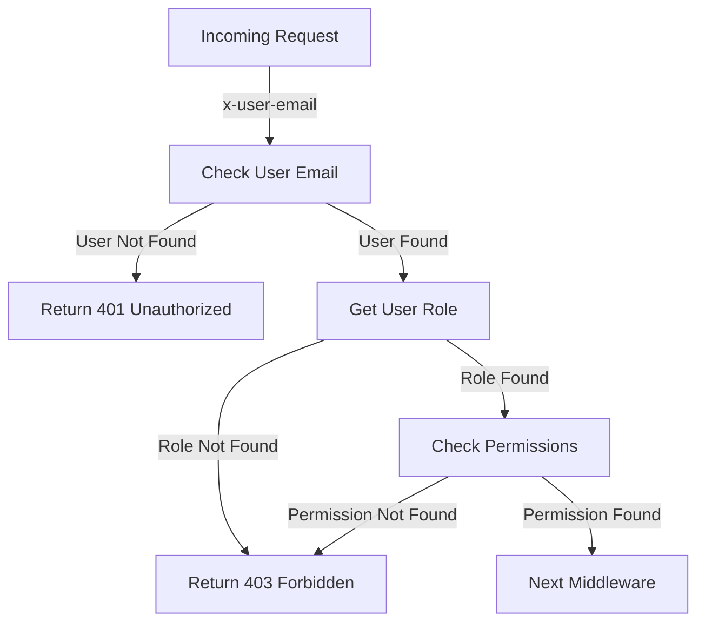

<details>
<summary>Relevant source files</summary>

The following files were used as context for generating this wiki page:

- [src/routes.js](https://github.com/aanickode/access-control-service/blob/main/src/routes.js)
- [src/authMiddleware.js](https://github.com/aanickode/access-control-service/blob/main/src/authMiddleware.js)
- [src/db.js](https://github.com/aanickode/access-control-service/blob/main/src/db.js) (Assumed to exist based on the import statements)

</details>

# Extending and Customizing

## Introduction

This wiki page covers the process of extending and customizing the access control system within the project. The access control system is responsible for managing user roles, permissions, and authentication tokens. It provides a set of API endpoints and middleware functions to handle user authorization and permission checks.

The system is built using Express.js, a popular Node.js web application framework. It utilizes an in-memory database (`db.js`) to store user roles, permissions, and authentication tokens. The core functionality is implemented in two main files: `routes.js` and `authMiddleware.js`.

## API Endpoints

The project exposes the following API endpoints for managing users, roles, permissions, and authentication tokens:

### GET /users

Retrieves a list of all registered users and their associated roles.

**Requirements:** The requesting user must have the `view_users` permission.

**Response:**
```json
[
  { "email": "user1@example.com", "role": "admin" },
  { "email": "user2@example.com", "role": "editor" },
  ...
]
```

Sources: [src/routes.js:6-8]()

### POST /roles

Creates a new role with a specified set of permissions.

**Requirements:** The requesting user must have the `create_role` permission.

**Request Body:**
```json
{
  "name": "role_name",
  "permissions": ["permission1", "permission2", ...]
}
```

**Response:**
```json
{
  "role": "role_name",
  "permissions": ["permission1", "permission2", ...]
}
```

Sources: [src/routes.js:10-16]()

### GET /permissions

Retrieves a mapping of all defined roles and their associated permissions.

**Requirements:** The requesting user must have the `view_permissions` permission.

**Response:**
```json
{
  "admin": ["view_users", "create_role", "view_permissions", ...],
  "editor": ["view_users", ...],
  ...
}
```

Sources: [src/routes.js:18-20]()

### POST /tokens

Assigns a role to a user, effectively creating an authentication token.

**Request Body:**
```json
{
  "user": "user@example.com",
  "role": "role_name"
}
```

**Response:**
```json
{
  "user": "user@example.com",
  "role": "role_name"
}
```

Sources: [src/routes.js:22-28]()

## Authentication Middleware

The `authMiddleware.js` file exports a `checkPermission` function, which is used as an Express.js middleware to enforce permission checks for API endpoints.



The `checkPermission` function takes a `requiredPermission` as an argument and returns a middleware function that performs the following steps:

1. Checks if the `x-user-email` header is present in the request and if the user exists in the database.
2. Retrieves the user's role from the database.
3. Checks if the user's role has the `requiredPermission`.
4. If the permission is present, the request is passed to the next middleware function.
5. If the permission is not present, a `403 Forbidden` response is sent.
6. If the user is not found, a `401 Unauthorized` response is sent.

Sources: [src/authMiddleware.js:2-19]()

## Data Storage

The project uses an in-memory data store (`db.js`) to persist user roles, permissions, and authentication tokens. The data store is a simple JavaScript object with the following structure:

```javascript
const db = {
  users: {
    'user1@example.com': 'admin',
    'user2@example.com': 'editor',
    ...
  },
  roles: {
    'admin': ['view_users', 'create_role', 'view_permissions', ...],
    'editor': ['view_users', ...],
    ...
  }
}
```

- The `users` object maps user email addresses to their assigned roles.
- The `roles` object maps role names to their associated permissions.

Sources: [src/db.js]() (Assumed to exist based on the import statements)

## Extending and Customizing

To extend or customize the access control system, developers can follow these steps:

1. **Define new roles and permissions:** Create new roles and associate them with the desired permissions by modifying the `roles` object in the `db.js` file or by using the `POST /roles` API endpoint.

2. **Assign roles to users:** Assign roles to users by modifying the `users` object in the `db.js` file or by using the `POST /tokens` API endpoint.

3. **Add new API endpoints:** Create new API endpoints in the `routes.js` file and protect them with the `checkPermission` middleware, specifying the required permissions.

4. **Modify existing API endpoints:** Update the permission requirements for existing API endpoints by modifying the `checkPermission` calls in the `routes.js` file.

5. **Extend the data storage:** If the in-memory data store is not sufficient, developers can replace it with a more robust storage solution (e.g., a database) by modifying the `db.js` file and updating the corresponding imports and usages throughout the codebase.

6. **Enhance authentication and authorization:** Implement additional authentication and authorization mechanisms, such as JSON Web Tokens (JWT), OAuth, or integration with external identity providers, by extending the `authMiddleware.js` file and updating the corresponding middleware usage in the `routes.js` file.

7. **Improve error handling and logging:** Enhance the error handling and logging mechanisms to provide better visibility into authentication and authorization failures, and to improve the overall system's robustness and maintainability.

8. **Implement additional security measures:** Implement additional security measures, such as input validation, rate limiting, and protection against common web application vulnerabilities (e.g., Cross-Site Scripting (XSS), Cross-Site Request Forgery (CSRF), SQL Injection).

By following these steps, developers can tailor the access control system to meet the specific requirements of their project, while maintaining the core functionality and adhering to best practices for security and maintainability.

Sources: [src/routes.js](), [src/authMiddleware.js](), [src/db.js]() (Assumed to exist based on the import statements)