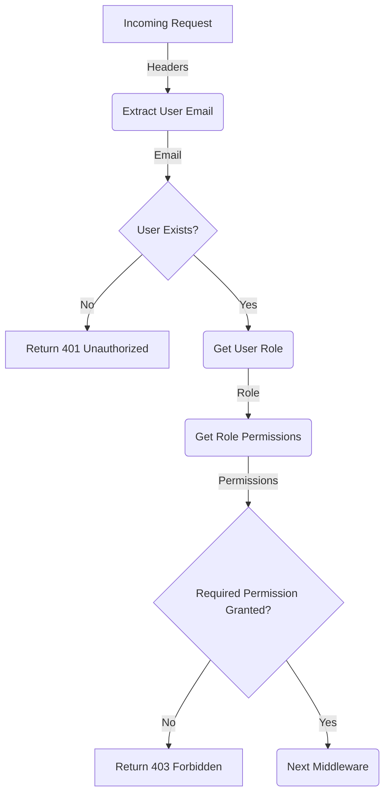
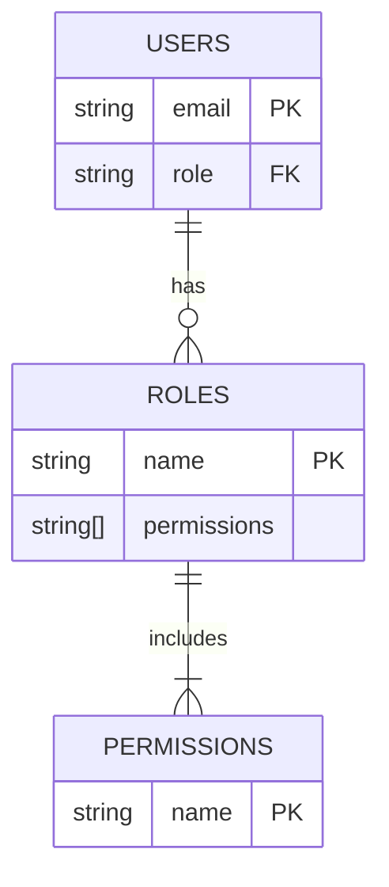

<details>
<summary>Relevant source files</summary>

The following files were used as context for generating this wiki page:

- [src/authMiddleware.js](https://github.com/aanickode/access-control-service/blob/main/src/authMiddleware.js)
- [src/routes.js](https://github.com/aanickode/access-control-service/blob/main/src/routes.js)
- [src/db.js](https://github.com/aanickode/access-control-service/blob/main/src/db.js) (Assumed to exist based on import statements)
</details>

# Extending and Customizing

## Introduction

This wiki page covers the process of extending and customizing the access control system within the project. The access control system manages user roles, permissions, and authentication tokens. It provides a set of API endpoints and middleware functions to handle user authorization and role-based access control (RBAC).

The key components involved in extending and customizing the access control system are:

- `authMiddleware.js`: Contains the `checkPermission` middleware function for authorizing requests based on user roles and required permissions.
- `routes.js`: Defines the API routes and applies the `checkPermission` middleware to protected endpoints.
- `db.js`: (Assumed) Provides an in-memory database for storing user roles, permissions, and authentication tokens.

Sources: [src/authMiddleware.js](), [src/routes.js]()

## Authorization Middleware

The `checkPermission` middleware function in `authMiddleware.js` is responsible for authorizing incoming requests based on the user's role and the required permission for the requested resource or operation.

### Middleware Flow



1. The middleware extracts the user's email from the `x-user-email` header of the incoming request.
2. If the user email is not present or the user doesn't exist in the database, a 401 Unauthorized response is returned.
3. The user's role is retrieved from the database based on their email.
4. The permissions associated with the user's role are fetched from the database.
5. If the required permission is not included in the user's role permissions, a 403 Forbidden response is returned.
6. If the user has the required permission, the request is passed to the next middleware or route handler.

Sources: [src/authMiddleware.js:3-18]()

## API Routes

The `routes.js` file defines the API routes and applies the `checkPermission` middleware to protected endpoints.

### Route Definitions

```mermaid
graph TD
    A[/users] -->|GET| B(checkPermission<br>'view_users')
    B --> C[Return List of Users]
    D[/roles] -->|POST| E(checkPermission<br>'create_role')
    E --> F[Create New Role]
    G[/permissions] -->|GET| H(checkPermission<br>'view_permissions')
    H --> I[Return List of Roles and Permissions]
    J[/tokens] -->|POST| K[Create Authentication Token]
```

1. `GET /users`: Returns a list of users and their roles. Requires the `view_users` permission.
2. `POST /roles`: Creates a new role with the specified permissions. Requires the `create_role` permission.
3. `GET /permissions`: Returns a list of all roles and their associated permissions. Requires the `view_permissions` permission.
4. `POST /tokens`: Creates an authentication token for a user with a specific role. No permission check is performed for this route.

Sources: [src/routes.js:7-33]()

## Data Storage

The project uses an in-memory database (assumed to be defined in `db.js`) to store user roles, permissions, and authentication tokens. The database structure is likely as follows:



- The `USERS` table stores user email addresses as the primary key and their associated role.
- The `ROLES` table stores role names as the primary key and an array of permissions for each role.
- The `PERMISSIONS` table (assumed) stores a list of unique permission names.

Sources: [src/authMiddleware.js:7-9](), [src/routes.js:7,13,19,26]()

## Configuration and Customization

To extend or customize the access control system, you can modify the following components:

1. **Permissions**: Add, remove, or modify the available permissions in the `PERMISSIONS` table or the corresponding data structure in `db.js`.
2. **Roles**: Define new roles with specific sets of permissions by adding entries to the `ROLES` table or the corresponding data structure in `db.js`.
3. **Authorization Rules**: Modify the `checkPermission` middleware function in `authMiddleware.js` to implement custom authorization rules or integrate with external authentication/authorization systems.
4. **API Routes**: Add, remove, or modify API routes in `routes.js` and apply the `checkPermission` middleware as needed for protected endpoints.
5. **User Management**: Implement user registration, role assignment, and token management functionality by extending the existing routes or creating new routes in `routes.js`.

Sources: [src/authMiddleware.js](), [src/routes.js](), [src/db.js]() (assumed)

## Conclusion

The access control system in this project provides a flexible and extensible framework for managing user roles, permissions, and authentication tokens. By leveraging the `checkPermission` middleware and the API routes defined in `routes.js`, you can implement role-based access control and customize the system to meet your specific requirements. Additionally, the in-memory database (`db.js`) allows for easy modification and extension of user roles, permissions, and authentication tokens.