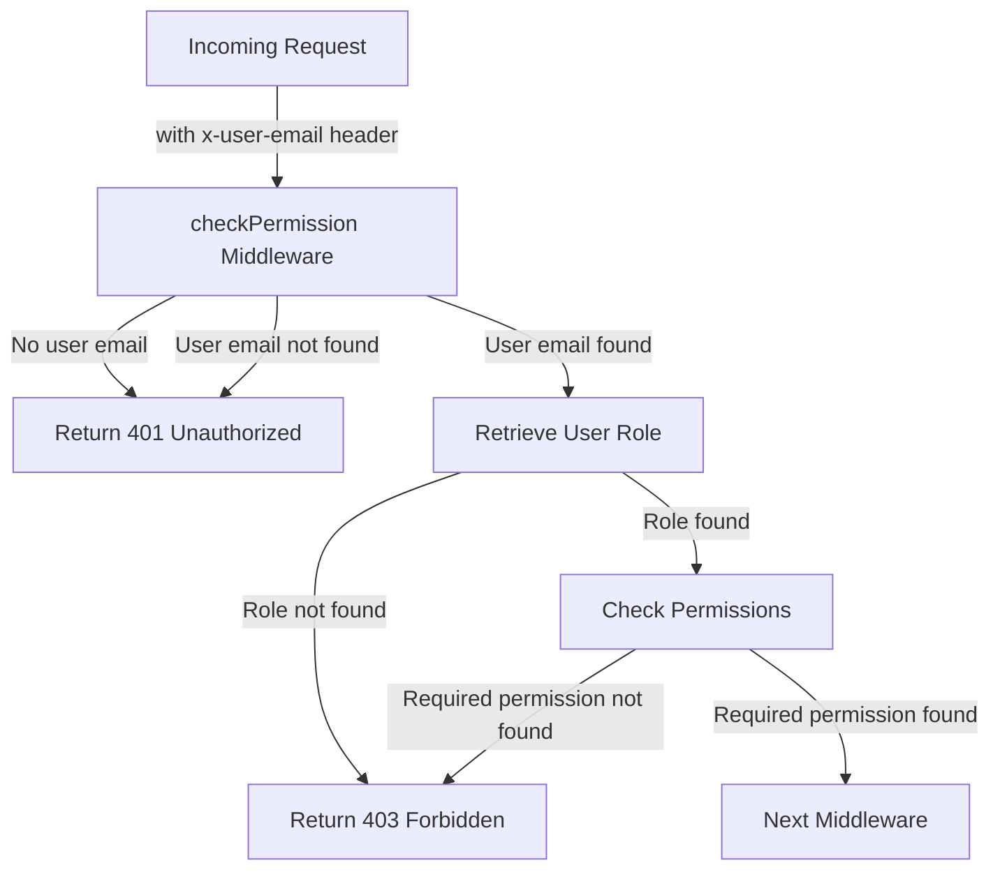
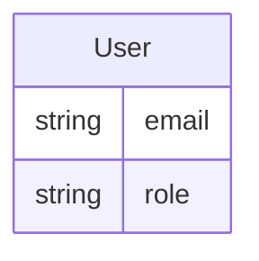
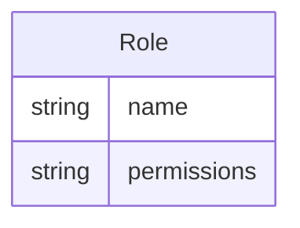

Relevant source files

The following files were used as context for generating this wiki page:

- [src/authMiddleware.js](https://github.com/aanickode/access-control-service/blob/main/src/authMiddleware.js)
- [src/models.js](https://github.com/aanickode/access-control-service/blob/main/src/models.js)

# Extending and Customizing

## Introduction

This wiki page covers the process of extending and customizing the access control system within the project. The access control system is responsible for managing user roles, permissions, and enforcing authorization rules based on the assigned roles and permissions.

The core functionality of the access control system is implemented in the `authMiddleware.js` and `models.js` files. The `authMiddleware.js` file contains the `checkPermission` middleware function, which verifies if a user has the required permission to access a specific resource or perform a particular action. The `models.js` file defines the data models for `User` and `Role`, which are used to store user information and role-based permissions.

## Access Control Middleware

The `checkPermission` middleware function is the central component of the access control system. It is responsible for validating user permissions and enforcing authorization rules.

### Middleware Flow

Sources: [src/authMiddleware.js:2-18]()

1. The middleware function expects a `requiredPermission` parameter, which is the permission required to access the requested resource or perform the requested action.
2. It first checks if the `x-user-email` header is present in the request and if the user exists in the `db.users` object.
3. If the user is not found or the `x-user-email` header is missing, the middleware returns a 401 Unauthorized response.
4. If the user is found, the middleware retrieves the user's role from the `db.users` object.
5. The middleware then checks if the user's role exists in the `db.roles` object and retrieves the associated permissions.
6. If the required permission is not present in the user's permissions, the middleware returns a 403 Forbidden response.
7. If the user has the required permission, the middleware calls the `next()` function to pass control to the next middleware or route handler.

### Key Functions

- `checkPermission(requiredPermission)`: This function returns a middleware function that checks if the user has the specified `requiredPermission`.

Sources: [src/authMiddleware.js:2]()

## Data Models

The `models.js` file defines the data models for `User` and `Role`.

### User Model

The `User` model has the following fields:

| Field | Type    | Description                  |
|-------|---------|------------------------------|
| email | string  | The user's email address     |
| role  | string  | The name of the user's role  |

Sources: [src/models.js:1-4]()

### Role Model

The `Role` model has the following fields:

| Field       | Type     | Description                                |
|-------------|----------|-------------------------------------------|
| name        | string   | The name of the role                      |
| permissions | string[] | An array of permissions associated with the role |

Sources: [src/models.js:5-8]()

## Extending and Customizing

To extend or customize the access control system, you can modify the existing code or add new functionality based on your requirements. Here are some potential areas for extension and customization:

### Adding New Permissions

To add a new permission, you need to update the `db.roles` object in the data store (e.g., database, in-memory store) with the new permission associated with the appropriate roles.

### Modifying Permission Checks

If you need to modify the logic for checking permissions, you can update the `checkPermission` middleware function in `authMiddleware.js`. For example, you could implement more complex permission rules, such as checking for multiple required permissions or implementing role hierarchies.

### Integrating with a Database

Currently, the user and role data are stored in an in-memory object (`db.users` and `db.roles`). To integrate with a database, you would need to replace the in-memory data store with database queries and update the code accordingly.

### Adding User Management Functionality

If you need to add functionality for managing users and roles, you can create new API endpoints or services that interact with the data store (e.g., database) to create, update, or delete users and roles.

### Implementing Authentication

The current implementation assumes that the `x-user-email` header is present and contains a valid user email. To implement authentication, you would need to add functionality to validate the user's credentials (e.g., username and password) and generate an authentication token or session, which can then be used in subsequent requests.

## Conclusion

The access control system in this project provides a basic implementation for managing user roles, permissions, and enforcing authorization rules. By understanding the core components and data models, you can extend and customize the system to meet your specific requirements, such as adding new permissions, modifying permission checks, integrating with a database, adding user management functionality, or implementing authentication.