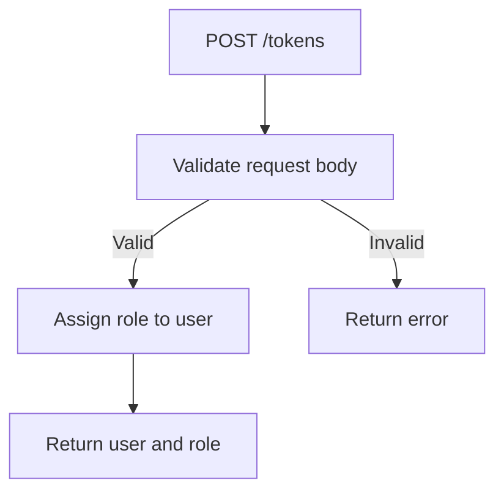
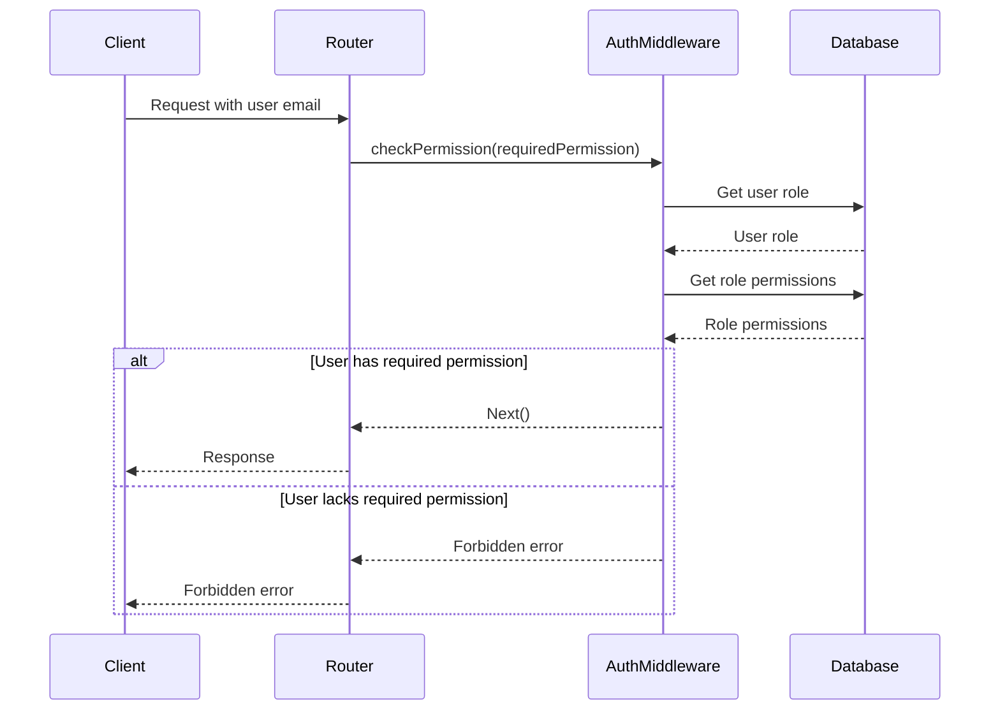
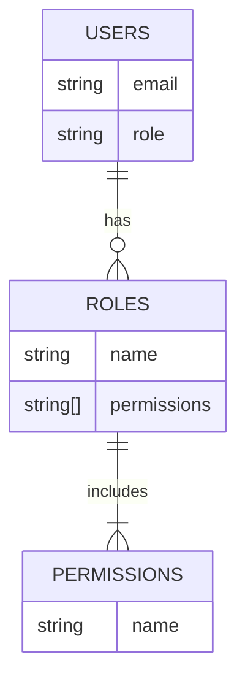

<details>
<summary>Relevant source files</summary>

The following files were used as context for generating this wiki page:

- [src/routes.js](https://github.com/aanickode/access-control-service/blob/main/src/routes.js)
- [src/authMiddleware.js](https://github.com/aanickode/access-control-service/blob/main/src/authMiddleware.js)
- [src/db.js](https://github.com/aanickode/access-control-service/blob/main/src/db.js)

</details>

# Extending and Customizing

## Introduction

The provided source files implement an access control system for managing user roles and permissions within an application. This system allows authorized users to view and create roles, assign roles to users, and enforce permissions on certain routes or actions based on the user's assigned role.

The main components involved in extending and customizing this access control system are:

- `routes.js`: Defines the API routes and their corresponding handlers, including permission checks using the `checkPermission` middleware.
- `authMiddleware.js`: Contains the `checkPermission` middleware function, which verifies the user's role and permissions based on the provided user email and the required permission.
- `db.js` (assumed): Stores the in-memory data for users, roles, and their associated permissions.

Sources: [src/routes.js](), [src/authMiddleware.js]()

## API Routes and Handlers

The `routes.js` file defines the following API routes and their corresponding handlers:

### 1. GET `/users`

This route retrieves a list of all users and their assigned roles. It requires the `view_users` permission.

```mermaid
graph TD
    A[GET /users] -->|checkPermission('view_users')| B[Get users and roles]
    B --> C[Return user list]
```

Sources: [src/routes.js:5-8]()

### 2. POST `/roles`

This route allows creating a new role with a set of permissions. It requires the `create_role` permission.

```mermaid
graph TD
    A[POST /roles] -->|checkPermission('create_role')| B[Validate request body]
    B -->|Valid| C[Create new role]
    C --> D[Return new role and permissions]
    B -->|Invalid| E[Return error]
```

Sources: [src/routes.js:10-16]()

### 3. GET `/permissions`

This route retrieves a list of all defined roles and their associated permissions. It requires the `view_permissions` permission.

```mermaid
graph TD
    A[GET /permissions] -->|checkPermission('view_permissions')| B[Get roles and permissions]
    B --> C[Return roles and permissions]
```

Sources: [src/routes.js:18-20]()

### 4. POST `/tokens`

This route assigns a role to a user. It does not require any specific permission.



Sources: [src/routes.js:22-28]()

## Authentication and Authorization

The `authMiddleware.js` file contains the `checkPermission` middleware function, which is responsible for verifying the user's role and permissions based on the provided user email and the required permission.



The `checkPermission` middleware function works as follows:

1. It checks if the `x-user-email` header is present in the request and if the user exists in the database.
2. If the user exists, it retrieves the user's role from the database.
3. It then retrieves the permissions associated with the user's role from the database.
4. If the required permission is included in the user's role permissions, the middleware calls `next()` to proceed with the route handler.
5. If the required permission is not included, the middleware returns a `403 Forbidden` error.

Sources: [src/authMiddleware.js:2-19]()

## Data Storage

The provided source files assume the existence of a `db.js` file, which likely stores the user, role, and permission data in memory. The structure of this data can be inferred from the usage in `routes.js` and `authMiddleware.js`:



- The `users` object maps user emails to their assigned role names.
- The `roles` object maps role names to an array of permission names.
- The `permissions` are likely stored as strings within the `roles` object.

Sources: [src/routes.js:6,12,19,24](), [src/authMiddleware.js:8,10]()

## Extending and Customizing

To extend or customize the access control system, developers can:

1. **Add new routes**: Define new routes in `routes.js` and apply the `checkPermission` middleware with the appropriate required permission.
2. **Modify existing routes**: Change the permission requirements or logic of existing routes in `routes.js`.
3. **Create new permissions**: Add new permission strings to the `roles` object in the data storage (`db.js`).
4. **Modify roles**: Update the permissions associated with existing roles or create new roles in the data storage (`db.js`).
5. **Customize authentication**: Modify the `checkPermission` middleware in `authMiddleware.js` to change the user identification method (e.g., use JWT tokens instead of email headers) or the permission verification logic.
6. **Integrate with a database**: Replace the in-memory data storage (`db.js`) with a database integration to persist user, role, and permission data.

Sources: [src/routes.js](), [src/authMiddleware.js](), [src/db.js]()

## Conclusion

The provided source files implement a basic access control system for managing user roles and permissions within an application. By understanding the components involved, such as the API routes, authentication middleware, and data storage, developers can extend and customize the system to meet their specific requirements, such as adding new routes, modifying existing roles and permissions, or integrating with a database for persistent data storage.