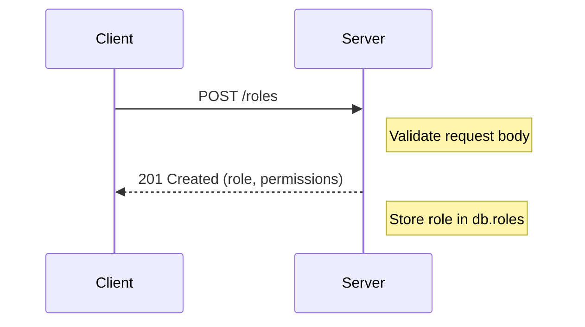
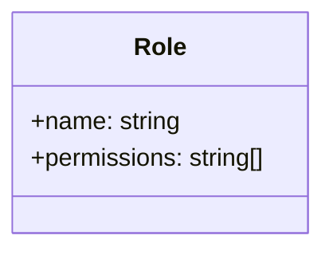
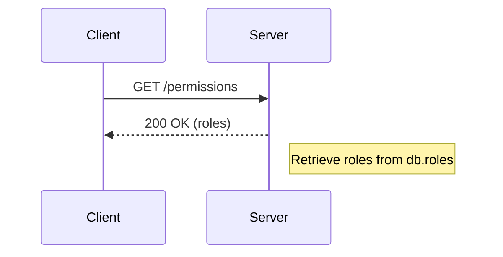
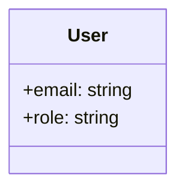
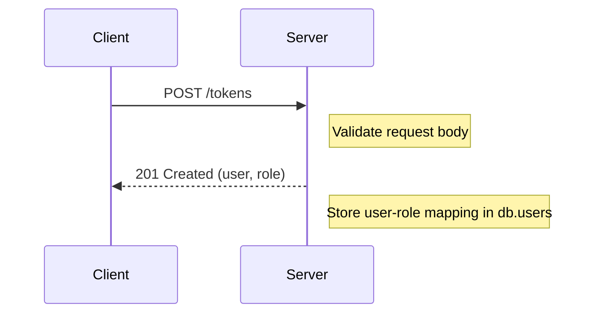
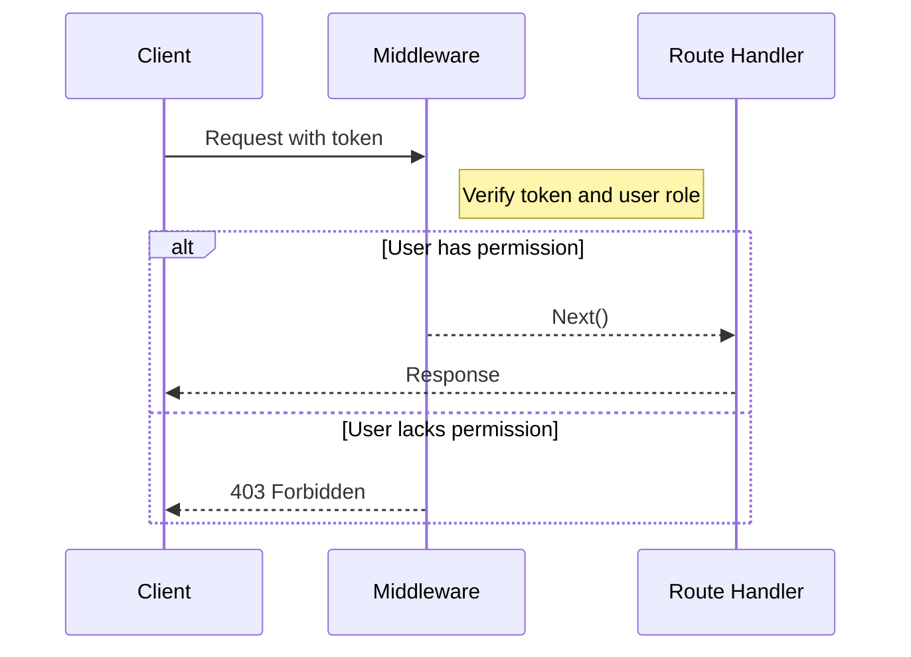

Relevant source files

The following files were used as context for generating this wiki page:

- [src/models.js](https://github.com/aanickode/access-control-service/blob/main/src/models.js)
- [src/routes.js](https://github.com/aanickode/access-control-service/blob/main/src/routes.js)

# Extending and Customizing

## Introduction

This wiki page covers the process of extending and customizing the access control system within the project. The access control system manages user roles, permissions, and authentication tokens. It provides a set of API endpoints for retrieving user information, creating roles, viewing permissions, and generating authentication tokens.

Sources: [src/routes.js]()

## Role Management

The system allows for creating and managing roles with associated permissions. Each role is defined by a unique name and a list of permissions.

### Creating a Role

To create a new role, send a POST request to the `/roles` endpoint with the role name and an array of permissions in the request body.

Sources: [src/routes.js:9-15]()

#### Role Model

Sources: [src/models.js:5-7]()

### Viewing Permissions

To retrieve a list of all roles and their associated permissions, send a GET request to the `/permissions` endpoint.

Sources: [src/routes.js:17-19]()

## User Management

The system manages user information, including email addresses and assigned roles.

### Viewing Users

To retrieve a list of all users and their assigned roles, send a GET request to the `/users` endpoint.

Sources: [src/routes.js:5-7]()

#### User Model

Sources: [src/models.js:1-3]()

### Generating Authentication Tokens

To generate an authentication token for a user, send a POST request to the `/tokens` endpoint with the user's email and the role to be assigned.

Sources: [src/routes.js:21-27]()

## Access Control

The system implements an access control mechanism using middleware to check if a user has the required permissions for certain routes.

### Permission Checking Middleware

The `checkPermission` middleware function is used to protect routes by verifying if the authenticated user has the specified permission.

Sources: [src/routes.js:5,7]()

The middleware likely retrieves the user's role from the authentication token, checks if the role has the required permission, and either allows the request to proceed or returns a 403 Forbidden response.

Sources: [src/authMiddleware.js]() (File not provided)

## Extending and Customizing

To extend or customize the access control system, developers can:

- Add new routes and apply the `checkPermission` middleware to control access.
- Define new roles and permissions in the `db.roles` object.
- Modify the `User` and `Role` models to include additional fields or constraints.
- Implement additional middleware functions for authentication, authorization, or other security concerns.
- Integrate with a persistent database or external authentication/authorization service.

Sources: [src/routes.js](), [src/models.js]()

## Conclusion

The access control system provides a foundation for managing user roles, permissions, and authentication tokens. By leveraging the existing components and following the established patterns, developers can extend and customize the system to meet specific project requirements while maintaining a consistent and secure access control mechanism.

Sources: [src/routes.js](), [src/models.js]()